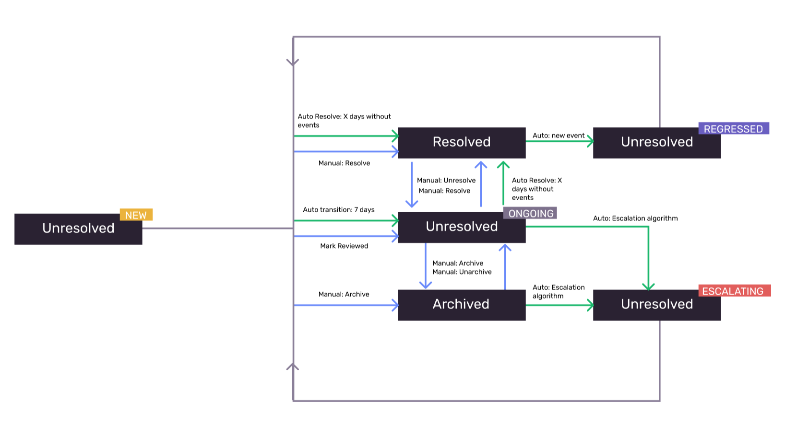

Use the status tags attached to issues on the [**Issues** page](https://sentry.io/issues/) in Sentry to help you triage and prioritize problems with your application that are important to you. Keep in mind that an issue can only have **one status at a time.**

Here's a list of all statuses, how they're assigned to an issue, and their custom search term:

| Status         | Condition                                                                                                                                                                                                            | Custom Search Term |
| -------------- | -------------------------------------------------------------------------------------------------------------------------------------------------------------------------------------------------------------------- | ------------------ |
| **New**        | An issue that was created in the last 7 days.                                                                                                                                                                        | is:new             |
| **Ongoing**    | An issue that was created more than 7 days ago or has manually been marked as reviewed.                                                                                                                              | is:ongoing         |
| **Escalating** | An issue that's exceeded its forecasted event volume. For more details, see [Escalating Issues Algorithm](escalating-issues). Please note that escalating issues currently does not work for merged/unmerged issues. | is:escalating      |
| **Regressed**  | A resolved issue that's come up again.                                                                                                                                                                               | is:regressed       |
| **Archived**   | An issue that's been marked as archived.                                                                                                                                                                             | is:archived        |
| **Resolved**   | An issue that's been marked as fixed.                                                                                                                                                                                | is:resolved        |

The diagram below shows how the statuses are updated automatically and manually:

One way to limit the issues that you see is by selecting a tab at the top of the **Issues** page. On the “Unresolved" tab, you'll find `New`, `Ongoing`, `Escalating`, and `Regressed` issues. You can also narrow down further by choosing the "For Review", "Regressed", "Escalating", or "Archived" tabs.

## Manually Triaging Issues

While some issue statuses are added and updated automatically, you can manually `Archive` or `Resolve` an issue, which will also change its status and remove it from the `is:for_review` list. Items in the `is:for_review` list are new, regressed, or unresolved issues that haven't been reviewed yet.

### Archive

Archive an issue to move it out of the issue stream and pause alerts on it until the issue gets worse. Archiving makes sense for noisy issues that are less pressing or not applicable to you or your team. Archiving changes the issue status to `Archived` and moves the issue from "Unresolved" into the "Archived" tab.

Sentry will automatically bring an issue back to the top of the list and change its status to `Escalating` if the events in that issue significantly increase over a short period of time. To learn more about how this works, see [Escalating Issues Algorithm](escalating-issues). By default, issues are archived until escalating. There's also an option to mark an issue as `Archived` for:

- Forever
- A set period of time
- Until it occurs a set number of times
- Until a set number of users are affected

If you archive an issue "Forever", events connected with that issue will continue to be recorded, but the issue will never be labeled as escalating even if it meets escalating conditions. You can still unarchive any archived issue, including those that have been archived "Forever". All unarchived issues will then show up in the "Unresolved" tab.

### Resolve

You can manually mark an issue as `Resolved` when it’s been fixed. A plain **Resolve** marks the issue fixed immediately. If another event for that issue is seen in any release, Sentry marks it `Regressed` and brings it back for review.

If you use [releases](/product/releases/), you can resolve an issue in a specific release instead. That tells Sentry which versions still count as expected noise and which newer versions should count as a regression. For more detail on how release comparison works, see [3 Different Ways to Resolve Issues](/product/releases/#3-different-ways-to-resolve-issues).

- **The next release**: Marks the issue resolved in the next release after the latest one where it was seen. Use this when the fix is merged or ready, but not deployed yet. Older clients can keep sending the error without reopening the issue; Sentry only treats it as a regression if it shows up again after that next release ships.
  - Example: You fixed a null pointer in `main`, but production is still on `1.8.0`. Resolve in the next release so `1.8.0` traffic stays quiet and only a recurrence in `1.9.0` (or later) reopens the issue.
- **The current release**: Marks the issue resolved in the project's current/latest release shown in the UI. Use this when the fix is already live in that release. Events from older releases won't reopen it; events from a newer release will.
  - Example: You shipped the fix in `2.4.1`, which is the current release. Resolve in the current release so leftover `2.4.0` sessions don't create a false regression, but a recurrence in `2.4.2` does.
- **Another existing release**: Marks the issue resolved in a release you choose. Use this when the fix shipped in a specific version that isn't the one labeled current, such as a hotfix branch or a release that only some environments run.
  - Example: Most traffic is on `3.2.0`, but you hotfixed the bug in `3.1.4` for a single tenant. Resolve in that existing release so Sentry anchors regression detection to `3.1.4` instead of the latest release.

You can also resolve by [including the issue ID in a commit or pull request associated with a release](/product/releases/associate-commits/#resolve-issues-by-commit).

If the same issue comes back in a newer release than the one you resolved it in, its status will automatically change to `Regressed`.

### Delete

You can remove an issue from the issue list by deleting it, but it will reappear as a new issue if it recurs.

There's also an option to `Delete and Discard Forever`, which will make it so that the issue is never seen again, even if it recurs. Any future events tied to the permanently deleted issue will be discarded automatically and won't count towards [your quota](/pricing/quotas/).

<Alert>

Discard forever only works for [Error Issues](/product/issues/issue-details/error-issues/?original_referrer=https%3A%2F%2Fdocs.sentry.io%2Fproduct%2Fissues%2Fstates-triage%2F). Other issue categories, such as [Performance Issues](/product/issues/issue-details/performance-issues/?original_referrer=https%3A%2F%2Fdocs.sentry.io%2Fproduct%2Fissues%2Fstates-triage%2F) only support normal deletion.

</Alert>
