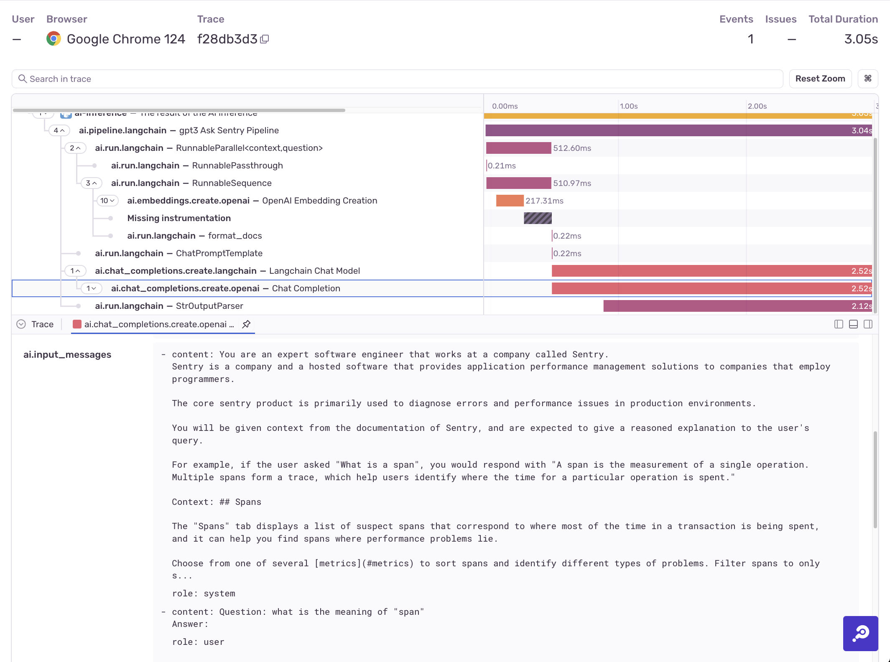

Once you've [configured the Sentry SDK](/product/llm-monitoring/getting-started/) for your AI project, you'll start
receiving data in the Sentry LLM Monitoring dashboard.

## The Per-pipeline Dashboard
In the example below, there are two LangChain pipelines (whose `.name` is the name that shows up in the table).
One has used 58,000 tokens in the past hour, and the other has used 44,900 tokens. When you click one of the pipelines in the table, you can see details about that particular pipeline.

As you can see in the example above, the "Ask Sentry" pipeline has used 59 thousand tokens and taken 3.2 seconds on average.

<Note>
Creating an AI pipeline is different than calling an LLM. If you're creating AI pipelines by calling LLMs directly (without using a tool like LangChain), consider using [manual AI instrumentation](/product/llm-monitoring/getting-started/#manually-instrumenting-ai-workloads).
</Note>

## Where AI Data Shows Up In the Trace View

If configured to include PII, the Sentry SDK will add prompts and responses to LLMs and other AI models to spans in the trace view.

In the example above, you can see input messages and LLM responses related to the `ai.chat_completions.create.langchain` span. Other spans like `ai.chat_completions.create.openai` show the number of tokens used for that particular chat completion.

This view can show other data as well. For example, if you call your LLM from a webserver, the trace will include details about the webserver through other integrations, and you'll get a holistic view of all the related parts.
