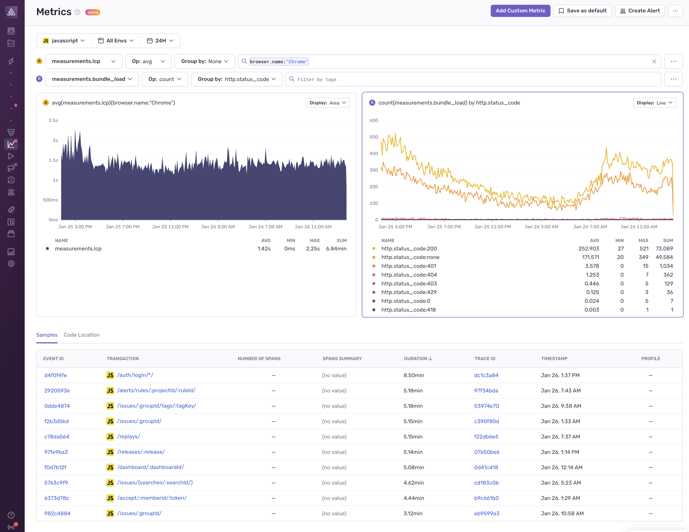
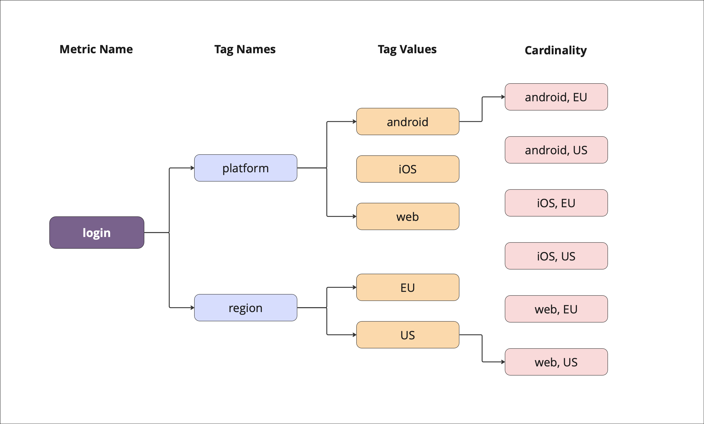

<Include name="feature-stage-beta-metrics.mdx" />

<Include name="metrics-api-change.mdx" />

Sentry metrics are numerical values that allow you to pinpoint and solve issues impacting user experience and app performance by measuring the data points that are important to you and your application. You can track things like latency, processing time, event size, user signups and conversion rates, and see how they correlate back to tracing data. This gives you a comprehensive understanding of the health of your systems and helps solve issues faster.

## Metric Types

Metrics at Sentry come in different flavors, in order to help you track your data in the most efficient and cost-effective way. The metric types we currently support are:

- **Counters:** Tracks a value that can only be incremented (for example, button clicks)
- **Distributions:** Tracks a list of values which can be aggregated over time like `max`, `min`, `avg` (for example, page load times)
- **Gauges:** Tracks a value that can go up or down (for example, available disk space, memory used)
- **Sets:** Tracks a set of values on which can be aggregations over time such as `count_unique` (for example, number of unique users)

Each metric also needs to have a unit associated with it, so that you know what you're dealing with. Examples of units are seconds, milliseconds, bytes, or even potatoes if you like.

## Augmenting Metrics with Tags

Metrics are powerful on their own, but you can enrich them further by adding dimensions in the form of Tags. Metrics can be categorized, organized, and filtered based on these different dimensions, providing more granularity and flexibility in analyzing and querying your data.

Tags consist of key-value pairs, where the key represents the tag name and the value represents the tag value. For example, you might have a platform tag, like `platform:android` or `platform:ios`. You can create your own custom tags to track attributes that help organize your data for your specific use case. Other useful tags are browser name, region, language, and customer.

To improve your product experience, Sentry adds certain common tags by default: `transaction`, `environment`, and `release`. This allows you to immediately analyze and segment your metrics data based on these useful dimensions. These tags can also be found on events such as errors and transactions.

## Limits and Restrictions

### Cardinality

In metrics, "cardinality" refers to the number of unique time-series generated by tags associated with a metric. The more unique tag combinations you create, the higher the cardinality.

For instance, imagine you are tracking daily logins. You create a metric named `login` and add tags like `platform` (with values `ios`, `android`, `web`) to indicate where logins occur. This will result in 3 distinct time-series:
- metric `login`, tag `platform:android`
- metric `login`, tag `platform:ios`
- metric `login`, tag `platform:web`

Then you decide to add a new tag called `region` which can be either be `US` or `EU`. If all combinations of tag values actually occurs, this will result in up to **6 time-series:**
- metric `login`, tag `platform:android`, tag `region:US`
- metric `login`, tag `platform:android`, tag `region:EU`
- metric `login`, tag `platform:ios`, tag `region:US`
- metric `login`, tag `platform:ios`, tag `region:EU`
- metric `login`, tag `platform:web`, tag `region:US`
- metric `login`, tag `platform:web`, tag `region:EU`

Generally, the maximum cardinality for a metric is the product of tag cardinalities. In this example, the cardinality is 3(`platform`) x 2(`region`) = 6.

To maintain reasonable cardinality, use tags with a fixed or predictable set of values. Adding a tag such as `user_id`, which will have a different value for each user and can also grow significantly over time, will result in a substantial increase in overall cardinality. Considering that each user might log in from various platforms, this multiplies the number of unique time series needed to analyze the data. For example, with 100,000 user IDs and 3 platform values, you would potentially require 300,000 time series.

Metrics are useful for analyzing your data in aggregate. If you have more than 10 users, is it really useful to track the number of logins for each user from each platform? Probably not. Instead, what might be more valuable is to look at a dimension like a `plan_tier` (e.g. `free`, `team`, `business`,`internal users`) to segment your login data based on user categories that are meaningful for your analysis. This approach helps limit cardinality and optimizes metric analysis.

If you really are interested in individual user actions, consider using [transactions](/product/performance/transaction-summary/#what-is-a-transaction) instead of metrics.

<Note>

Sentry incorporates protection mechanisms that will drop metrics if their cardinality exceeds an internally defined limit.

</Note>

### Supported Characters

Sentry allows the use of specific characters for the components of a metric:

- **Metric Name**: All word characters including `_`, `-`, `.`, but must start with an alphabetic character. Any unsupported characters will be replaced by `_`.

- **Metric Unit**: ASCII alphanumeric characters, underscores, and digits.

- **Metric Tag Key**: All word characters including `_`, `-`, `.`, `/`. Any unsupported characters will be removed from the tag key.

- **Metric Tag Value**: All Unicode characters.

More information about the normalization of unsupported characters can be found [here](https://develop.sentry.dev/sdk/metrics/#normalization).

### Maximum Lengths

Sentry sets a maximum length for the components of a metric:
- **Metric Name**: 150 characters.
- **Metric Unit**: 15 characters.
- **Metric Tag Key**: 32 characters.
- **Metric Tag Value**: 200 characters.

### Retention

Metrics are retained for 90 days in sentry.io (the same retention period as other event types, such as Errors and Transactions). The retention period is not configurable.

## Learn More

<PageGrid />
