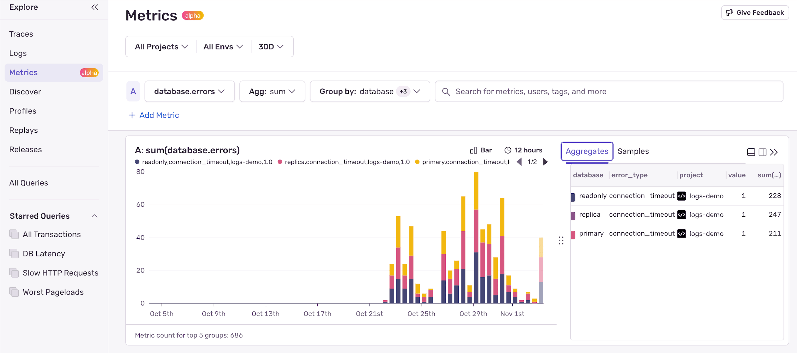
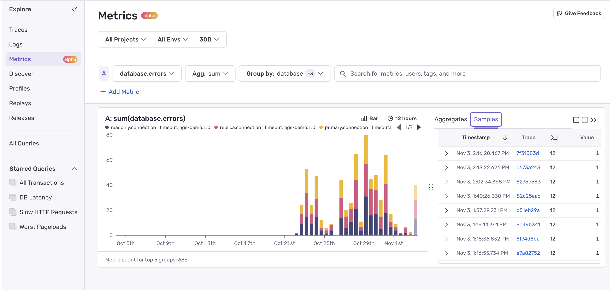
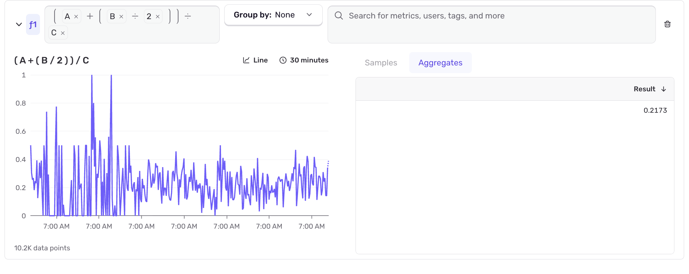

## Overview

With Sentry's Application Metrics, you can send [counters](#counters), [gauges](#gauges), and [distributions](#distributions) from your code to track application health signals like `email.sent`, `checkout.failed`, or `queue.depth`. What makes Sentry's Application Metrics unique is that every metric event is **trace-connected**, meaning you can click directly into the related traces, logs, and errors when something looks off.

<Arcade src="https://demo.arcade.software/wNDJOXTJw64xiuVi7Hp6?embed" />

Unlike traditional metrics tools that only show _if_ something's changed, Sentry's trace-connected metrics let you understand _why_ it changed. When a `checkout.failed` counter spikes, you can click into a sample and see the exact trace, spans, logs, and errors that produced that metric event.

Not everything in your application generates an error or requires full tracing. Application Metrics are perfect for tracking:

- **Business events**: `checkout.started`, `checkout.failed`, `payment.declined`, `refund.issued`
- **Application health**: `email.sent`, `email.failed`, `job.processed`, `job.retried`
- **Resource utilization**: `queue.depth`, `pool.in_use`, `cache.hit_rate`
- **User behavior**: `search.zero_results`, `feature.enabled`, `configuration.loaded`

## Set Up Application Metrics

To get started, navigate to the [Getting Started](/product/metrics/getting-started/) page and select your SDK from the list.

## Metric Types

Sentry supports three types of metrics:

### Counters

Counters track how many times something happened. Each increment adds to a cumulative total.

**Aggregation methods**: `sum`, `per_second`, and `per_minute`.

**Use cases**: events that occur over time
- `email.sent` - Track total emails sent
- `checkout.failed` - Track failed checkout attempts
- `api.request` - Track API calls

### Gauges

Gauges set a specific value at a point in time, like a snapshot. The latest value replaces the previous one.

**Aggregation methods**: `min`, `max`, `avg`, `per_second`, and `per_minute`.

**Use cases**: current state or level
- `queue.depth` - Current number of items in queue
- `pool.in_use` - Active connections in a pool
- `memory.usage` - Current memory consumption

### Distributions

Distributions record numeric values to compute statistical aggregates.

**Aggregation methods**: `p50`, `p75`, `p90`, `p95`, `p99`, `avg`, `sum`, `min`, `max`, `count`, `per_second`, and `per_minute`.

**Use cases**: values that vary and need statistical analysis
- `cart.amount_usd` - Purchase amounts for revenue tracking
- `query.duration_ms` - Query latency for performance monitoring
- `file.size_bytes` - File sizes for storage analysis

## Viewing and Exploring Application Metrics

Each metric query in the Explorer is displayed as its own block (labeled **A**, **B**, **C**, etc.) with a chart on the left and a data panel on the right. See [multiple metrics and equations](#multiple-metrics-and-equations) for more. Each block includes:

- **Metric selector** — choose the metric name (like `cart.add`, `chat.open`)
- **Agg** — select the aggregation function (examples:`sum`, `avg`, `p95`)
- **Group by** — optionally break out by an attribute
- **Search bar** — filter to specific attribute values

### Chart Types

Each metric block displays a time-series chart. You can switch the chart type from the chart header:

- **Line** — general-purpose trend visualization
- **Area** — useful for cumulative values or showing volume
- **Bar** — good for daily or interval-based comparisons
- **Heat map** — shows value density over time, ideal for distribution metrics where you want to see where values concentrate rather than just percentile lines, or sums of single counts

### Aggregates View

Switch to the **Aggregates** tab (in the data panel to the right of the chart) to see your metric data grouped and summarized. When you've set a **Group by** attribute, the aggregates table shows one row per group with the selected aggregation applied. Use this view to spot trends, identify anomalies, and compare segments.

### Samples View

The **Samples** tab shows individual metric events with **direct links to their traces**. This is where trace-connected metrics shine:

- See each individual metric event as it occurred
- Click any sample to open the full trace waterfall
- View related spans, logs, and errors from the same moment
- Understand the exact context that produced each metric

When you notice a spike or dip in the Aggregates view, switch to Samples to drill into specific occurrences and find the root cause.

### Multiple Metrics and Equations

You can compare several metrics side-by-side in a single Explorer view and derive new values from them without leaving the page:

- Click **Add Metric** to add another metric query to the page. Each query gets its own panel and a short label (`A`, `B`, `C`, …) so you can reference it elsewhere. You can reorder queries by dragging their panels, and add up to 26 queries at once.
- Click **Add Equation** to create a calculated series that references existing metric labels — for example, `A / B` to compute a ratio between two counters, or `A - B` to subtract a baseline from a current value. Equations appear alongside your metric queries and can be added to dashboards and monitors alongside the underlying metrics.

#### Example: A Custom Apdex Score

One common use of multiple queries and equations together is deriving a ratio-based KPI from a single latency metric. The screenshot below shows a board inspired by [Apdex](https://en.wikipedia.org/wiki/Apdex) (Application Performance Index), a user-satisfaction score that buckets response times into Satisfied and Tolerating zones relative to a target threshold `T`.

In this example, the source metric is `dashboards.widget.onEdit`, which captures the duration of each widget edit:

- **A** counts **Satisfied** events with the filter `value < 100` (where `T = 100ms`).
- **B** counts events in a **Tolerating** band with the filters `value > 200` and `value < 400`.
- **C** counts **Total** events with no filter applied.
- **f1** combines the buckets with the equation `(A + (B / 2)) / C` to produce a single Apdex-inspired score.

This example demonstrates how threshold filters split one source metric into buckets, and an equation composes those buckets into a single KPI. The same approach works for error rates, conversion rates, SLO scores, and other ratio-style metrics.

## Turning Metrics Into Monitors

Any metric query you build in the Explorer can be turned into a [Monitor](/product/monitors-and-alerts/monitors/) so you get notified when its behavior changes.

- From the **Metrics Explorer**, open **Save As → Monitor for** and choose the metric/aggregate you want to monitor. Sentry will pre-fill the Monitor with the metric, aggregate, filters, group-by, and time interval from your current query.
- From **Discover**, use the **Create Monitor** button on an Application Metrics query to jump into the Monitor creation flow with the metric pre-selected.

When creating a [Monitor](/product/monitors-and-alerts/monitors/), **Application Metrics** is available as a dataset alongside Errors, Spans, Logs, and Releases, and there's a dedicated **Application Metrics** template in the Monitor form to get you started quickly. The Monitor detects threshold breaches, percentage changes, or dynamic anomalies on the metric and creates an issue when conditions are met — which you can then route through [Alerts](/product/monitors-and-alerts/alerts/) to Slack, PagerDuty, email, and more.

## Adding Metrics to Dashboards

You can pin any metric query as a widget on a [Dashboard](/product/dashboards/) for longer-term tracking:

- From the Metrics Explorer, open **Save As → Dashboard widget** and choose the metric query you want to visualize.
- If you have multiple metric queries on the page, you can add them individually or pick **All Metrics** to create a single widget containing all of them.

## Saving Queries

Frequently-used metric queries can be saved and re-opened from the [Explorer](https://sentry.io/explore/metrics/):

- **Save As → New Query** stores your current metric queries, filters, group-bys, and time range under a name of your choosing.
- **Save As → Existing Query** updates a previously-saved query with your current configuration.

Saved queries show up in the Explorer's saved-query list and are accessible to everyone in your organization with Explorer access.

## Trace-Connected Debugging Flow

Application Metrics debugging workflow:

1. **Spot the anomaly**: Notice a spike in your Aggregates view (e.g., `checkout.failed` increased 3x)
2. **Open samples**: Switch to the Samples tab to see individual metric events
3. **Pick a trace**: Click on a sample to open the full trace that produced it
4. **Find the cause**: Examine spans for slow queries, check logs for error messages, view related exceptions
5. **Fix the issue**: With full context in hand, identify and resolve the root cause

Instead of "alert → guesswork," debugging becomes a **single flow**: Metric spike → sample → trace → root cause.

### When a Sample Doesn't Have a Trace

Application Metrics are typically sampled at 100% while traces are usually sampled at a much lower rate, so some metric events won't have a trace attached to them. When that happens, use the metric's attributes (such as release, environment, or route) to find a comparable trace in [Trace Explorer](/product/trace-explorer/). 

[Cross-Event Querying](/product/trace-explorer/#cross-event-querying) makes this easier by letting you filter traces based on related spans, logs, and application metrics. The comparable trace gives you the same debugging context as a directly attached one.

## Metric Attributes

Each metric event automatically includes:

| **Field**            | **Description**                                                                   |
|----------------------|-----------------------------------------------------------------------------------|
| **name**             | The metric identifier (e.g., `checkout.failed`)                                   |
| **kind**             | The metric type (counter, gauge, or distribution)                                 |
| **value**            | The numeric value                                                                 |
| **unit** *(optional)*| Unit of measurement (e.g., `usd`, `ms`, `bytes`). Rendered in the Samples table, trace view, and chart axes when set. |
| **timestamp**        | When the metric was recorded                                                      |
| **project**          | The project the metric belongs to                                                 |
| **trace_id**         | Links to the active trace when the metric was recorded                            |
| **span_id**          | Links to the specific span within the trace                                       |
| **client_sample_rate** *(optional)* | The client-side sample rate applied when the metric was captured    |
| **custom attributes**| Any key-value pairs you add for grouping and filtering                            |

## When to Use Application Metrics

Application Metrics are best for **application and code-based health signals**, numeric indicators of whether your application logic is behaving as expected.

**Good candidates for Application Metrics:**
- Business KPIs tied to code execution
- Application health indicators
- Resource utilization tracking
- User action counts
- Success/failure rates

**Other Sentry features that may be a better fit:**
- Log aggregation - use [Logs](/product/logs/)
- Full request tracing - use [Traces](/product/trace-explorer/)

## AI-Powered Metric Analysis

Your Sentry metrics can be leveraged with AI agents and tooling for debugging and automated analysis:

- **[Sentry MCP Server](https://mcp.sentry.dev)**: Enables natural language queries and deep integration with AI tools like Claude, Cursor, and VS Code using the Model Context Protocol
- **[Seer](/product/ai-in-sentry/seer/)**: Sentry's AI debugging agent can use metrics alongside traces, logs, and errors to provide intelligent issue analysis
