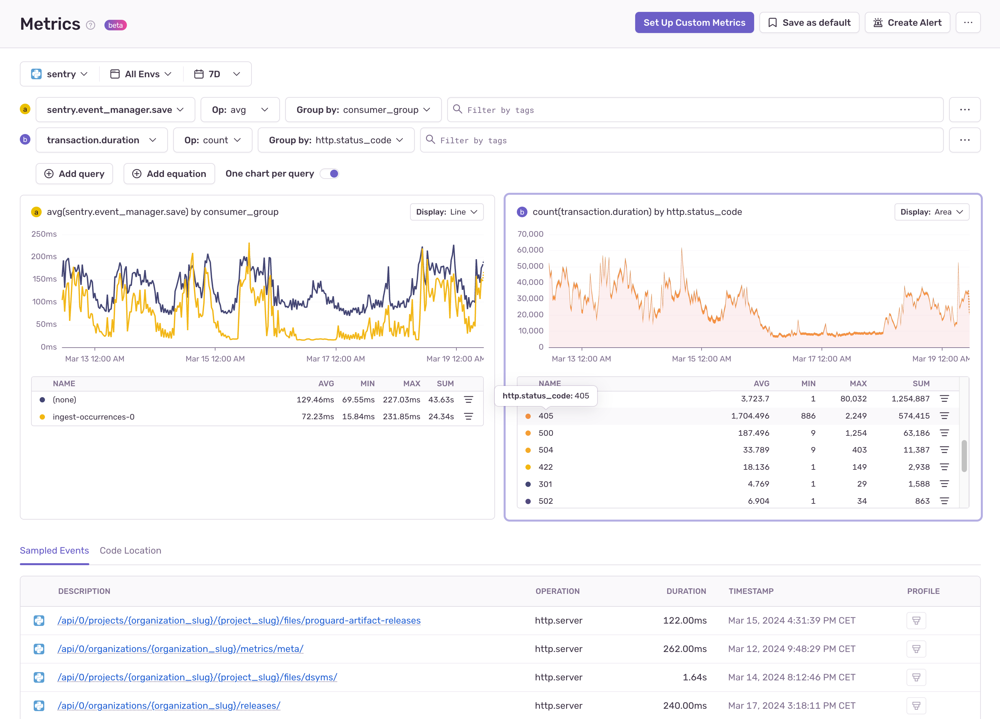

<Include name="feature-stage-beta-metrics.mdx" />

Sentry metrics are numerical values that allow you to pinpoint and solve issues impacting user experience and app performance by measuring the data points that are important to you and your application. You can track things like latency, processing time, event size, user signups, and conversion rates, and see how they correlate back to tracing data. This gives you a comprehensive understanding of the health of your systems and helps solve issues faster.

## Metric Types

Metrics at Sentry come in different flavors, in order to help you track your data in the most efficient and cost-effective way. The metric types we currently support are:

- **Counters:** Tracks a value that can only be incremented (for example, button clicks)
- **Distributions:** Tracks a list of values which can be aggregated over time like `max`, `min`, `avg` (for example, page load times)
- **Gauges:** Tracks a value that can go up or down (for example, available disk space, memory used)
- **Sets:** Tracks a set of values on which can be aggregations over time such as `count_unique` (for example, number of unique users)

Each metric also needs to have a unit associated with it, so that you know what you're dealing with. Examples of units are seconds, milliseconds, bytes, or even potatoes if you like.

## Augmenting Metrics with Tags

Metrics are powerful on their own, but you can enrich them further by adding dimensions in the form of Tags. These are key/value string pairs (for example, `platform:ios`) that are associated with metrics to provide contextual information, and are often used to filter and group them during analysis.

Sentry adds certain common tags by default such as, `transaction`, `environment`, and `release`, but you can also create your own custom tags to track attributes that help organize your data for your specific use case. Some common examples of useful tags are browser name, region, language, or customer.

## Limits and Restrictions

### Cardinality

Cardinality, in the context of metrics, refers to how many unique time series your metrics create. The number of time series depends on the combinations of tags that are added to a metric.

When dealing with tags, it's important to be wary of cardinality explosion. Here's an example to help you understand what this means.

Suppose you are collecting a metric that counts how many logins are being made every day. You might want to emit a metric called `login` and decide to add tags such as `platform` with values `ios`, `android`, `web`, which track the platoform from where the login was performed. You might also want to add a `user_id` tag, which contains the ID of the user that logged in; however, this tag will have a lot of values that are likely to increase. If you then consider that for each `user_id`, logins might be performed across all of your `platform`(s), this will increase the number of unique time series needed to plot your data. As an example, if you have 100k user ids, you might need at most 100k * 3 time series to plot data for all the combinations of the tags.

A common way to solve the problem of cardinality explosion is to choose tag values that have a fixed set of values. Instead of using `user_id`, you might decide to add additional data like the `country` from where the user logged in, which is a tag that has a fixed set of values.

<Note>

Sentry has protection mechanisms in place that will result in your metrics being dropped if their cardinality surpasses a limit that is defined internally.

</Note>

### Unsupported Characters Normalization

The metric name, tag keys and tag values are normalized before being sent to Sentry:
- Metric name -> any unsupported character is replaced with `_`.
- Metric tag keys -> any unsupported character is removed.
- Metric tag values -> any unsupported character is replaced by a specific character.

More information about the normalization of unsupported characters can be found [here](https://develop.sentry.dev/sdk/metrics/#normalization).

### Metric Tags Length

Metric tags have a maximum length:
- Tag keys -> 32 characters.
- Tag values -> 200 characters.

### Retention

Metrics are retained for 90 days in sentry.io (the same retention period as other event types, such as Errors and Transactions). The retention period is not configurable.

## Learn More

<PageGrid />
