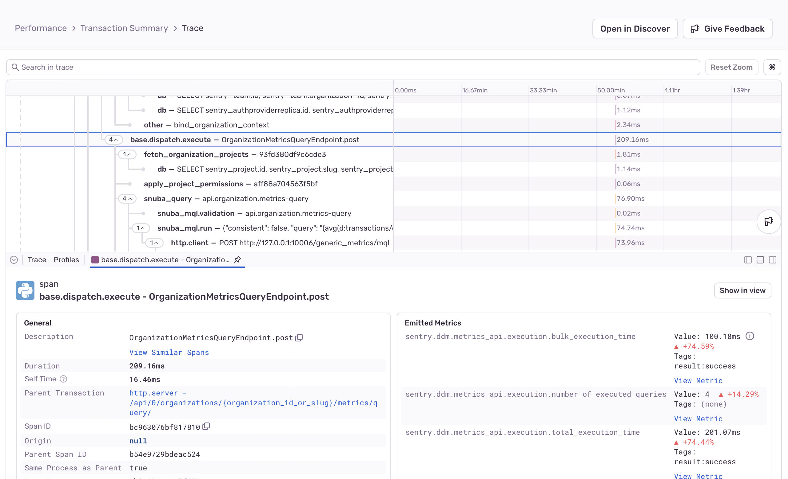

<Include name="feature-stage-beta-metrics.mdx" />

Once you've started sending metrics to Sentry, you can explore them in the product using the **Metrics** page. It might take a few seconds for the first datapoints to appear.

## Querying & Visualization

  <iframe
    src="https://demo.arcade.software/wazwqB6rvF5ZronReDLa?embed&show_copy_link=true"
    frameborder="0"
    loading="lazy"
    webkitallowfullscreen
    mozallowfullscreen
    allowfullscreen
    style={{"colorScheme":"light","height":"100%","left":"0px","position":"absolute","top":"0px","width":"100%"}}
    title="Sentry Metrics Explorer - Query &amp; Visualize"
  ></iframe>

You can use the dropdowns at the top of the page as a query editor for your metrics. Select the metric you want to plot from a list of available metrics in your project, the aggregate operation you'd like to perform (such as avg, min, max, and so on), and, optionally, any tags you'd like to group by. In the image above the metric `gibpotato.potatoes.event_processing_time`, is queried and shown, grouped by `event_type`.

Optionally, you can also use the search bar to filter for specific tag values. In addition to custom metrics that are defined by your team, you can also explore any tags that Sentry offers out-of-the-box.

The results of your query will be displayed on a chart below. You can use the "Display" dropdown on the top right-hand corner of the chart to choose whether to visualize your metric as a line, area, or bar chart.

Underneath the chart, you have a summary table where you can see avg, min, max and sum for your metric at-a-glance. When using group by, you might have multiple time series displayed on the chart and multiple lines in your table that represent each group.

If you'd like to zoom in and dig deeper into a particular area of your chart, draw a rectangle over your area of interest. This will narrow down the visualization to the particular time and value range that you've selected.

### View Multiple Metrics

Sometimes observing one metric is enough to reach an insight. However, it's oftentimes necessary to look at multiple metrics simultaneously to find potential correlations.

  <iframe
    src="https://demo.arcade.software/LM8eNFS5x1y7YVC1Pe91?embed&show_copy_link=true"
    frameborder="0"
    loading="lazy"
    webkitallowfullscreen
    mozallowfullscreen
    allowfullscreen
    style={{"colorScheme":"light","height":"100%","left":"0px","position":"absolute","top":"0px","width":"100%"}}
    title="Sentry Metrics Explorer - Multiple Metrics"
  ></iframe>

In this case, you can create additional queries in order to compare and contrast different metrics. Click "Add Query" button to create a new query. Alternatively, you can also click "... > Duplicate" next to an existing query to create a duplicate of that query.

This will display query results in the same chart, but you can also choose to display them in separate charts. In order to do that click "One chart per query" toggle.

Every query gets its identifier which is also shown in the summary table of the chart and allows you to easily distinguish between results of different queries.

Multiple queries can be combined into equations that allow you to perform arithmetic operations on the results of your queries. This can be useful when you want to compare two metrics or calculate a ratio between them. Click "Add Equation" to create a new equation. You can reference queries using their identifier (the letter(s) in the circle to the left of each query) in the input field that appears. For example, if you have two queries, `a` and `b`, you can create an equation that calculates the ratio between them by typing `a / b`. You can also use the `+`, `-`, and `*` operators.

## Looking at Exemplars

While metrics are a great tool for analyzing your data in aggregate and identifying possible issues, you often need to go deeper and look at the correlation with other signals, such as traces, to find the root cause for a particular anomaly. Once you've identified a particular area of interest - such as a spike or a drop in your metric - it's helpful to compare a trace from when the metric was stable to one that happened during this anomalous behaviour. [Traces](/concepts/key-terms/tracing/distributed-tracing/) provide detailed records of exactly what happened in your system at a point in time, with all the rich context contained in individual spans.   

Below your metric charts, the "Span Samples" tab shows a list of exemplars associated with that metric. By clicking on a span, you can navigate to the full trace view.

  <iframe
    src="https://demo.arcade.software/aPBtSIQrhir2SLgTMcbZ?embed&show_copy_link=true"
    frameborder="0"
    loading="lazy"
    webkitallowfullscreen
    mozallowfullscreen
    allowfullscreen
    style={{"colorScheme":"light","height":"100%","left":"0px","position":"absolute","top":"0px","width":"100%"}}
    title="Sentry Metrics Explorer - Sample Transactions"
  ></iframe>

Within the trace view, custom metrics associated with a span are also displayed in the span details.

## Code Locations

<Note>

This feature is not currently available in all SDKs.

</Note>

When it comes to custom metrics, you can use the code locations tab to see the line of code in your application where your metric is being emitted. This can come in handy when troubleshooting an issue, especially if you were not the one creating the metric in the first place.

  <iframe
    src="https://demo.arcade.software/LIthR3DDJaUXTLSNvD17?embed&show_copy_link=true"
    frameborder="0"
    loading="lazy"
    webkitallowfullscreen
    mozallowfullscreen
    allowfullscreen
    style={{"colorScheme":"light","height":"100%","left":"0px","position":"absolute","top":"0px","width":"100%"}}
    title="Sentry Metrics Explorer - Code Location"
  ></iframe>

## Create Alerts & Dashboards

In order to stay ahead of issues, you can also create metric-based alerts to get notified about unexpected changes or spikes. Click "... > Create Alert" next to your metric query to configure your custom metric alert.

  <iframe
    src="https://demo.arcade.software/7qnZaYnUMqEzJcR4Ro2D?embed&show_copy_link=true"
    frameborder="0"
    loading="lazy"
    webkitallowfullscreen
    mozallowfullscreen
    allowfullscreen
    style={{"colorScheme":"light","height":"100%","left":"0px","position":"absolute","top":"0px","width":"100%"}}
    title="Sentry Metrics Explorer - Create Alerts &amp; Dashboards"
  ></iframe>

If you want to continuously monitor a particular metric, click "... > Add to Dashboard" to create a new Dashboard widget. You can configure your dashboard to display custom metrics that matter most to you. To learn more, see [Dashboards](/product/dashboards/).
