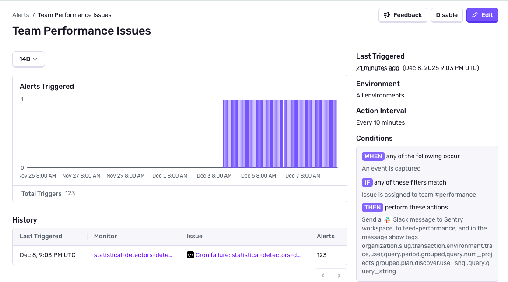

<Include name="feature-available-for-user-group-early-adopter" />

Sentry's **Alerts** take action when issues in your organization match pre-defined rules. An alert can send notifications, create tickets, call webhooks, or use other [integrations](/organization/integrations/)—for issues coming from projects or [Monitors](/product/monitors-and-alerts/monitors/).

### Some examples of when you could use an Alert

- Send a notification to your team's Slack channel when a **new** issue is created.
- Create a ticket in Jira when an issue is **assigned** and matches severity filters.
- Call a webhook when an issue **escalates** or moves from resolved back to unresolved.

## Creating an Alert

<Arcade src="https://demo.arcade.software/yXRDN2qTVqtedkfpQIbB?embed" />

To create an Alert, go to the [Alerts](https://sentry.io/monitors/alerts) page in Sentry and click **Create Alert**.

### Select Sources and Environments

The source of an Alert can be one or more Projects, or one or more Monitors. After you choose sources, pick which **environment(s)** the alert evaluates. By default, alerts run across all environments.

### Set Triggers

A trigger is an action that must occur for the Alert to run. All trigger actions are issue state based. For example, you may want to send a notification to your team's Slack channel _when an issue is created_. You can select multiple triggers in a single Alert. They will run under an `ANY` condition, meaning that if any one of the triggers happen, the Alert will run.

### Set Filters

Filters are conditions that must be met for the Alert to run. For example, you may want to create a ticket _only for issues that are assigned to a specific team_ and _at a certain severity_. You can create multiple filters in a single Alert, and group them under either `ANY` or `ALL` conditions. For `ANY` conditions, if any one of the filters are true, the Alert will run. For `ALL` conditions, only if all of the filters are true, the Alert will run.

### Add Actions

Actions run when triggers and filters match. Depending on your integrations, actions can include chat notifications (Slack, Microsoft Teams, Discord), email, on-call tools (PagerDuty, Opsgenie), issue trackers (Jira, Azure DevOps, Linear), webhooks, and [integrations](/organization/integrations/integration-platform/).

**Note:** Some integrations are only available for certain sources or issue types. Check [Integrations](/organization/integrations/) for your workspace.

### When to Notify the Team

Using Alerts with custom filters allows you to notify the team about critical issues. Some examples of when you can use Sentry to alert:

- On downtime
- When there are severe traffic spikes or drops
- When the number of errors exceed a certain threshold

## Managing Alerts

You can see a list of all your Alerts on the [Alerts](https://sentry.io/monitors/alerts) page. By default, Alerts are filtered down to your projects.

<Alert>

Alerts are an Organization-level feature. By default, all team members can create and edit Alerts. You can update this setting in [Organization Membership settings](https://sentry.io/settings/organization/).

</Alert>

By clicking on an Alert, you can view the details, edit the Alert, or turn it on or off.

The details page will show a high level chart of how often the Alert has run, a list of the most recent runs, the configuration, and connected monitors.

### Alerts Best Practices

The main goal is to create Alerts that are valuable and not too noisy.

Here are some quick tips:
- Use filters to narrow down the issues that are critical for to your team to be notified about.
- Select only the triggers that matter for Alerting actions. For example, you may want to create a Jira ticket any time an issue is created, but only be notified in Slack when an issue is a certain severity.
- Consider how your team works in terms of triaging. For example, do you want individual alerts routing to specific project, or service channels, or one alert to catch them all in a team channel? 

## Sentry Notifications

Besides Alerts, Sentry sends you notifications about various things like [issue state changes](/product/issues/states-triage/), [release deploys](/product/releases/), and [quota usage](/pricing/quotas/). You can fine-tune these notifications, as well as your personal alert settings, in **User Settings > Notifications**. Learn more about notifications and adjusting their associated settings in [the full documentation](/product/notifications/).
