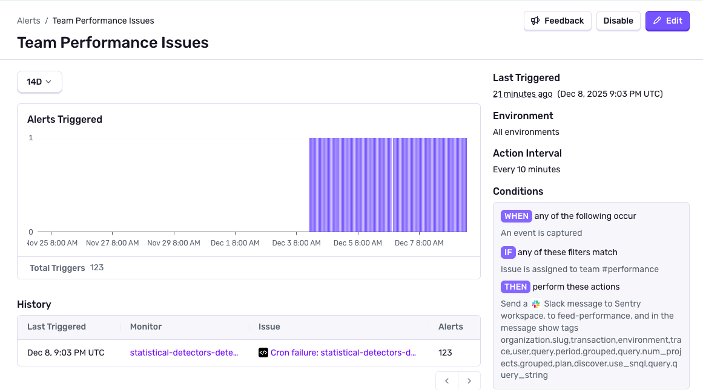

Sentry's **Alerts** take action when issues in your organization match pre-defined rules. An alert can send notifications, create tickets, call webhooks, or use other [integrations](/integrations/)—for issues coming from projects or [Monitors](/product/monitors-and-alerts/monitors/).

### Some examples of when you could use an Alert

- Send a notification to your team's Slack channel when a **new** issue is created.
- Create a ticket in Jira when an issue is **assigned** and matches severity filters.
- Call a webhook when an issue **escalates** or moves from resolved back to unresolved.

## Creating Alerts

You can create an Alert from **Monitors > [Alerts](https://sentry.io/monitors/alerts)**. When creating an Alert, you'll configure the issue sources, event triggers, filters, actions, and Alert throttling.

For an in-depth walkthrough of each setting, see [Creating an Alert](/product/monitors-and-alerts/alerts/create-alerts/).

<Alert>

Alerts are an Organization-level feature. Org Owners, Org Managers, Org Admins, and Team Admins can always create and edit Alerts. Org Members and Team Contributors can too, as long as **Let Members Create and Edit Monitors and Alerts** is enabled (the default) in your [organization settings](https://sentry.io/settings/organization/). Alerts scoped to all projects are restricted to Org Owners and Org Managers.

</Alert>

Available actions depend on the [integrations](/integrations/) installed in your organization, and some integrations are only available for certain sources or issue types.

### When to Notify the Team

Using Alerts with custom filters allows you to notify the team about critical issues. Some examples of when you can use Sentry to alert:

- On downtime
- When there are severe traffic spikes or drops
- When the number of errors exceed a certain threshold

## Managing Alerts

You can see a list of all your Alerts on the [Alerts](https://sentry.io/monitors/alerts) page. By default, Alerts are filtered down to your projects.

By clicking on an Alert, you can view the details, edit the Alert, or turn it on or off.

The details page will show a high level chart of how often the Alert has run, a list of the most recent runs, the configuration, and connected monitors.

### Alerts Best Practices

The main goal is to create Alerts that are valuable and not too noisy.

Here are some quick tips:

- Use filters to narrow down the issues that are critical for to your team to be notified about.
- Select only the triggers that matter for Alerting actions. For example, you may want to create a Jira ticket any time an issue is created, but only be notified in Slack when an issue is a certain severity.
- Consider how your team works in terms of triaging. For example, do you want individual alerts routing to specific project, or service channels, or one alert to catch them all in a team channel?

## Sentry Notifications

Besides Alerts, Sentry sends you notifications about various things like [issue state changes](/product/issues/states-triage/), [release deploys](/product/releases/), and [quota usage](/pricing/quotas/). You can fine-tune these notifications, as well as your personal alert settings, in **User Settings > Notifications**. Learn more about notifications and adjusting their associated settings in [the full documentation](/product/notifications/).

## Learn More

<PageGrid />
