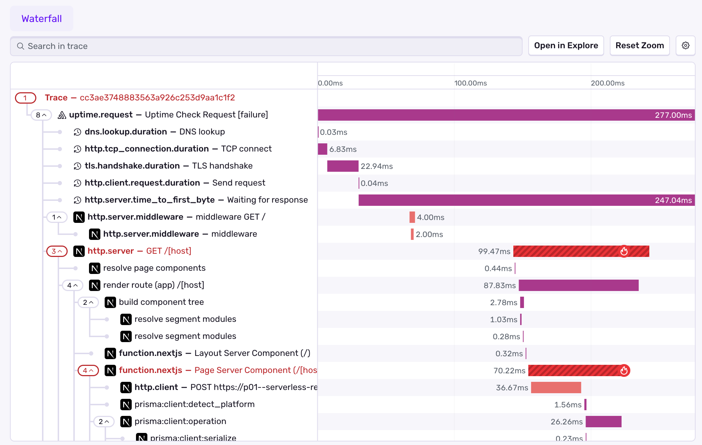
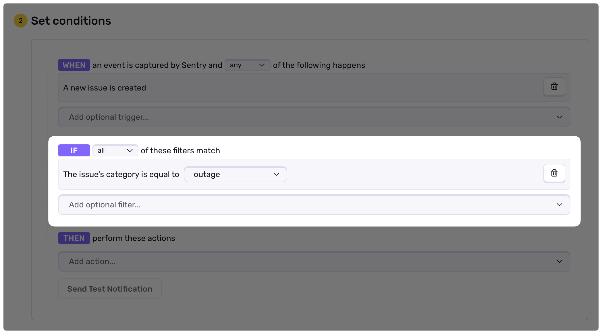

Sentry's Uptime Monitoring lets you monitor the availability and reliability of your web services effortlessly. Once enabled, it continuously tracks configured URLs, delivering instant alerts and insights to quickly identify downtime and troubleshoot issues.

By leveraging [distributed tracing](/concepts/key-terms/tracing/distributed-tracing/), Sentry enables you to pinpoint any errors that occur during an uptime check, simplifying triage and accelerating root cause analysis. This helps you enhance both the reliability and uptime of your web services.

## Set Up

Uptime is [automatically configured](/product/monitors-and-alerts/monitors/uptime-monitoring/automatic-detection/) as a new **Uptime Monitor** for the most frequently encountered hostname in all URLs of your error data, ensuring continuous monitoring of your most critical hostname right out of the box.

You can also create an **Uptime Monitor** from the [Monitors](https://sentry.io/monitors/new/) page for specific URLs. Uptime Monitors are fully customizable — see [Configuring an Uptime Monitor](#configuring-an-uptime-monitor) for the available options.

## Configuring an Uptime Monitor

Each Uptime Monitor is configured with request details and thresholds that control when downtime issues are created.

### Request

- **URL**: The target URL Sentry will check.
- **Method**: The HTTP method used (`GET`, `POST`, `HEAD`, `PUT`, `DELETE`, `PATCH`, or `OPTIONS`).
- **Headers**: Custom headers included in the request. Sentry automatically adds `User-Agent` and `Sentry-Trace` headers.
- **Body**: Request payload, available for `POST`, `PUT`, and `PATCH` methods.
- **Interval**: Time between each check (`1 minute`, `5 minutes`, `10 minutes`, `20 minutes`, `30 minutes`, or `1 hour`).
- **Timeout**: Maximum time Sentry waits for a response before marking a check as failed (up to 30 seconds).
- **Allow Sampling**: Defers the span sampling decision to your SDK so uptime checks can participate in [distributed tracing](/product/monitors-and-alerts/monitors/uptime-monitoring/uptime-tracing/).

<Alert level="warning">

When adding HTTP headers, be cautious of including sensitive data, such as API tokens or personal information, to prevent unintended exposure or storage.

</Alert>

### Thresholds

Thresholds control when a downtime issue is created and resolved based on consecutive check results.

- **Failure Tolerance**: How many consecutive failures trigger an issue. Defaults to **3 consecutive failures**. With a 5-minute interval and the default tolerance, an issue is created after 15 minutes of continuous downtime.
- **Recovery Tolerance**: How many consecutive successes resolve an issue. Defaults to **1 consecutive success**.

Tuning these helps reduce noise from transient failures while still surfacing sustained downtime.

### Verification

<Include name="feature-available-for-user-group-early-adopter.mdx" />

By default, a check passes when the response returns a 2xx status code. With **Verification**, you can define additional assertions against the HTTP response — including status codes, header keys and values, and JSON response bodies — and combine them with "any" or "all" grouping. You can test your configuration against the real endpoint from the monitor configuration screen before saving.

## Uptime Check Criteria

Our uptime monitoring system verifies the availability of your URLs by performing HTTP requests at regular, pre-configured intervals. For a URL to be considered up and running, the response must meet the following criteria:

1. **Successful Response (2xx Status Codes):**
   By default, the URL must return an HTTP status code in the 200–299 range, indicating a successful request. You can customize this behavior with [custom verification](#verification) (early access).
2. **Automatic Handling of Redirects (3xx Status Codes):** Sentry will follow redirects for URLs returning an HTTP status code in the 300–399 range and verify that the final destination URL returns a successful response. This ensures that redirects won't falsely create downtime issues.
3. **Timeout Setting:** Each request has a timeout threshold of 10 seconds.
   If the server doesn't respond within this period, the check will be marked as a failure,
   indicating a potential downtime or performance issues.
4. **DNS Issue Detection:** Our monitoring also includes the detection of DNS resolution issues.
   If a DNS issue is detected, the check will be marked as a failure,
   allowing you to address the underlying connectivity problems.

### Uptime Check Failures

An Uptime Monitor continuously checks the configured URL with the criteria defined above. If a failure occurs,
a new [uptime issue](/product/issues/issue-details/uptime-issues/) is created, including details about the failed check and related errors.

To prevent false positives caused by temporary network issues, **an issue is only generated after three consecutive failures** (configurable via [Thresholds](#thresholds)) following the initial detection of downtime. Additionally, uptime checks are performed from a variety of geographical locations in a round-robin fashion. This ensures that each failed check comes from a different region, reducing the likelihood of false positives due to localized network failures.

_In rare cases where Sentry is unable to perform a scheduled uptime check—such as during outages—the check status will be marked as "Unknown"._

## Uptime Request Spans

Uptime checks include spans called _uptime request spans_ that Sentry automatically creates for the request. The `uptime.request` span acts as a root span for traces related to uptime checks.

**Key Benefits:**

- Context: You instantly know a trace was generated by an uptime check vs user traffic
- Request lifecycle: You can see the full journey from the initial uptime check through your application's response
- Enhanced debugging: You can see more details about exactly where and why the failure occurred to distinguish between uptime-related issues and other application problems

<Alert type="info">
Uptime request spans are free and will not count against your [span quota](/pricing/quotas/manage-transaction-quota/). These spans are always created, even if you have sampling disabled.
</Alert>

## Notifications

To start getting notifications for a new downtime issue, [configure an Alert](/product/monitors-and-alerts/alerts/#creating-an-alert) that matches outage / downtime issues and add actions for email, Slack, on-call tools, or other integrations.

## Learn More About Uptime Monitoring

<PageGrid />
