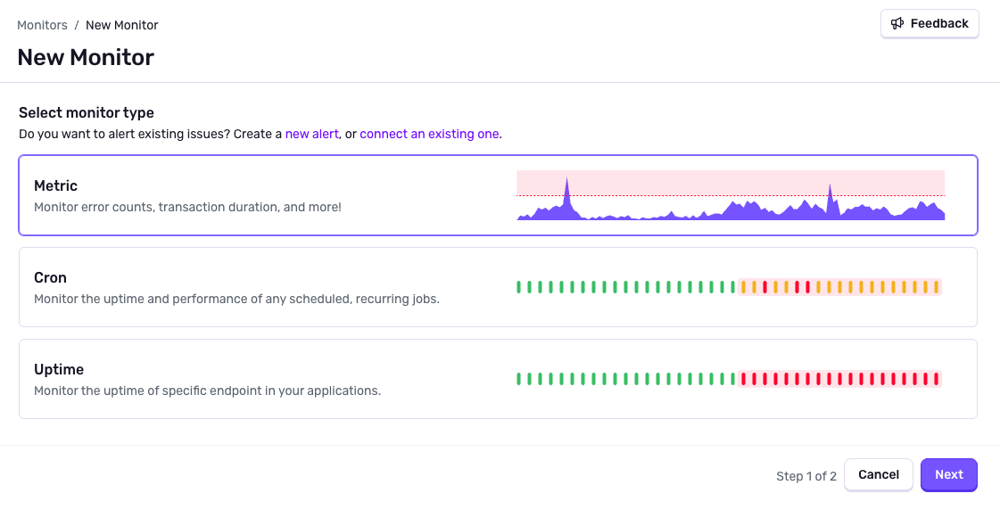

<Alert>
 New Monitors and Alerts is currently in <strong>beta</strong>. Beta features are still a work in progress and may have bugs. We recognize the irony. Help improve this feature by providing feedback on our [GitHub discussion](https://github.com/getsentry/sentry/discussions/101960).
</Alert>

Sentry's Monitors are used to customize when to turn errors and performance problems into issues. They can be configured using conditional rules to create issues when specific criteria are met. For example, you could monitor when the duration of a transaction takes longer than 3 seconds on a particular browser. Further automate your issue creation experience using Monitors to automatically add assignees and set different priorities based on severity. 

## Types of Monitors

### Custom Monitors

You can use Custom Monitors to track errors based on span attributes and custom metrics, the uptime and performance of any scheduled, recurring job, or the uptime and performance of any HTTP request.

- [Metric Monitors](#metric-monitor-settings): Track for errors based on span attributes and custom metrics.
- [Cron Monitors](/product/new-monitors-and-alerts/monitors/crons/): Track the uptime and performance of any scheduled, recurring job.
- [Uptime Monitors](/product/new-monitors-and-alerts/monitors/uptime-monitoring/): Track the uptime and performance of any HTTP request.

### Default Monitors

Sentry also provides default monitors that are automatically created for you when you create a new project. 

- **Error Monitor**: The default monitor based on [issue grouping/fingerprint rules](/concepts/data-management/event-grouping/)
- **Replay Monitor**: Once you've configured [Session Replay](/product/explore/session-replay/), issues will be created via the Replay Monitor
- **Trace Monitor**: Once you've configured [Tracing](/product/tracing/), issues will be created via the Trace Monitor
- **Profile Monitor**: Once  you've configured [Profiling](/product/explore/profiling/), issues will be created via the Profile Monitor

## Creating a Monitor

To create a Monitor, navigate to the [Monitors](https://sentry.io/issues/monitors/new/) page and click **Create Monitor**. You can choose between the three types of Monitors (metric, cron, and uptime). Each one will have a separate configuration process.

### General Settings

Monitors are made of attributes that define when to create an issue, and actions that define what to do when an issue is created.

- Name the Monitor
- Select the project, and in some cases, the environment
- Select attributes based on the Monitor type
- Set priority based on attributes
- Set auto-resolve based on attributes
- Set the assignee
- Connect [Custom Alerts](/product/new-monitors-and-alerts/alerts/) like external notifications and ticket creation
to pair with your Monitor

<Alert type="note">

Assignees set by [ownership rules](/product/issues/ownership-rules/) will override assignees set by Monitors.

</Alert>

{/* <Arcade src="https://demo.arcade.software/YOUR_ARCADE_ID?embed" /> */}

### Metric Monitor Settings

Metric Monitors are used to track errors based on span attributes and custom metrics. 

Choose the metric, the interval for how often to check, and the way you want to monitor for changes. You can choose an absolute number threshold, a percentage change, or dynamic anomaly detection.

#### Issue Detection Settings

**Fixed Thresholds**

When setting an absolute number threshold, a percentage change, or dynamic anomaly detection, here are a few considerations:
Use a fixed threshold or a percentage change threshold when you have a clear idea of what constitutes good or bad performance. Here are some examples:
- When your app's crash rate exceeds 1%
- When your app's transaction volume drops to zero
- When any issue affects more than 100 enterprise users in a day
- When the response time of a key transaction exceeds 500 ms

**Dynamic Thresholds**

Dynamic thresholds help you detect when a metric deviates significantly from its “normal” range. For example, the percentage of sessions affected by an issue in the last 24 hours is _20% greater than one week ago_, rather than the percentage of sessions affected is simply _greater than 20%_, which would be a fixed threshold.

Dynamic thresholds are good for when it’s cumbersome to create fixed thresholds for every metric of interest, or when you don’t have an expected value for a metric, such as in the following scenarios:

- **Seasonal fluctuations**: Seasonal metrics, such as number of transactions, are more accurately monitored by comparing them to the previous day or week, rather than a fixed value.
- **Unpredictable growth**: Fixed-threshold alerts may require continuous manual adjustment as traffic patterns change, such as with a fast-growing app. Dynamic thresholds work regardless of changing traffic patterns.

### Cron Monitor Settings

Cron Monitors are used to track the uptime and performance of any scheduled, recurring job. 

Choose the schedule for how often to check, set the check-in margin, the max runtime, and failure tolerance. Learn how to set up a [Cron Monitor](/product/new-monitors-and-alerts/monitors/crons/getting-started/).

### Uptime Monitor Settings

Uptime Monitors are used to track the uptime and performance of any HTTP request.

Choose the URL and HTTP request you wish to monitor. Set the interval, timeout, any headers you wish to include, and failure tolerance. Learn how to set up an [Uptime Monitor](/product/new-monitors-and-alerts/monitors/uptime-monitoring/).

## Managing Monitors

You can see a list of all your Monitors on the [Monitors](https://sentry.io/issues/monitors/) page. Select a Monitor type at the top of the page to narrow down the list. By default, Monitors are filtered down to your projects.

<Alert>

Monitors are a Project-level feature, but the permission set is organization-level. By default, all members can create and edit Monitors. You can update this setting in [Organization Membership settings](https://sentry.io/settings/organization/).

</Alert>

By clicking on a Monitor, you can view the details, edit the Monitor, or disable it.

The details page will show a high level chart of the Monitor's performance, the configuration, created issue, and connected automations. 