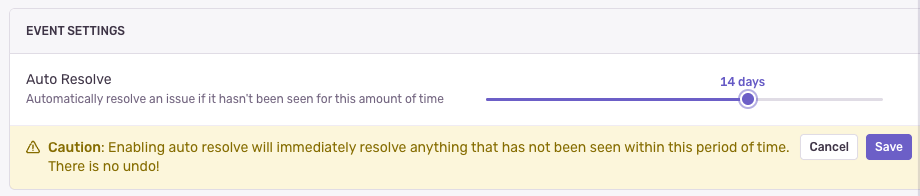

By the end of this guide, you'll be able to create and configure projects in Sentry to gain detailed insights into issues, including the exact lines of code affected, the environment in which they occurred, and the releases they originated from. Additionally, we'll walk you through Sentry's most essential integrations and SSO/SCIM configuration. If you get stuck anywhere, please [Ask Sentry AI](https://sentry.zendesk.com/hc/en-us?askAI=true) or join our [Discord](https://discord.gg/sentry) community.

## Step 1: Initial Project Creation and Configuration
By the end of this step, you'll have enabled a few features, mapped data into Sentry, and added important metadata like environments and releases to help you filter. 

1. Sentry's in-app project creation workflow allows you to enable Tracing and Session Replay. Check out this [step-by-step walkthrough](https://sentry.io/orgredirect/projects/new/) on creating and configuring a Sentry project within your environment. At a minimum, this will allow you to take advantage of the free allocated Tracing and Session replay quota.

2. The Sentry project creation flow includes a "Source Map Wizard" to help streamline the uploading of your artifacts (source maps, debug information files, symbols).

    - Source Maps (JS) and Debug Symbols are crucial for translating minified or obfuscated code back into a human-readable format, allowing you to pinpoint the exact lines of code causing your issues. Here you can find instructions for [JavaScript](/platforms/javascript/sourcemaps/uploading/) as well as [Android](/platforms/android/enhance-errors/source-context/) and [iOS](/platforms/apple/guides/ios/sourcecontext/).
    
    <Arcade src="https://demo.arcade.software/rxKoIgKxfVE5rXhizlEL?embed" />

3. Add [Environments](/concepts/key-terms/environments/#creating-environments) and [Releases](/platform-redirect/?next=/configuration/releases/) to Your Sentry init.

    - Set up environments (production, staging, etc.) and releases in Sentry to streamline error tracking. Environments filter issues by context, while releasing link errors to code versions for easier debugging.
    
    <Arcade src="https://demo.arcade.software/MKxHyDhuA1edeTqEhESL?embed" />

## Step 2: Get your team on Sentry by implementing SSO or SCIM - For New organizations

To manage user authentication and provisioning, you can configure Single Sign-On ([SSO](/organization/authentication/sso/)) and System for Cross-Domain Identity Management ([SCIM](/organization/authentication/sso/okta-sso/okta-scim/)).

## Step 3: integrations

[Source Code Management](): Integrating your SCM with Sentry is critical for efficient issue resolution. It links code changes to errors, helping you identify and resolve issues quickly. WIth commit tracking and Suspect Commits, users can pinpoint problematic changes and trace them to the relevant stack trace.

<Alert>
SCM (GitHub) integration highlights include:
 - [Stack trace linking](/organization/integrations/source-code-mgmt/github/#stack-trace-linking)
 - [Highlight suspect commits within an issue detail](/organization/integrations/source-code-mgmt/github/#suspect-commits-and-suggested-assignees)
 - [Automatically link code owners](/organization/integrations/source-code-mgmt/github/#code-owners)
 
 <Arcade src="https://demo.arcade.software/qFzrbkftPVGTGLveRedZ?embed" />
</Alert>

[Messaging/Notifications](/organization/integrations/notification-incidents/): A messaging integration will allow you to configure alerts based on issue severity, resolving or ignoring issues directly from Slack, and links back to Sentry for deeper investigation. This keeps teams proactive by instantly alerting them about critical issues.

[Issue Tracking](/organization/integrations/#issue-tracking): Helps teams track and manage Sentry issues within their ticketing system. You will be able to trigger the automatic creations of issues from Sentry events, sync status updates between tools, and link Sentry issues to existing tickets for streamlined resolution.

    - Linking Sentry to JIRA keeps issue statuses synced, automatically marking Sentry issues as resolved when appropriate. This ensures that reappearing issues get flagged regressions.
     <Arcade src="https://demo.arcade.software/atttrvOjh9g1x9V7c8Z9?embed" />

    - To manage stale issues within Sentry, enable auto-resolve for those unseen within a set timeframe. **We recommend setting auto-resolve to 2 weeks** for optimal issue and regression tracking. Configure this in **Project Settings > General Settings > Auto Resolve**.

    

By making it to the end, you have a great head start on getting the most out of Sentry. For further customization, explore the official Sentry Documentation or [ask Sentry AI](https://sentry.zendesk.com/hc/en-us?askAI=tru).
