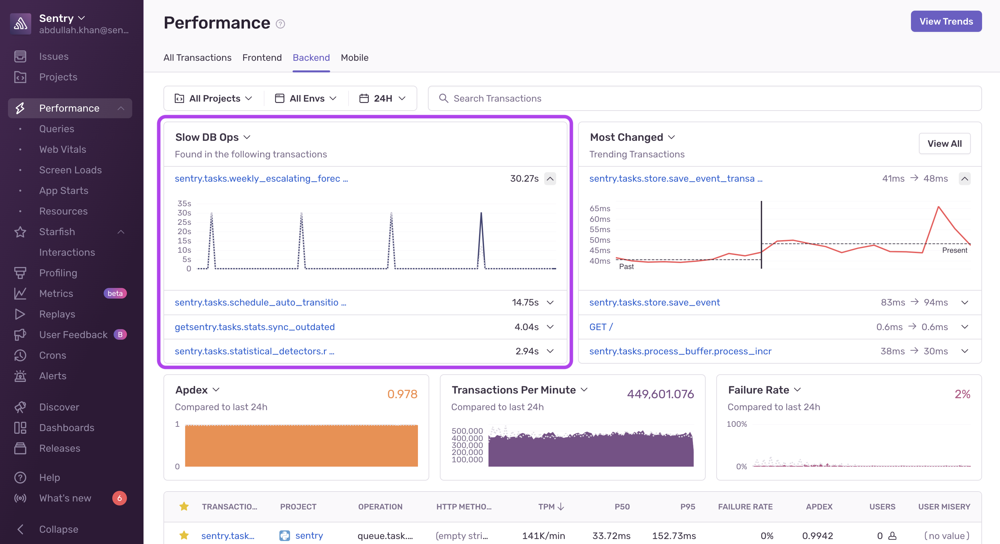

Performance widgets offer visualizations that you can change to best match your workflow. They provide performance-specific views that allow you to see and act on transaction data across your organization.
Depending on which [Performance Tab](/product/performance/filters-display/#tabs) you've selected, different curated performance widgets will be available.

<Note>

The value displayed in the top right of some widgets is the **overall value for the selected time period**, not the average of the data displayed in the chart. For datasets with low event volume, the overall value may be higher or lower than expected because metrics like [Apdex](/product/performance/metrics/#apdex) and [User Misery](/product/performance/metrics/#user-misery) are non-linear.

</Note>

## Average TTIDs

Shows the average TTID duration for top screens for mobile projects. Click the screen name to view more information about the screen in the [Screen Loads](/product/performance/mobile-vitals/screen-loads/) page.

This widget is available in the [Mobile](/product/performance/filters-display/#mobile) tab.

## Most Changed

Shows those transactions from the selected transaction list that have changed (either improved or regressed) the most. Note that only trends of a specific significance and throughput are shown and that precedence is given to the most regressed transactions. 

To filter by either **Most Improved** or **Most Regressed**, navigate to the trends page using the **View Trends** button. Learn more in [Trends](/product/performance/trends).

This widget is available in the [All Transactions](/product/performance/filters-display/#all-transactions), [Backend](/product/performance/filters-display/#backend) and [Mobile](/product/performance/filters-display/#mobile) tabs.

## Most Related Issues

Shows the highest count of any issue group related to a transaction and visualizes the issue count over time.

This widget is available in the [All Transactions](/product/performance/filters-display/#all-transactions) tab.

## Most Slow Frames

Shows transactions with the most slow frames for mobile projects. Learn more in [Mobile Vitals](/product/performance/mobile-vitals).

This widget is available in the [Mobile](/product/performance/filters-display/#mobile) tab.

## Most Frozen Frames

Shows transactions with the most frozen frames for mobile projects. Learn more in [Mobile Vitals](/product/performance/mobile-vitals).

This widget is available in the [Mobile](/product/performance/filters-display/#mobile) tab.

## Most Time-Consuming Queries

Shows database queries that take the most time in your application. These queries are usually either slow, very frequent, or both. Click on a query to open its [**Query Summary** page](/product/performance/queries#query-summary-page) or click "View All" to open the [**Queries** page](/product/performance/queries#queries-page).

This widget is available in the [All Transactions](/product/performance/filters-display/#all-transactions) and [Backend](/product/performance/filters-display/#backend) tabs.

## Most Time-Consuming Resources

Shows resources that take the most time in your application. These resources are usually either slow, very frequent, or both. Click on a resource to open its [**Resource Summary** page](/product/performance/resources#resource-summary-page) or click "View All" to open the [**Resources** page](/product/performance/resources#resources-page).

This widget is available in the [Frontend](/product/performance/filters-display/#frontend) tab.

## Best Page Opportunities

Shows web pages in your application that have the most [Opportunity](/product/performance/web-vitals/#opportunity) to improve. These pages usually have poor [Web Vital](/product/performance/web-vitals/) scores, high throughput, or both. Click on a page to open its [**Page Overview** page](/product/performance/web-vitals/#page-overview) or click "View All" to open the [**Web Vitals** page](/product/performance/web-vitals/#web-vitals-page).

This widget is available in the [Frontend](/product/performance/filters-display/#frontend) tab.

## Performance Score

Shows the [Performance Score](/product/performance/web-vitals/#performance-score) breakdown of your web projects. Click on a Web Vital component or "View All" to open a summary in the [**Web Vitals** page](/product/performance/web-vitals/#web-vitals-page).

This widget is available in the [All Transactions](/product/performance/filters-display/#all-transactions) tab.

## Slow HTTP Ops

Shows transactions with slow cumulative HTTP spans. Slow HTTP ops are not shown for all projects and transactions as the transactions must contain HTTP spans. Check out the SDK documentation for the project in question for more information.

This widget is available in the [Frontend](/product/performance/filters-display/#frontend) and [Backend](/product/performance/filters-display/#backend) tabs.

## Slow DB Ops

Shows transactions with slow cumulative DB spans. Slow DB ops are not shown for all projects and transactions as the transactions must contain DB spans. Check out the SDK documentation for the project in question for more information.

This widget is available under the [Backend](/product/performance/filters-display/#backend) tab.

## Slow Resource Ops

Shows transactions with slow cumulative resource spans. These show frontend transactions with poor performing resources spans, and show cumulative time spent loading scripts, CSS, and so on.

This widget is available under the [Frontend](/product/performance/filters-display/#frontend) tab.

