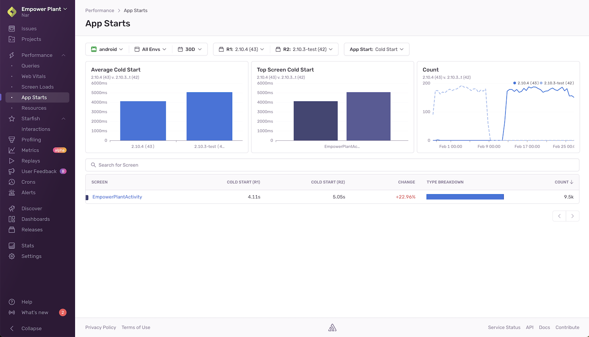
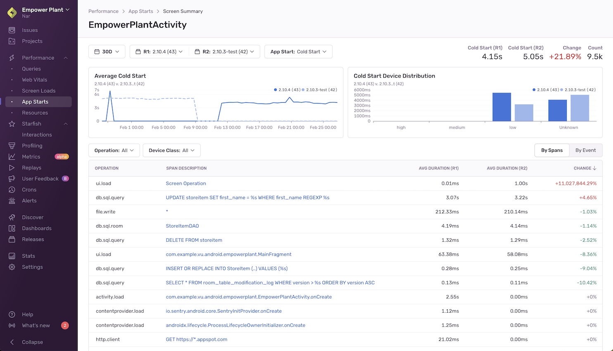
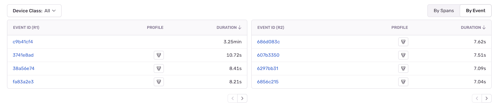
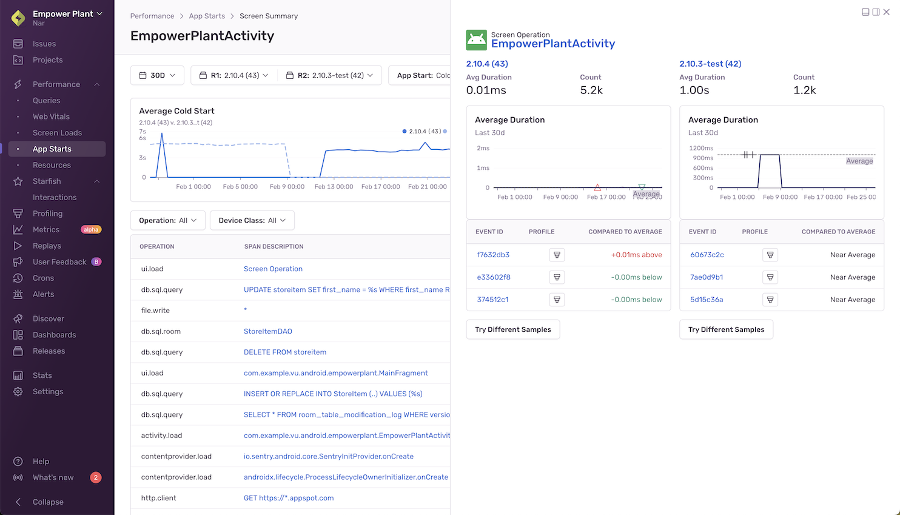

The **App Starts** page shows an overview of the amount of time it takes for your application to complete cold and warm starts. It helps you identify slow or regressed screens and gives additional information so you can better understand the factors contributing to the slowness of your application start times.

### Minimum SDK Requirements:

**For Android:**

- `>=7.4.0` for automatic instrumentation of app start spans and app start profiling
- [Performance-V2](/platforms/android/performance/instrumentation/perf-v2) feature flag and [App Start Profiling](/platforms/android/profiling/#app-start-profiling) must also be enabled in the SDK, e.g.:

```java {filename:MyApplication.java}
import io.sentry.android.core.SentryAndroid;

SentryAndroid.init(this, options -> {
  options.setEnablePerformanceV2(true);
  options.setEnableAppStartProfiling(true);
});
```

```kotlin {filename:MyApplication.kt}
import io.sentry.android.core.SentryAndroid

SentryAndroid.init(this) { options ->
  options.enablePerformanceV2 = true
  options.enableAppStartProfiling = true;
}
```

```xml {filename:AndroidManifest.xml}
<manifest>
    <application>
        <meta-data android:name="io.sentry.performance-v2.enable" android:value="true" />
        <meta-data android:name="io.sentry.traces.profiling.enable-app-start" android:value="true" />
    </application>
</manifest>
```

**For iOS:**

- `>=8.18.0` for automatic instrumentation of [app start spans](/platforms/apple/performance/instrumentation/automatic-instrumentation/#app-start-tracing)
- `>=8.21.0` for app start profiling
- [PerformanceV2](/platforms/apple/performance/instrumentation/automatic-instrumentation/#performance-v2) must be enabled in the SDK, e.g.:
```swift
import Sentry

SentrySDK.start { options in
    ...
    options.enablePerformanceV2 = true
}
```

By default, the **App Starts** page displays metrics for the two releases with the highest screen counts for the time range you’ve selected. To choose a different set of releases to compare, use the “release selector” at the top of the page. To change the app start type (cold or warm), use the “App Start” selector at the top of the page.

The charts display the following metrics (using cold starts as an example):

- Average Cold Start
    - The overall time it takes your application to start, compared by release.
- Top Screen Cold Start
    - The time it takes for individual screens to start, compared by release. This chart syncs with the sort order in the table below it.
- Count
    - The number of starts occurring in the selected time range for the releases. This gives you an idea of how statistically significant the aggregated data is.

**Reasons Why You Might Not Be Seeing Any Data:**

- You don’t have any transactions with op `ui.load`
- Your SDKs don’t meet the minimum SDK requirements

## Screen Summary Page



To get additional information about any of your application’s screens, click on them to get to the **Screen Summary** page. Here, you’ll see your average start duration broken down by release and [device class](/concepts/search/searchable-properties/#device-classification) (high, medium, low, or unknown). This will help you understand how users with different device performance levels are being affected.

The table below the chart shows spans that have changed from one release to the next and allows you to filter for specific span operations and device classes. Being able to narrow down to specific event samples helps debug slow starts.

Clicking the "By Event" toggle in the top right corner of this table will show you events split by release and you'll be able to see overall changes in start times between the two releases you've selected.



The following table describes the span operations that are surfaced in the spans table:

| Platform | Span Operations |
| --- | --- |
| Common | <ul> <li>file.write</li> <li>ui.load</li> <li>http.client</li> <li>db</li> <li>db.sql.query</li> <li>db.sql.transaction</li> </ul> |
| [iOS](/platforms/apple/guides/ios/performance/instrumentation/automatic-instrumentation/#app-start-tracing) | <ul> <li>app.start.cold</li> <li>app.start.warm</li> </ul> |
| Android | <ul> <li>activity.load</li> <li>application.load</li> <li>contentprovider.load</li> <li>process.load</li> </ul> |

## Span Detail View



Clicking on a span description opens up a side panel that shows span details, including the average duration and count for that span in each of the releases you’re looking at.

In the table below, you’ll see a list of sampled events and profiles (if they exist). By comparing the two, you’ll be able to see how much the duration of the span you’re looking at deviates from average spans in each of the two releases you’ve selected.

Sentry automatically identifies sample events to help you investigate performance problems. (They’re shown as triangles in the “Average Duration” graph.) To give you an accurate picture, a range of faster than average, slower than average, and average span durations are sampled across the whole time period you’ve selected.

You can use the sample list to drill down to and compare fast, average, and slow events of interest within a given screen.

Clicking on a sample event will take you into either the query’s span details within the span waterfall of the [Trace View page](/concepts/key-terms/tracing/trace-view/#product-walkthrough-trace-view-page) or the profile icon to see the [flamegraph](/product/profiling/flame-charts-graphs/) for the event. To get different event samples, click the "Try Different Samples" button.
