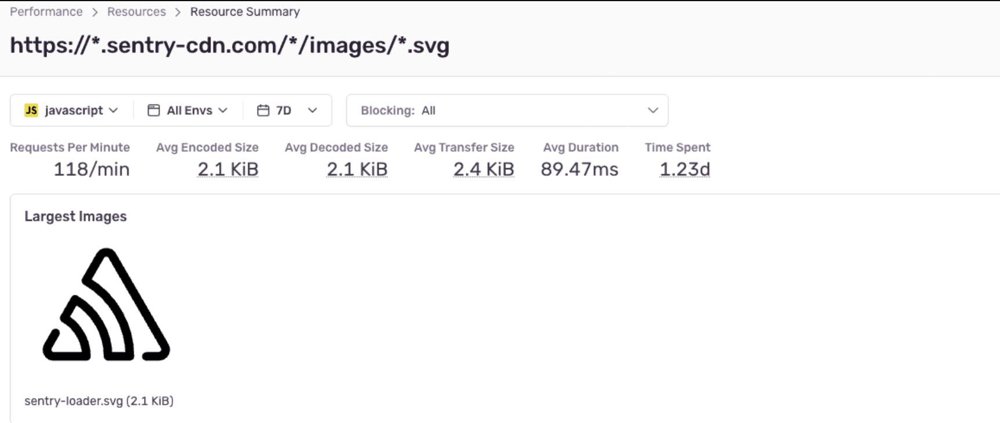

If you have performance monitoring enabled for your frontend, you can see how your browser resources are performing in Sentry.

Starting with the [**Resources** page](#resources-page), you get a high-level overview of how your resources are doing. From there, you can drill into a specific resource's [**Resource Summary** page](#resource-summary-page) and then investigate sample events from the [Sample List](#sample-list) to better understand the context of its performance in a specific page.

<div style={{position: 'relative', paddingBottom: 'calc(50.86013462976814% + 41px)', height: 0}}><iframe src="https://demo.arcade.software/BxySgGk7hpJ72xquLdKe?embed" frameborder="0" loading="lazy" webkitallowfullscreen mozallowfullscreen allowfullscreen style={{position: 'absolute', top: 0, left: 0, width: '100%', height: '100%', colorScheme: 'light'}}></iframe></div>

## Prerequisites and Limitations

The resource pages are only available for frontend JavaScript projects with performance monitoring enabled. Currently only JavaScript, CSS, images, and certain resources that are initiated by CSS (such as fonts), are supported.

For the best experience, we recommend enabling automatic instrumentation via the `BrowserTracing` integration for your frontend project to see resource performance data. This is supported for the following JavaScript platforms:

- [Vanilla JavaScript](/platforms/javascript/performance/)
- [Angular](/platforms/javascript/guides/angular/performance/)
- [Astro](/platforms/javascript/guides/astro/performance/)
- [Ember](/platforms/javascript/guides/ember/performance/)
- [Gatsby](/platforms/javascript/guides/gatsby/performance/)
- [Next.js](/platforms/javascript/guides/nextjs/performance/)
- [React](/platforms/javascript/guides/react/performance/)
- [Remix](/platforms/javascript/guides/remix/performance/)
- [Svelte](/platforms/javascript/guides/svelte/performance/)
- [SvelteKit](/platforms/javascript/guides/sveltekit/performance/)
- [Vue](/platforms/javascript/guides/vue/performance/)

### Span Eligibility

Sentry tries to extract metrics by looking at resource-related spans.

The JavaScript SDK automatically generates `resource` spans on `pageload` and `navigation` transactions using the browser's [Resource Timing API](https://developer.mozilla.org/en-US/docs/Web/API/Performance_API/Resource_timing).

If you are using <PlatformLink to="/performance/instrumentation/automatic-instrumentation">automatic instrumentation</PlatformLink>, resource monitoring should work without any configuration.

If you've manually instrumented Sentry, you'll need to make sure that your spans conform to our standards for the best experience:

- The span `op` field is prefixed with `resource` (for example, `resource.script` or `resource.css`).
- The span's `description` contains the URL of the loaded resource, which should correspond to the [PerformanceResourceTiming name field](https://developer.mozilla.org/en-US/docs/Web/API/PerformanceEntry/name).
- The `http.response_transfer_size` span data value is set to the [total transfer size](https://developer.mozilla.org/en-US/docs/Web/API/PerformanceResourceTiming/transferSize) of the resource.
- The `http.response_content_length` span data value is set to the [encoded body size](https://developer.mozilla.org/en-US/docs/Web/API/PerformanceResourceTiming/encodedBodySize) of the resource.
- The `http.decoded_response_content_length` span data value is set to the [decoded body size](https://developer.mozilla.org/en-US/docs/Web/API/PerformanceResourceTiming/decodedBodySize) of the resource.
- The `resource.render_blocking_status` span data value is set to the [render blocking status](https://developer.mozilla.org/en-US/docs/Web/API/PerformanceResourceTiming/renderBlockingStatus) of the resource.

Here's an example snippet of creating a resource span manually with the SDK.

```javascript
// https://developer.mozilla.org/en-US/docs/Web/API/PerformanceResourceTiming
const resources = performance.getEntriesByType("resource");
resources.forEach((entry) => {
  const startTime = msToSec(entry.startTime);
  const duration = msToSec(entry.duration);

  const span = Sentry.startInactiveSpan({
    startTimestamp: startTime,
    op: entry.initiatorType
      ? `resource.${entry.initiatorType}`
      : "resource.other",
    description: entry.name,
    data: {
      "http.response_transfer_size": entry.transferSize,
      "http.response_content_length": entry.encodedBodySize,
      "http.decoded_response_content_length": entry.decodedBodySize,
      "resource.render_blocking_status": entry.renderBlockingStatus,
    },
  });

  // override end timestamp to match performance entry
  span.finish(startTime + duration);
});
```

## Resources Page

The **Resources** page gives you a quick overview of your application's resource performance for the selected project(s). You can use this page as a starting point to investigate potential problem resources and drill down to better understand how various resources are affecting your app's performance.

Open the **Resources** page by clicking "Resources" in the sidebar, under "Performance". Alternatively, the **Performance** page also surfaces the highest impact resources in the "Most Time Consuming Resources" widget. From there, you can click "View All" to open the **Resources** page.

At the top of the page, summary graphs for requests per minute (throughput) and average duration provide high-level insight into the performance of your resources. If you see an anomaly or want to investigate a time range further, you can click and drag to select a range directly in a graph to filter data for that time range.

The resource table below shows a list of grouped resources, along with their type, their volume (requests per min), average duration, the total time your app spent loading that resource (time spent), and [average encoded size](https://developer.mozilla.org/en-US/docs/Web/API/PerformanceResourceTiming/encodedBodySize) of the resource.

By default, the resources table is sorted by most time spent, which serves as a proxy for the relative performance impact of a given resource. A resource's time spent is the sum of all its durations in a given time period or, put another way, the product of its average duration and requests per minute. This means that resources at the top are usually loading really slowly, very frequently, or both.

You can click on a column header to change how the table is sorted. Sort by requests per minute to see the most frequently loaded resources or by average duration to see the slowest-loading resources.

You can also filter resources by domain, type, page it's found on, and whether it has render blocked.

To view more details, click on a resource from the table to open its **Resource Summary** page.

<div style={{position: 'relative', paddingBottom: 'calc(50.86013462976814% + 41px)', height: 0}}><iframe src="https://demo.arcade.software/dVvM0eWdGjN7bVhxSwJr?embed" frameborder="0" loading="lazy" webkitallowfullscreen mozallowfullscreen allowfullscreen style={{position: 'absolute', top: 0, left: 0, width: '100%', height: '100%', colorScheme: 'light'}}></iframe></div>

### What Does a Render Blocking Mean?

A render blocking resource is one which will stop the browser from rendering anything on the screen, until the resource is fully download and processed by the browser.

An example of this is a `<script/>` within the `<head>` of an HTML document. When loaded, the browser will want to load this script entirely before rendering content as it assumes it may need something from that script to render. If this is not the case, you can add the `defer` or `async` attribute to the script in order to reduce or eliminate render blocking.

Sentry captures a resources render blocking status using the `resource.render_blocking_status` property in the [PerformanceResourceTiming Api](https://developer.mozilla.org/en-US/docs/Web/API/PerformanceResourceTiming/renderBlockingStatus).

### Resource Parameterization

To enable Sentry to group similar resources together, Sentry parameterizes resource URLs, removing potentially dynamic elements. This helps track the performance of a particular resource across different releases, even when they have dynamic segments (used for busting caches or CDNS).

If you would like to further improve your groupings, consider the following rules we use when parameterizing urls. These rules can help you understand how you can name urls to improve grouping.

The following tokens will be replaced with \* within a resource url

1. A version string (`myfile.v3.0.js` is replace with `myfile.*.js`)
2. Hexadecimal strings with more than 5 digits (`myfile.7A9B3E.js` is replaced with `myfile.*.js`)
3. UUID's
4. Integer IDs with more than one digit (`1234.7A9B3E.js` is replace with `*.*.js`)
5. Strings longer then 25 characters
6. The entire path except for common path segments such as static, chunks, media, etc

<Note>

Resource parametrization is still a work-in-progress. As these improvements are made, you will will temporarily see instances of the new and old groupings in your Resource Module.

Let us know of any feedback through Github Issues.

</Note>

To see an example of resource URL from a group, hover over a URL in the resource table.

## Resource Summary Page

To open a resource's **Resource Summary** page, click on the resource from the table in the **Resources** page.

At the top of the page, average encoded size, average decoded size, average transfer size, average duration, and requests per minute are shown for the selected time range. Right below this, you can see summary graphs for requests per minute, average duration, and average resource size over time.

At the bottom, you can find a list of pages the resource is found in, sorted by the requests per minute for the resource on that page.

If you want to investigate a specific page, click on it to open a sidebar showing some sample events.

<div style={{position: 'relative', paddingBottom: 'calc(50.829268292682926% + 41px)', height: 0}}><iframe src="https://demo.arcade.software/D96Pu2LMLHddyVCn3BOd?embed" frameborder="0" loading="lazy" webkitallowfullscreen mozallowfullscreen allowfullscreen style={{position: 'absolute', top: 0, left: 0, width: '100%', height: '100%', colorScheme: 'light'}}></iframe></div>

### Image Samples

When viewing an image resource, the resource summary page will also show the 5 largest image samples. Sentry determines the span is an image if it has one of the following extensions: 'jpg', 'jpeg', 'png', 'gif', 'svg', 'webp', 'apng', 'avif'.

If size information is not available, the samples will not be ordered in any particular order. If the images are publicly accessible and the 'Enable Images' project settings is enabled, then the actual images will be rendered in the UI.

<Note>

At the moment, relative resource span descriptions (ones that begin with '/') are not supported for the image preview. We are working on adding this soon! See https://github.com/getsentry/sentry/issues/63208

</Note>



## Sample List

Click on a page to open its samples list. This side panel shows summary metrics (requests per minute, average duration, and time spent) for the resource in the specific page.

The table shows a sample list of events, their span duration, and the difference in duration compared to average. This table is sorted by longest span duration.

Sentry automatically finds a variety of samples to help you investigate performance problems. The chosen events will cover the entire selected time range, as well as a range of durations (both faster than, slower than, and near the average duration). You can get a sense of the performance characteristics by comparing different sample events.

These same events are also represented as triangles shown in the average duration graph above.

You can generate a new list of random sample events by clicking the "Try Different Samples" button at the bottom.

From the sample list, you can drill down to specific good, average, or bad examples of a given resource within a given page. Click on an event ID to drill into the resource's span details within the span waterfall of the [Trace Details](/concepts/key-terms/tracing/trace-view/#product-walkthrough-trace-details-page) page.

<div style={{position: 'relative', paddingBottom: 'calc(50.829268292682926% + 41px)', height: 0}}><iframe src="https://demo.arcade.software/h2B547DqgJGIrlsMeVWx?embed" frameborder="0" loading="lazy" webkitallowfullscreen mozallowfullscreen allowfullscreen style={{position: 'absolute', top: 0, left: 0, width: '100%', height: '100%', colorScheme: 'light'}}></iframe></div>
