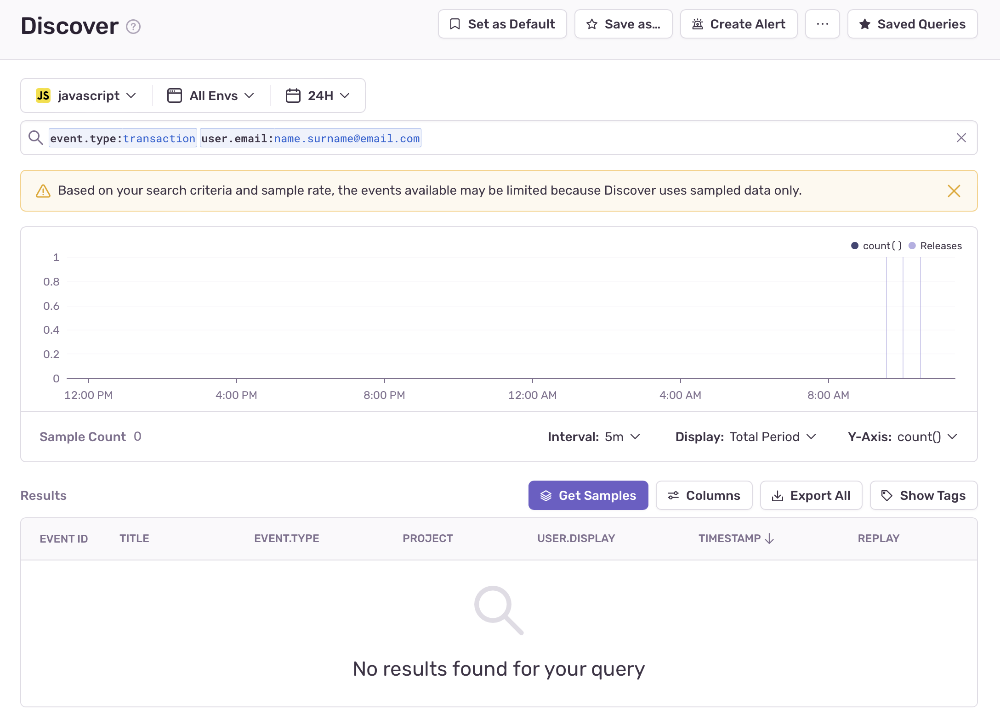
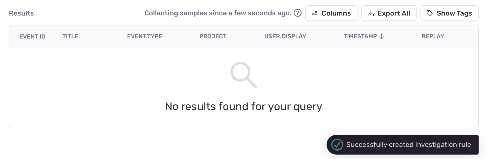
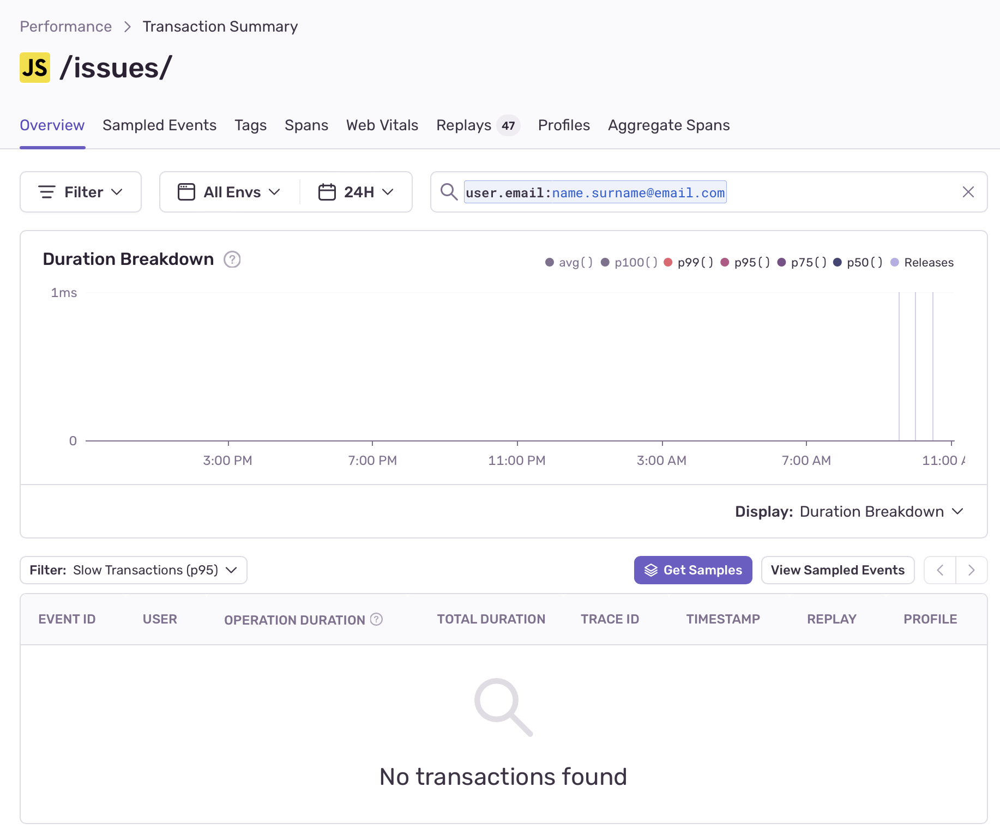

<Note>

Retention priorities are only available on the latest version of our plans, starting from 1M reserved transactions. Anyone in your org with owner or billing-level permissions can update your plan by going to Settings > Subscription, and clicking the "Manage Subscription" button.

</Note>

While storing all your data makes sense at relatively low volumes, as your application scales, storing a raw copy of all your data has diminishing returns. When data reaches high volumes, Sentry begins to automatically prioritize retaining certain transactions over others with server-side data retention strategies called retention priorities.

It's important to note that even when we begin to only store the most valuable data based on retention priorities, the [performance metrics](/product/performance/metrics/) you see are still based on **all** the events you send to Sentry. This ensures that you get a full and complete view of your application's health.

## Prerequisites

- [Admin-level permissions](/organization/membership/).
- Latest version of one of the below SDKs:
  - Python: 1.7.2 or later
  - JavaScript: 7.6.0 or later
  - Apple: 7.23.0 or later
  - Android: 6.5.0 or later
  - React Native: 4.3.0 or later
  - Dart and Flutter: 6.11.0 or later
  - PHP: 3.9.0 or later
  - Laravel: 3.0.0 or later
  - Symfony: 4.4.0 or later
  - Ruby: 5.5.0 or later
  - Java: 6.5.0 or later
  - .NET: 3.22.0 or later
  - Go: 0.16.0 or later

## Retention Priorities

Below is a list of the transactions we prioritize and deprioritize. They are enabled by default, but can be updated on a per-project basis to better fit your organization's needs.

### Prioritized Transactions

Sentry automatically prioritizes and retains the following types of transactions:

#### Latest Release

Latest releases are a retention priority because when you create a new release, we assume you'll want to have more visibility during the early adoption phase, which improves your ability to catch new issues as your release is gaining traction.
Because you may want to deploy the same release in different environments, we'll also take your environment into account and prioritize those transactions.

#### Dev Environments

Since dev environments usually generate a small number of transactions as compared to prod environments, we prioritize them during your testing phase so you can get meaningful insights. We consider an environment to be a dev environment if its name matches one of the following glob pattterns:

- `*debug*`
- `*dev*`
- `*local*`
- `*qa*`
- `*test*`

#### Low Volume Projects

<Note>

You won't be able to disable the Low Volume Projects retention priority because it's set on an organization-wide level, not on a per-project basis.

</Note>

Some projects within your organization are very high volume compared to others. This means that low-volume projects might get drowned out if we treat all projects equally. To ensure that you have enough samples regardless of project scale, we prioritize low-volume projects.

#### Low Volume Transactions

Transactions can be logically grouped by their name within a project. This means that transactions with the same name most likely indicate the same operation or code path, while transactions with different names usually indicate different operations.
We prioritize low-volume transactions for the same reason we prioritize low-volume projects – so they don't get drowned out by high-volume transactions. We want to make sure that transactions representing low-volume code paths are sampled in enough quantities to generate a complete view of your application.

### Investigation Mode

Our automated retention priorities work well in a generic manner to collect a baseline of samples because they prioritize retaining data that is valuable for any customer at any given time. However, there are certain scenarios, such as investigating a particular issue, when very specific data becomes temporarily more important. In such cases, sometimes the automated sampling priorities do not provide enough samples, so you may want to create investigation rules.

Investigation rules are sampling rules that can be created through the Sentry UI to temporarily boost the number of transactions collected for a particular scenario (for example, transactions with specific tag values). These rules can be created to retain more samples when too few (less than 5) are available. Once created, a rule will be active for up to 48 hours or until 100 samples are collected. You'll be notified via email when enough transactions have been collected.

Investigation sampling rules only apply to transactions and don't guarantee that full traces will be sampled. The maximum number of sampling rules that can exist at the same time is 50.

#### Creating a New Investigation Rule

When you perform a query on transactions either in [Discover](/product/discover-queries/) or in [Transaction Summary](/product/performance/transaction-summary/) and receive fewer than 5 samples, you can click "Get Samples" to create a new investigation rule to retain more samples of transactions for the respective query.

<Note>

Please note that this feature only applies to transactions. Therefore, in Discover, you have to specify `event.type:transaction` in the query to access the feature, whereas in Performance the event type is implicit.

</Note>

Clicking this button triggers the creation of an investigation rule for the respective query. After the successful creation of the rule, a notification will appear and the button for creating the investigation rule will be replaced by a message specifying that the investigation is in progress and the amount of time since it has been active.

If a user performs the same search later and the investigation is still active, the notification will indicate that there is an active rule collecting data for the query.

Creating a rule is also possible from the Transaction Summary page in Performance.

### Deprioritized Transactions

Sentry automatically deprioritizes the following transactions:

#### Health Checks

We deprioritize health check type transactions because while they're important for checking the stability of your application, they don't have any value beyond the task associated with them. We consider a transaction to be a health check if its name matches one of the following glob patterns:

- `*healthcheck*`
- `*heartbeat*`
- `*/health`
- `*/healthy`
- `*/healthz`
- `*/live`
- `*/livez`
- `*/ready`
- `*/readyz`
- `*/ping`

### How to Change Retention Priorities

To make changes to a project's retention priorities in Sentry, go to **Settings > Projects**, select the project you're interested in, then scroll down to "Performance" in the "PROCESSING" section and make any updates under "RETENTION PRIORITIES" using the toggles. Each of your projects can have an individual set of retention priorities.

  <iframe
    src="https://demo.arcade.software/bEv0SO2UEmqbVJVok99o?embed"
    frameborder="0"
    loading="lazy"
    webkitallowfullscreen
    mozallowfullscreen
    allowfullscreen
    style={{"colorScheme":"light","height":"100%","left":"0px","position":"absolute","top":"0px","width":"100%"}}
    title="General Settings — totes-ma-gotes — Sentry"
  ></iframe>

## Deciding on Your SDK Sample Rate

To give Sentry the fullest, most accurate picture of your application’s health, we recommend that you send us 100% of your transactions. You can do this by setting your [tracesSampleRate](/platform-redirect/?next=/performance/) to 1.0. If this isn't feasible for your organization, set a lower value, or switch to sampling selectively by using the [tracesSampler](/platform-redirect/?next=/performance/) to filter your transactions based on contextual data. Note that when calculating throughput, transaction metering is based on received transactions not stored transactions.

<Note>
  Please note that changes to your SDK sampling configuration may affect your
  quota. If you increase your SDK sampling rate, you'll also be increasing the
  volume of transactions you send to Sentry. This may require that you adjust
  your transaction quota.
</Note>
