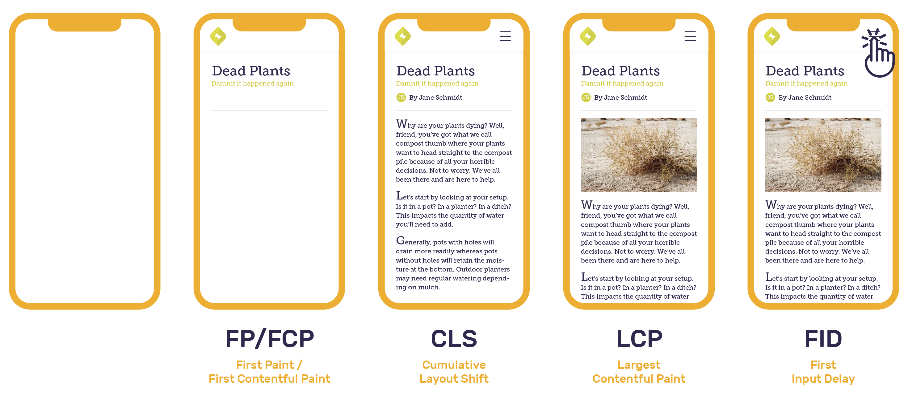
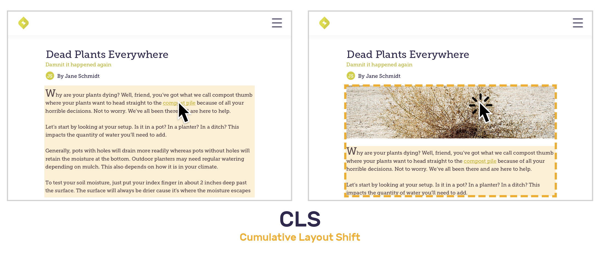

[Web Vitals](https://web.dev/vitals/) are a set of metrics defined by Google to measure render time, response time, and layout shift. Each data point provides insights about the overall [performance](/product/performance/) of your application.

The in-browser Sentry SDKs collect web vitals information (where supported) and adds that information to frontend [transactions](/product/performance/transaction-summary/). These web vitals are then summarized in several graphs for a quick overview of how each frontend transaction is performing for your users.



## Core Web Vitals

Google considers Core Web Vitals to be the most important metrics for measuring the user experience on web pages. According to a May 2021 [Google blog post](https://developers.google.com/search/blog/2020/11/timing-for-page-experience), these metrics also impact your search ranking.

### Largest Contentful Paint (LCP)

[Largest Contentful Paint (LCP)](https://web.dev/lcp/) measures how long it takes for the content that covers the largest pixel area in the viewport to render - in other words, how long before a user sees the main content on a page. This content may take any form from the document object model (DOM), such as an image, SVG, or text block.

### First Input Delay (FID)

[First Input Delay (FID)](https://web.dev/fid/) measures response time when a user tries to interact with the viewport by clicking a button, link, or any other custom JavaScript controller. FID data is critical for understanding whether interactions on an application page are successful or not.

### Cumulative Layout Shift (CLS)

[Cumulative Layout Shift (CLS)](https://web.dev/cls/) is the sum of individual layout shift scores for every unexpected element shift that happens during the rendering process. An example of this would be trying to click a link on a page that hasn't finished loading and having that link shift down before you've had a chance to click on it due to image rendering issues. The CLS web vital score isn't based on duration. It represents the extent of the disruptive and visually unstable shifts.



Each layout shift score is calculated using an impact and distance fraction. The impact fraction is the total visible area that the element affects between the two rendered frames. The distance fraction measures the distance it has moved relative to the viewport.

```
Layout Shift Score = Impact Fraction * Distance Fraction
```

Let’s take a look at the example above which has one unstable element - the body text. The impact fraction is roughly 50% of the page and moves the body text down by 20%. The layout shift score is 0.1, the product of 0.5\*0.2. Thus, CLS is 0.1.

## Other Web Vitals

These Web Vitals are generally less user-visible, but are useful for troubleshooting issues with the Core Web Vitals.

### First Paint (FP)

First Paint (FP) measures the amount of time the first pixel takes to appear in the viewport, rendering any visual change from what was previously displayed. This may be in any form from the document object model (DOM), such as background color, canvas, or image. FP helps developers understand if anything unexpected is happening to render the page.

### First Contentful Paint (FCP)

[First Contentful Paint (FCP)](https://web.dev/fcp/) measures the time for the first content to render in the viewport. This may be in any form from the document object model (DOM), such as images, SVGs, or text blocks. FCP frequently overlaps with First Paint (FP). FCP helps developers understand how long it takes before the user sees any content change on the page.

### Time To First Byte (TTFB)

[Time To First Byte (TTFB)](https://web.dev/time-to-first-byte/) measures the time that it takes for a user's browser to receive the first byte of page content. TTFB helps developers understand whether their slowness is caused by the initial response or instead due to render-blocking content.

## Thresholds

Google's "Good", "Needs Improvement", and "Poor" thresholds are used to classify data points into green, yellow, and red for the corresponding Web Vitals. "Needs improvement" is referred to as "Meh" in Sentry.

| Web Vital                                                       | Good     | Meh      | Poor    |
| --------------------------------------------------------------- | -------- | -------- | ------- |
| [Largest Contentful Paint](#largest-contentful-paint-lcp) (LCP) | &lt;= 2.5s  | &lt;= 4s    | > 4s    |
| [First Input Delay](#first-input-delay-fid) (FID)               | &lt;= 100ms | &lt;= 300ms | > 300ms |
| [Cumulative Layout Shift](#cumulative-layout-shift-cls) (CLS)   | &lt;= 0.1   | &lt;= 0.25  | > 0.25  |
| [First Paint](#first-paint-fp) (FP)                             | &lt;= 1s    | &lt;= 3s    | > 3s    |
| [First Contentful Paint](#first-contentful-paint-fcp) (FCP)     | &lt;= 1s    | &lt;= 3s    | > 3s    |
| [Time To First Byte](#time-to-first-byte-ttfb) (TTFB)           | &lt;= 100ms | &lt;= 200ms | > 600ms |

<Note>

Some Web Vitals such as FP, FCP, LCP, and TTFB are measured relative to the start of the transaction. Values may differ when compared to values generated with other tools such as [Lighthouse](https://github.com/GoogleChrome/lighthouse).

</Note>

## Web Vitals Page

The **Web Vitals** page, nested under the **Performance** page, gives you an overview of your page load performance for the selected project(s). You can use this page as a starting point to investigate poor Web Vitals affecting your web application and drill down to better understand which pages are affecting your web performance the most.

In the top left, the [Performance Score](#performance-score) ring shows the overall performance rating of your application. Each component of the ring represents a single Web Vital and its relative weight and impact on the Performance Score. The area chart on the right shows you a breakdown - by Web Vitals - of your performance score over time.

Below this, you can see your application's average vital values and the individual scores for each Web Vital. These metrics can help you prioritize which Web Vitals need attention most. Click on a Web Vital to open a more detailed summary of that metric and see which pages have the most [opportunity](#opportunity) for improvement.

At the bottom of the **Web Vitals** page, a sortable table shows a list of your application's pages, along with their associated average values for each Web Vital. Each page also has its own individual Performance Score. The Opportunity column displays a page score's potential improvement to your application's overall Performance Score if maximized to 100. The search bar above this table allows you to filter for specific pages by route name.

<Note>

The **Web Vitals** page only displays data from your application's initial page load transactions. Navigations are not included.

</Note>

<div style={{"height":"0px","paddingBottom":"calc(56.9796% + 41px)","position":"relative"}}>
  <iframe
    src="https://demo.arcade.software/AJ3NdhYZ3cYEOI4MtrI7?embed"
    frameborder="0"
    loading="lazy"
    webkitallowfullscreen
    mozallowfullscreen
    allowfullscreen
    style={{"colorScheme":"light","height":"100%","left":"0px","position":"absolute","top":"0px","width":"100%"}}
  ></iframe>
</div>

## Page Overview

From the table in **Web Vitals** or a Web Vital Summary panel, click on a page to open its **Page Overview**. Here, you can see summary of that single page's Web Vitals. In **Page Overview**, you can further drill down to a specific page load sample [Event](/product/sentry-basics/concepts/tracing/event-detail/), [Replay](/product/session-replay/), or [Profile](/product/profiling/).

The **Page Overview** page displays a "Page Loads" chart in the right sidebar of the page. A mini **Aggregate Span Waterfall** is also displayed in the right sidebar, which shows you common span paths that your application's page may take. Click the "View Full Waterfall" button or the "Aggregate Spans" tab at the top of the page to see the full **Aggregate Span Waterfall**.

<div style={{"height":"0px","paddingBottom":"calc(56.9336% + 41px)","position":"relative"}}>
  <iframe
    src="https://demo.arcade.software/xO6SXBXm0adgURZx7cWV?embed"
    frameborder="0"
    loading="lazy"
    webkitallowfullscreen
    mozallowfullscreen
    allowfullscreen
    style={{"colorScheme":"light","height":"100%","left":"0px","position":"absolute","top":"0px","width":"100%"}}
  ></iframe>
</div>

### Samples List

At the center of the **Page Overview**, Web Vital average values and scores are displayed. Clicking a Web Vital score will open a slideout panel containing a variety of **Page Load** samples with good to poor scores. Each sample contains an **Event ID** that can be clicked to open the [Event Detail](/product/sentry-basics/concepts/tracing/event-detail/) page for further investigation. If there is a [Replay](/product/session-replay/) or [Profile](/product/profiling/) associated with the sample page load, links will be included in the associated table columns.

<div style={{"height":"0px","paddingBottom":"calc(56.9796% + 41px)","position":"relative"}}>
  <iframe
    src="https://demo.arcade.software/rFtiXFfPG1CX1QcrgdSf?embed"
    frameborder="0"
    loading="lazy"
    webkitallowfullscreen
    mozallowfullscreen
    allowfullscreen
    style={{position: 'absolute', top: 0, left: 0, width: '100%', height: '100%', colorScheme: 'light'}}
  ></iframe>
</div>

## Performance Score

**Performance Score** is a rating from 0 to 100 that summarizes the perceived performance of your web application. Each page load on your web application that gets sent to Sentry is scored based on its **Web Vitals**. These scores are aggregated to provide a score for each of your pages and an overall score for your application.

The **Performance Score** is comprised of 5 individual **Web Vital** components. Each **Web Vital** is given a rating from 0 to 100 through a [Log-Normal Distribution](https://www.desmos.com/calculator/o98tbeyt1t). Each **Web Vital** rating is given a weight, which is summed up to create the overall **Performance Score** with a maximum value of 100. Some browsers may not support all the **Web Vitals** used in Sentry's **Performance Score** calculation, so weights are dynamically adjusted depending on which **Web Vitals** are available on a page load. The default weight as well as the p90 and p50 distribution values for each **Web Vital** can be found in the table below.

| Web Vital                                                       | P90                                                    | P50                                                    | Weight |
| --------------------------------------------------------------- | ------------------------------------------------------ | ------------------------------------------------------ | ------ |
| [Largest Contentful Paint](#largest-contentful-paint-lcp) (LCP) | [1200ms](https://www.desmos.com/calculator/ejhjazajbd) | [2400ms](https://www.desmos.com/calculator/ejhjazajbd) | 30%    |
| [First Input Delay](#first-input-delay-fid) (FID)               | [100ms](https://www.desmos.com/calculator/vy5qiu1idj)  | [300ms](https://www.desmos.com/calculator/vy5qiu1idj)  | 30%    |
| [Cumulative Layout Shift](#cumulative-layout-shift-cls) (CLS)   | [0.1](https://www.desmos.com/calculator/irdoqfftdf)    | [0.25](https://www.desmos.com/calculator/irdoqfftdf)   | 15%    |
| [First Contentful Paint](#first-contentful-paint-fcp) (FCP)     | [900ms](https://www.desmos.com/calculator/gcxbiypuuh)  | [1600ms](https://www.desmos.com/calculator/gcxbiypuuh) | 15%    |
| [Time To First Byte](#time-to-first-byte-ttfb) (TTFB)           | [200ms](https://www.desmos.com/calculator/ykzahw9goi)  | [400ms](https://www.desmos.com/calculator/ykzahw9goi)  | 10%    |

Performance Scores are currently only supported on desktop web browsers. Find out which Web Vitals are required to calculate Performance Scores in the [Browser Support](#browser-support) table.

## Opportunity

**Opportunity** scores are number values associated with each page and are meant to give you a sense of which pages are most valuable to improve. The Opportunity score is the maximum possible increase to your application's overall Performance Score if you were to raise a page's score to 100. If a page in your application already has a score of 100, the Opportunity score would be 0, since there's no way to further optimize this page.

Opportunity score calculation is also weighted based on the traffic that a page sees. Pages with high traffic tend to have higher Opportunity scores. For example, a page with a score of 70 that experiences 1000 page loads a day will have a higher Opportunity score than a page with a score of 50 that experiences only 10 page loads a day.

## Distribution Histogram


The Web Vitals histogram displays data distribution, and it can help you identify and diagnose frontend performance problems by revealing anomalies.

By default, outliers will be excluded from the histograms to provide a more informative view of these vitals. Outliers are determined using the [upper outer fence](https://en.wikipedia.org/wiki/Outlier#Tukey's_fences) as the upper bound, and any data points above the upper bound are deemed an outlier.

The vertical marker for each Web Vital is the 75th percentile of the observed data points. In other words, 25% of the recorded values exceed that amount.

If you notice a region of interest on any of the histograms, click and drag over the area to zoom in for a more detailed view. You may also want to see more information related to the transactions in the histograms. Click "Open in Discover" beneath the Web Vital of choice to build a custom query for further investigation. For more details, see the full documentation for the Discover [Query Builder](/product/discover-queries/query-builder/).

If you wish to see all of the data available, open the dropdown and click "View All". You will likely see extreme outliers when you click "View All". You can click and drag over an area to zoom in for a more detailed view.

## Browser Support

| Web Vital                                                       | Chrome | Edge | Opera | Firefox | Safari | IE  |
| --------------------------------------------------------------- | ------ | ---- | ----- | ------- | ------ | --- |
| [Largest Contentful Paint](#largest-contentful-paint-lcp) (LCP) | ✓\*    | ✓\*  | ✓\*   | ✓       |        |     |
| [First Input Delay](#first-input-delay-fid) (FID)               | ✓      | ✓    | ✓     | ✓       | ✓      | ✓   |
| [Cumulative Layout Shift](#cumulative-layout-shift-cls) (CLS)   | ✓\*    | ✓\*  | ✓\*   |         |        |     |
| [First Paint](#first-paint-fp) (FP)                             | ✓      | ✓    | ✓     |         |        |     |
| [First Contentful Paint](#first-contentful-paint-fcp) (FCP)     | ✓\*    | ✓\*  | ✓\*   | ✓\*     | ✓\*    |     |
| [Time To First Byte](#time-to-first-byte-ttfb) (TTFB)           | ✓\*    | ✓\*  | ✓\*   | ✓\*     | ✓\*    | ✓   |

\* These Web Vitals are required to calculate [Performance Scores](#performance-score), based on the clients browser. Some browsers may not always send all Web Vitals depending on the web page and/or browser version. Page loads that are missing required Web Vitals are not scored due to low data quality.
