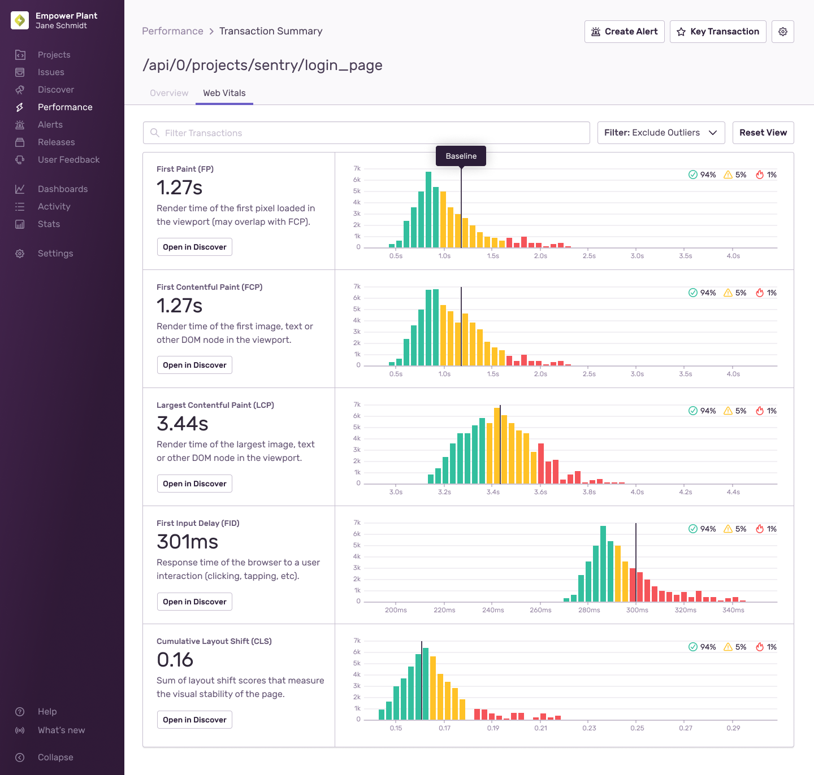

<Note>
On March 12, 2024, Google replaced [First Input Display (FID)](/product/performance/web-vitals/web-vitals-concepts/#first-input-delay-fid) with [Interaction to Next Paint (INP)](/product/performance/web-vitals/web-vitals-concepts/#interaction-to-next-paint-inp) as a Core Web Vital. To begin collecting INP measurements, make sure your Javascript SDK version is [7.104.0](https://github.com/getsentry/sentry-javascript/releases/tag/7.104.0) or higher and that the option [`enableInp`](/platforms/javascript/performance/instrumentation/automatic-instrumentation/#enableinp) is on. FID measurements are no longer shown in the **Web Vitals** page, but can still be accessed in [Discover](/product/discover-queries). You may see changes to your performance score during this transition.
</Note>

Web vitals are a set of metrics that measure the quality of the user experience on a web page. To learn more about these metrics, see [Web Vitals Concepts](/product/performance/web-vitals/web-vitals-concepts/).

In Sentry, web vitals are used to calculate a [Performance Score](#performance-score) for your web application. Using these metrics, we surface the pages that have the most [opportunity](#opportunity) to improve your app's overall performance.

## Web Vitals Page

The **Web Vitals** page, nested under the **Performance** page, gives you an overview of your page load and interaction performance for the selected project(s). You can use this page as a starting point to investigate poor Web Vitals affecting your web application and drill down to better understand which pages are affecting your web performance the most.

In the top left, the [Performance Score](#performance-score) ring shows the overall performance rating of your application. Each component of the ring represents a single Web Vital and its relative weight and impact on the Performance Score. The area chart on the right shows you a breakdown - by Web Vitals - of your performance score over time.

Below this, you can see your application's p75 vital values and the individual scores for each Web Vital. These metrics can help you prioritize which Web Vitals need attention most. Click on a Web Vital to open a more detailed summary of that metric and see which pages have the most [opportunity](#opportunity) for improvement.

At the bottom of the **Web Vitals** page, a sortable table shows a list of your application's pages, along with their associated p75 values for each Web Vital. Each page also has its own individual Performance Score. The Opportunity column displays a page score's potential improvement to your application's overall Performance Score if maximized to 100. The search bar above this table allows you to filter for specific pages by route name.

<Note>

The **Web Vitals** page only displays data from your application's initial page load transactions and interactions. Navigations are not included.

</Note>

  <iframe
    src="https://demo.arcade.software/r4sWfbdgClwhXSoM0bnJ?embed"
    frameborder="0"
    loading="lazy"
    webkitallowfullscreen
    mozallowfullscreen
    allowfullscreen
    style={{"colorScheme":"light","height":"100%","left":"0px","position":"absolute","top":"0px","width":"100%"}}
  ></iframe>

## Page Overview

From the table in **Web Vitals** or a Web Vital Summary panel, click on a page to open its **Page Overview**. Here, you can see a summary of that single page's Web Vitals. In **Page Overview**, you can further drill down to a specific page load sample [Event](/concepts/key-terms/tracing/trace-view/), [Interaction](/product/performance/web-vitals/web-vitals-concepts/#interaction-to-next-paint-inp), [Replay](/product/session-replay/), or [Profile](/product/profiling/).

The **Page Overview** page displays a "Page Loads" chart in the right sidebar of the page. A mini **Aggregate Span Waterfall** is also displayed in the right sidebar, which shows you common span paths that your application's page may take. Click the "View Full Waterfall" button or the "Aggregate Spans" tab at the top of the page to see the full **Aggregate Span Waterfall**.

  <iframe
    src="https://demo.arcade.software/xO6SXBXm0adgURZx7cWV?embed"
    frameborder="0"
    loading="lazy"
    webkitallowfullscreen
    mozallowfullscreen
    allowfullscreen
    style={{"colorScheme":"light","height":"100%","left":"0px","position":"absolute","top":"0px","width":"100%"}}
  ></iframe>

### Samples List

<Note>
The samples list only shows page loads with web vitals and performance score. If a page load is missing a required web vital, it will not be shown in the samples list. Find out which web vitals are required in the [Browser Support](/product/performance/web-vitals/web-vitals-concepts/#browser-support) table.
</Note>

At the center of the **Page Overview**, Web Vital p75 values and scores are displayed. Clicking a Web Vital score will open a slideout panel containing a variety of **Page Load** samples with good to poor scores. Each sample contains an **Event ID** that can be clicked to open the [Trace Details](/concepts/key-terms/tracing/trace-view/#product-walkthrough-trace-details-page) page for further investigation. If there is a [Replay](/product/session-replay/) or [Profile](/product/profiling/) associated with the sample page load, links will be included in the associated table columns.

  <iframe
    src="https://demo.arcade.software/rFtiXFfPG1CX1QcrgdSf?embed"
    frameborder="0"
    loading="lazy"
    webkitallowfullscreen
    mozallowfullscreen
    allowfullscreen
    style={{position: 'absolute', top: 0, left: 0, width: '100%', height: '100%', colorScheme: 'light'}}
  ></iframe>

## Performance Score

**Performance Score** is a rating from 0 to 100 that summarizes the perceived performance of your web application. Page loads and Interactions on your web application are scored based on their **Web Vitals**. Each **Web Vital** is given a rating from 0 to 100 through a [Log-Normal Distribution](https://www.desmos.com/calculator/o98tbeyt1t), which is then weighed and aggregated by page and overall for your entire web application.

The overall **Performance Score** of your web application is the weighted average of your **Page Load** and **Interaction** scores. If your web application has far more Page Load scores than Interaction scores, your overall **Performance Score** will be biased towards Page Loads, and vice versa. An equal number of Page Load and Interaction scores produces an overall **Performance Score** comprised of a 50/50 average.

<Note>
Performance Scores are currently only supported on desktop web browsers.
</Note>

A **Page Load Performance Score** is comprised of up to 4 individual **Web Vital** components found on each event. The default weights and score rating thresholds for each **Web Vital** can be found in the table below.

| Page Load Web Vital                                             | Good (90+)                                             | Meh (50+)                                              | Weight |
| --------------------------------------------------------------- | ------------------------------------------------------ | ------------------------------------------------------ | ------ |
| [Largest Contentful Paint](/product/performance/web-vitals/web-vitals-concepts/#largest-contentful-paint-lcp) (LCP) | [1200ms](https://www.desmos.com/calculator/ejhjazajbd) | [2400ms](https://www.desmos.com/calculator/ejhjazajbd) | ~42%   |
| [Cumulative Layout Shift](/product/performance/web-vitals/web-vitals-concepts/#cumulative-layout-shift-cls) (CLS)   | [0.1](https://www.desmos.com/calculator/irdoqfftdf)    | [0.25](https://www.desmos.com/calculator/irdoqfftdf)   | ~22%   |
| [First Contentful Paint](/product/performance/web-vitals/web-vitals-concepts/#first-contentful-paint-fcp) (FCP)     | [900ms](https://www.desmos.com/calculator/gcxbiypuuh)  | [1600ms](https://www.desmos.com/calculator/gcxbiypuuh) | ~22%   |
| [Time To First Byte](/product/performance/web-vitals/web-vitals-concepts/#time-to-first-byte-ttfb) (TTFB)           | [200ms](https://www.desmos.com/calculator/ykzahw9goi)  | [400ms](https://www.desmos.com/calculator/ykzahw9goi)  | ~14%   |

<Note>
Some browsers may not support all **Web Vitals** used in Sentry's **Performance Score** calculation, so weights are dynamically adjusted depending on which ones are available on the browser.

Find out which Web Vitals are required to calculate Page Load Performance Scores in the [Browser Support](/product/performance/web-vitals/web-vitals-concepts/#browser-support) table.
</Note>

An **Interaction Performance Score** is based off a single **Web Vital** component, INP (Interaction to Next Paint). The following table shows the score rating thresholds for INPs.

| Interaction Web Vital                                             | Good (90+)                                           | Meh (50+)                                              | Weight |
| --------------------------------------------------------------- | ------------------------------------------------------ | ------------------------------------------------------ | ------ |
| [Interaction to Next Paint](/product/performance/web-vitals/web-vitals-concepts/#interaction-to-next-paint-inp) (INP)   | [200ms](https://www.desmos.com/calculator/jaqxodpx8d)  | [500ms](https://www.desmos.com/calculator/jaqxodpx8d)  | 100%   |

<Note>
For an interaction to be considered an INP candidate, it must have a latency of at least [40ms](https://github.com/GoogleChrome/web-vitals/blob/v3.5.2/src/onINP.ts#L209).
</Note>

## Opportunity

**Opportunity** scores are number values associated with each page and are meant to give you a sense of which pages are most valuable to improve. The Opportunity score is the maximum possible increase to your application's overall Performance Score if you were to raise a page's score to 100. If a page in your application already has a score of 100, the Opportunity score would be 0, since there's no way to further optimize this page.

Opportunity score calculation is also weighted based on the traffic that a page sees. Pages with high traffic tend to have higher Opportunity scores. For example, a page with a score of 70 that experiences 1000 page loads a day will have a higher Opportunity score than a page with a score of 50 that experiences only 10 page loads a day.

## Distribution Histogram

The Web Vitals histogram displays data distribution, and it can help you identify and diagnose frontend performance problems by revealing anomalies.

By default, outliers will be excluded from the histograms to provide a more informative view of these vitals. Outliers are determined using the [upper outer fence](https://en.wikipedia.org/wiki/Outlier#Tukey's_fences) as the upper bound, and any data points above the upper bound are deemed an outlier.

The vertical marker for each Web Vital is the 75th percentile of the observed data points. In other words, 25% of the recorded values exceed that amount.

If you notice a region of interest on any of the histograms, click and drag over the area to zoom in for a more detailed view. You may also want to see more information related to the transactions in the histograms. Click "Open in Discover" beneath the Web Vital of choice to build a custom query for further investigation. For more details, see the full documentation for the Discover [Query Builder](/product/discover-queries/query-builder/).

If you wish to see all of the data available, open the dropdown and click "View All". You will likely see extreme outliers when you click "View All". You can click and drag over an area to zoom in for a more detailed view.
