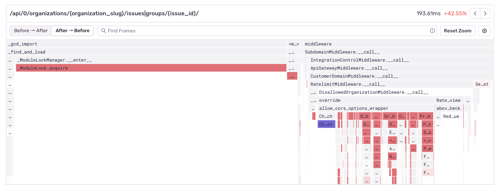
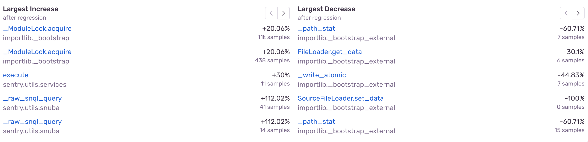

There are multiple ways to visualize and use profiling data, including differential flamegraphs, which can help easily identify function regressions or changes in the execution context.

## What Are Differential Flamegraphs?

Differential flamegraphs are graph visualizations that highlight how the call stack frequencies of a program have changed, a task which can be tedious without them. They're often used in analysis for finding function regressions and understanding which functions got slower, faster, or were newly added. Keep in mind that differential flamegraphs aren't really a new concept, but just aggregate flamegraphs drawn using the colors generated by the diff of the two.

In Sentry, differential flamegraphs are shown whenever a function regression is detected. When a regression happens, Sentry generates two aggregate flamegraphs. One from the period leading up to the regression, and another from the time right after it. A differential flamegraph is then used to visualize the difference between the two.

<Note>

In a differential flamegraph, the color red means that a function's execution time has increased or that there's a newly present function. The color blue means that the execution time has decreased.

</Note>

Be on the lookout for red frames when interpreting differential flamegraphs. They're the reason why your application code has been performing worse.

The differential flamegraph above is showing that the function call to `ModuleLock.acquire` has increased in duration, hinting at a lock contention problem which is slowing down the code.

Let's look at another example:

The above differential flamegraph shows that new function calls to `OrganizationTeamsEndpoint.dispatch` were introduced, which made the code run slower, while calls to `ChunkUploadEndpoint.get` decreased.

If you look closely, you'll notice that the top right corner has a `Before -> After` and `After -> Before` toggle. This is because by default, differential flamegraphs draw the aggregate flamegraph from after a regression has occurred as the source of truth. This means that any code that may have been removed, will no longer be drawn (after all, it's not there anymore). This is why negating the view is useful, as it allows us to compare the data from before and peek into the future of how our code will change.

``
Here's an example of what our module lock problem looks like when using the profiling data from after the regression has occurred as the source of truth:

And here's what it looks like if we're using the data from before the regression occurred as our source of truth:

By using the `Before -> After` toggle we can see that `ModuleLock.acquire` was faster before the regression, but we can also see some of the function calls inside our `ChunkUploadEndpoint`, which are no longer being called.

While differential flamegraphs in Sentry use a different color scheme and pull from a different source of data than regular flamegraphs, you can pan and zoom around the chart and search for frames the same way you do with regular flamegraph.

The table under the differential flamegraph shows both the largest increases and the largest decreases in function duration.

Differential flamegraphs are a good way to quickly visualize potential sources of performance regressions or improvements. Currently, they're only available as part of the automated function regression workflow, but we're working on adding them to other parts of the profiling workflow.
