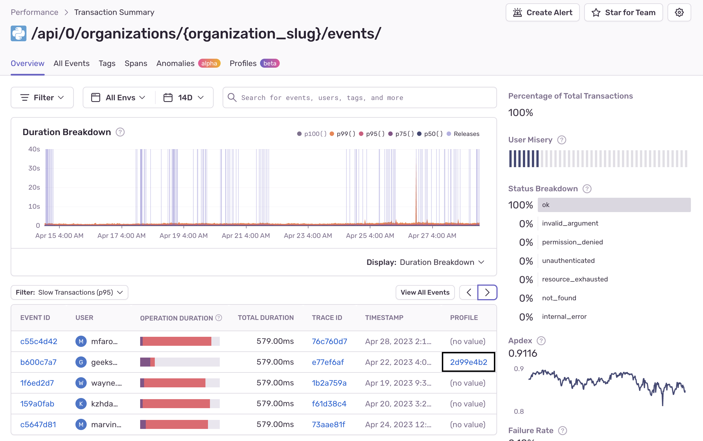
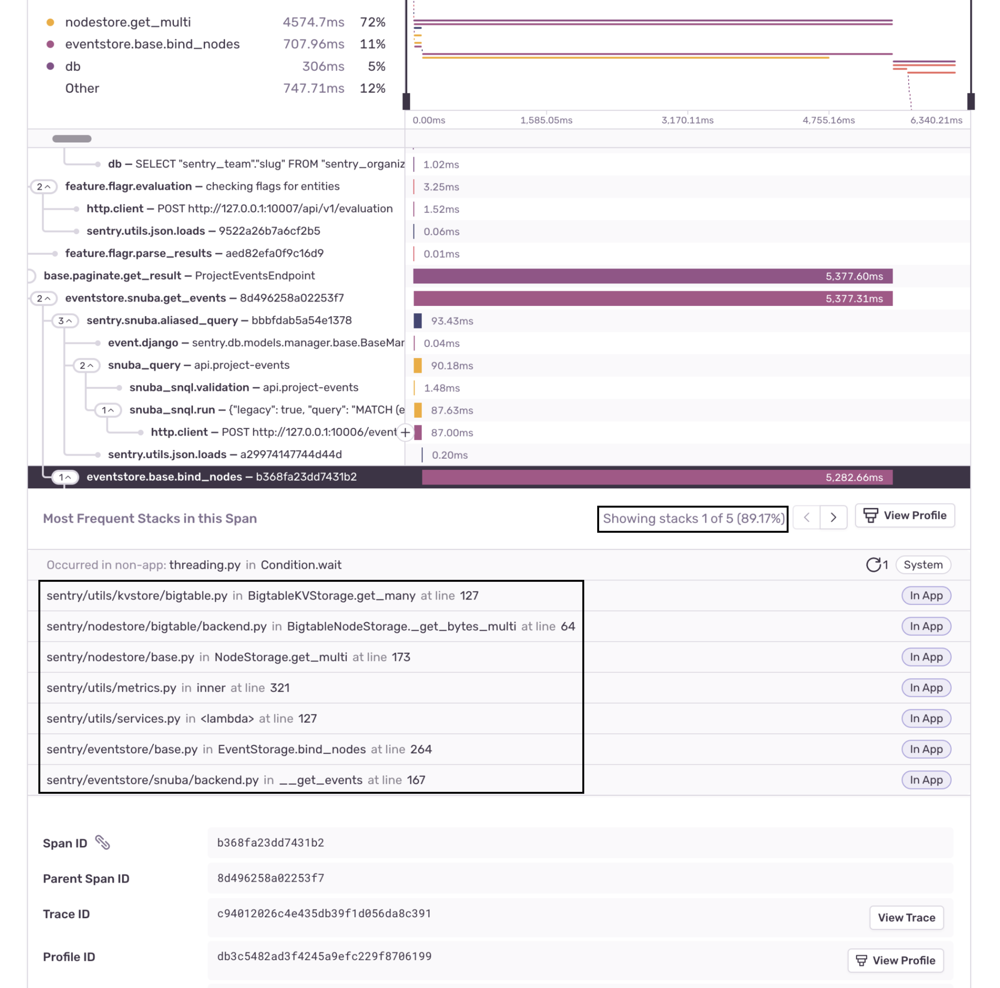
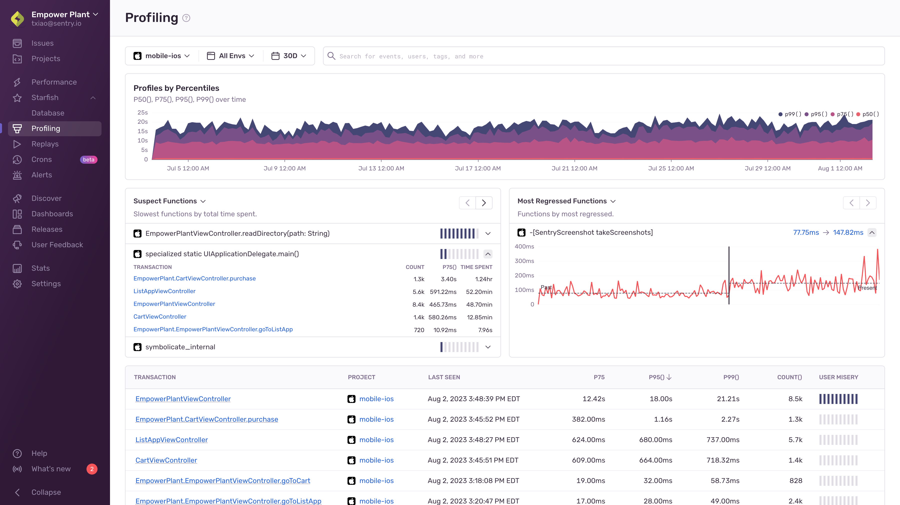

<Note>

**The currently supported platforms are:**

- [Android (Java and Kotlin only)](/platforms/android/profiling/)
- [iOS and macOS (Swift and Objective-C only)](/platforms/apple/profiling/)
- [Flutter [experimental, iOS and macOS only]](/platforms/flutter/profiling/)
- [Python](/platforms/python/profiling/)
- [.NET [experimental]](/platforms/dotnet/profiling/)
- [Node.js](/platforms/javascript/guides/node/profiling/)
- [PHP (including Laravel and Symfony)](/platforms/php/profiling/)
- [Browser JavaScript [beta]](/platforms/javascript/profiling/)
- [Go [experimental]](/platforms/go/profiling/)
- [Ruby [beta]](/platforms/ruby/profiling/)
- [React Native [beta]](/platforms/react-native/profiling/)

</Note>

Sentry's profiling feature builds upon our established [Performance Monitoring](/product/performance) capabilities to provide precise code-level visibility into application execution in a production environment. Profiling provides context at a deeper level than traditional tracing, enabling you to visualize the precise details of the call stack without the need for custom instrumentation. With Profiling you can quickly identify hot paths in your code and understand potential performance bottlenecks, enabling you to build in [performance as a feature](https://blog.codinghorror.com/performance-is-a-feature/) from day one.

Sentry profiling supports common platforms for both Mobile and Backend applications:

- [Mobile app profiling](/product/profiling/mobile-app-profiling/) makes it possible to collect **profiles from real devices in production**, providing a complete picture of how the app performs in a variety of environments.
- Backend platform profiling makes it possible to easily target the essential code that yields the biggest improvements in backend throughput and resource utilization.

## Zooming In From Performance to Profiling

Sentry profiling data is structured as an extension of performance transactions. This means you can "zoom in" on transactions to see their profiles directly by clicking on any transaction on the **Performance** page.

This will take you to the **Transaction Summary** page where you'll see a list of transaction events.

Transaction events that have a profile contain a link in the "Profile" column which will take you to a flame graph with details about that event. Learn how to read [Flame Graphs and Aggregated Flame Graphs](/product/profiling/flame-charts-graphs).

Alternatively, if you click on the "Event ID" for a transaction, you'll see a span waterfall where you can identify suspect spans - operations that may be impacting performance, including slow DB queries and HTTP requests. You can click on a span to see profile information, including the most frequently occurring code path (call stack with with exact line numbers), along with the approximate percentage of time required for that code path.

From this view, you can also click "View Profile" to zoom in on the flame graph.

## Profiling Page

The **Profiling** page shows a list of transactions in descending order of execution time for your selected project(s).

The "Profiles by Percentiles" timeline chart can be used to filter the transaction data by highlighting the desired time period. Below that, there are three widgets to choose from.

The "Slowest Functions" widget shows you a list of the functions that took the most time in your application. It lists the transactions the function was called from. Clicking on a transaction will take you to an example profile. The "Most Regressed Functions" and "Most Improved Functions" widgets show you a list of the functions that have gotten slower/faster over time. Clicking on the timings will take you to an example from either before/after the detected regression/improvement.

Using the Profiling page is typically an advanced workflow, enabling you to directly select transactions of interest and examine detailed profiling data.

## Profiling Summary Page

Selecting one of the transactions will take you to the **Profile Summary** page below. On this page, you can examine the aggregated information of this profile.

While the **Profiling** page can be used to view information about the profiles in our application, the **Profile Summary** page shows aggregated information from profiles collected under a single type of transaction.

This information allows you to dive deeper into what your code was executing during this transaction and may get you closer to the root of the problem.

The top of the page has a percentile chart with profile durations and a search bar. It helps you visually identify possible performance regressions or changes. You can isolate the date-time ranges you want to investigate by clicking and dragging it. If you want to narrow down your investigation to profiles executed under a specific environment, use the search bar filters.

The bottom right side of the page has aggregated information about function regressions detected during your selected time range plus, a list of the slowest functions. There's also a list of general information about the profile including:

- When the profile was last seen
- The total number of profiles collected for this transaction
- p75, p95, and p99 values

Below the general information is a list of regressions that Sentry may have detected. Clicking the before/after timings in the regressed function list will take you to example flamecharts of the before and after execution so that you can investigate what changed.

There's also a list of the slowest functions which are consuming the most time in your application. These are good candidates for optimization.

On the left side of the page is an aggregate flamegraph as well as a digest of the slowest and most regressed functions. We recommend looking for wide frames that have no children as a starting point. This will allow you to identify frames that are often occupying the stack and make good candidates for optimization. Read the [Flame Graphs and Aggregated Flame Graphs](/product/profiling/flame-charts-graphs) docs if you'd like a deeper understanding of this data.

An alternative way to visualize the flamegraph is by clicking on the "Call Tree" button which will render the flamegraph as an inverted call tree with the leftmost nodes first, which will then expand to their parent nodes. The sample column in the call tree represents the frequency with which Profiling collected stack samples where that function was on the stack. You can expand the tree by clicking on the caret before the function name. (Holding ⌘ at the same time will expand that entire branch all the way to the root.)

## Learn More

To learn more about profiling tools, read the docs about [Flame Graphs and Aggregated Flame Graphs](/product/profiling/flame-charts-graphs).

<PageGrid />
