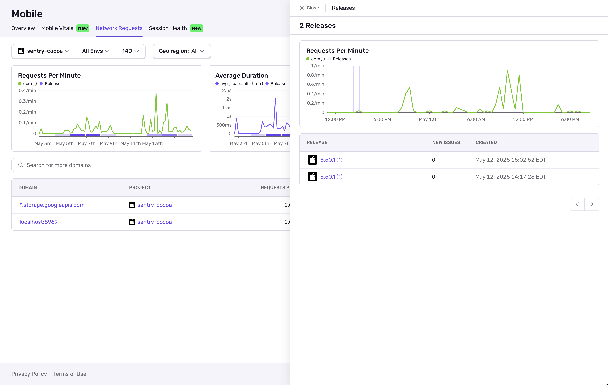

## Charts

In most charts, releases are grouped up and displayed as colored boxes underneath the chart. Hovering over the boxes shows a tooltip with the number of releases in that group. Clicking on a box opens a flyout drawer to let you explore the releases within that group.

## Releases List Drawer

Clicking on a release box underneath a chart opens a flyout drawer showing a zoomed-in view of the chart that was clicked on. This zoomed-in chart has the same time interval as the clicked releases box. There is also a table with a list of the releases inside that time interval. Selecting a single release from the chart or the table will open its details inside of the drawer.

## Release Details Drawer

The Release Details drawer gives a quick view of a release without leaving the current page. It shows new issues, commits, and files in the release. If you want to explore the Release further, you can click the "View Full Details" button in the top right corner of the flyout.

## Release Version Link

Outside of the **Releases List** page, hovering over any release version link will open a tooltip, showing a tiny preview of the release.

Clicking the link will open the [Release Details drawer](#release-details-drawer) with more details of the release, without leaving the current page.
