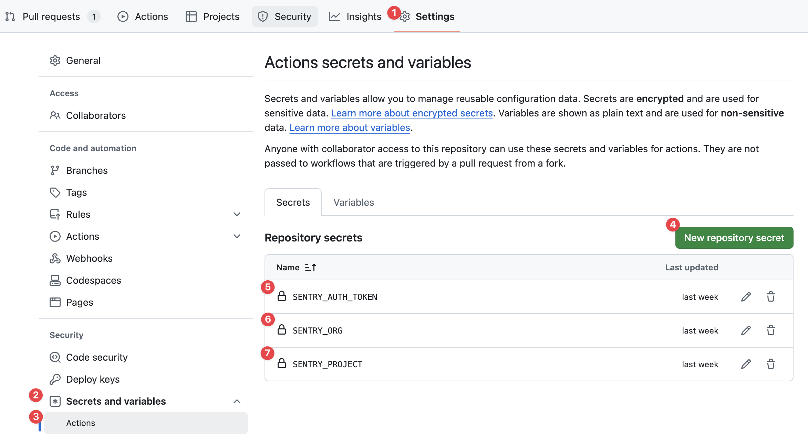

The [Sentry Release GitHub Action](https://github.com/marketplace/actions/sentry-release) automates Sentry release management in GitHub with just one step. After sending Sentry release information, you’ll be able to associate commits with releases. Additionally, you can upload source maps to view original, un-minified source code.

For more details about Sentry release management concepts, see the full documentation on [releases](/product/releases/).

## Prerequisites

For the Sentry Release GitHub action to communicate securely with Sentry, you'll need to configure an [Organization Auth Token](https://sentry.io/orgredirect/organizations/:orgslug/settings/auth-tokens/).


You also need to set your Organization and Project slugs and if you're using a self-hosted Sentry instance, provide the URL used to connect to Sentry via `SENTRY_URL`.

<OrgAuthTokenNote />

```bash
SENTRY_AUTH_TOKEN=___ORG_AUTH_TOKEN___
SENTRY_ORG=___ORG_SLUG___
SENTRY_PROJECT=___PROJECT_SLUG___
# For self-hosted
# SENTRY_URL=https://my-sentry-url
```

We recommend storing these as [encrypted secrets](https://docs.github.com/en/actions/security-for-github-actions/security-guides/using-secrets-in-github-actions) on your repository.

To set repository secrets, click on your repository **Settings ①**, select **Secrets and variables ②** from the sidebar and click on **Actions ③**. Click on the **New repository secret ④** and add the secrets **`SENTRY_AUTH_TOKEN` ⑤**, **`SENTRY_ORG` ⑥** and **`SENTRY_PROJECT` ⑦**.



## Releases

You can create a new Sentry release by setting the `version` option. By default, the Sentry Release GitHub action will use the GitHub sha that triggered the GitHub workflow.

```yml
- uses: actions/checkout@v4
  with:
    fetch-depth: 0

- name: Create Sentry release
  uses: getsentry/action-release@v1
  env:
    SENTRY_AUTH_TOKEN: ${{ secrets.SENTRY_AUTH_TOKEN }}
    SENTRY_ORG: ${{ secrets.SENTRY_ORG }}
    SENTRY_PROJECT: ${{ secrets.SENTRY_PROJECT }}
  with:
    environment: production
    version: 'v1.3.4'
```

## Source Maps

If your application is written in JavaScript you probably deploy minified application code. To enable readable
stack traces in your Sentry errors, you need to upload source maps to Sentry.

Provide the path(s) to your source maps via the `sourcemaps` option and set the `inject` flag to allow the GitHub
action to inject information into your source files and source maps to ensure proper un-minification of your stack traces.
Visit [What are Artifact Bundles](/platforms/javascript/sourcemaps/troubleshooting_js/artifact-bundles/) if you want to learn more.

```yml
- uses: actions/checkout@v4
  with:
    fetch-depth: 0

- name: Create Sentry release
  uses: getsentry/action-release@v1
  env:
    SENTRY_AUTH_TOKEN: ${{ secrets.SENTRY_AUTH_TOKEN }}
    SENTRY_ORG: ${{ secrets.SENTRY_ORG }}
    SENTRY_PROJECT: ${{ secrets.SENTRY_PROJECT }}
  with:
    environment: production
    inject: true
    sourcemaps: './dist'
```

<Alert>

  It's important the Sentry Release GitHub Actions runs after any build steps in your pipeline but before deployment and
  to deploy the files that have been built after the action runs so that Sentry can properly un-minify stack traces for you.

</Alert>
