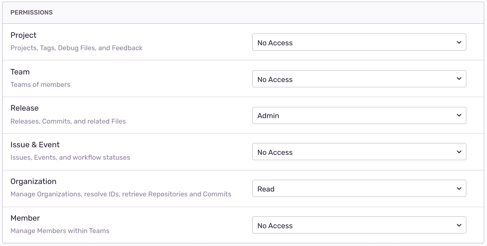

This guide walks you through the process of automating Sentry release management and deploy notifications in [RWX](https://www.rwx.com/). After deploying with RWX, you'll be able to associate commits with releases. You'll also be able to apply source maps to see the original code in Sentry.

Before starting, confirm that your Sentry project is properly set up to track commit metadata by [installing a repository integration](/product/releases/setup/release-automation/). Once that's installed, and you've added your repository, come back to this guide. If you've already installed a repository integration, you're ready to go.

## Create a Sentry Internal Integration

For RWX to communicate securely with Sentry, you'll need to create a new internal integration. In Sentry, navigate to **Settings > Developer Settings > New Internal Integration**.

Give your new integration a name (for example, "RWX Deploy Integration") and specify the necessary permissions. In this case, you need Admin access for "Release" and Read access for "Organization".

For more details about scopes and API endpoints, see the full documentation on [API Permissions](/api/permissions/).



Click "Save", then record your token, which you'll need in the next section.

## Configure Secrets and Vars in RWX

Store your Sentry auth token as a [secret](https://www.rwx.com/docs/secrets) in an RWX [vault](https://www.rwx.com/docs/vaults). Using the default vault:

<OrgAuthTokenNote />

```bash
rwx vaults secrets set sentry-auth-token=___ORG_AUTH_TOKEN___
```

You'll reference it from a run as `${{ secrets.sentry-auth-token }}`.

## Create Release and Notify Sentry of Deployment

To automate your Sentry release management process, add a `sentry-release` task that runs [after](https://www.rwx.com/docs/after) your deploy task succeeds. This example installs `sentry-cli` in its own task so it can be cached and reused across runs:

```yaml
on:
  github:
    push:
      init:
        commit-sha: ${{ event.git.sha }}

base:
  image: ubuntu:24.04
  config: rwx/base 1.0.2

tasks:
  - key: code
    call: git/clone 2.0.7
    with:
      repository: https://github.com/YOUR-ORG/YOUR-REPO.git
      ref: ${{ init.commit-sha }}
      github-token: ${{ github.token }}
      preserve-git-dir: true

  - key: deploy
    use: code
    run: ./bin/deploy

  - key: sentry-cli
    run: |
      mkdir -p bin
      curl -sL https://sentry.io/get-cli/ | INSTALL_DIR=$PWD/bin bash
      echo "$PWD/bin" > $RWX_ENV/PATH

  - key: sentry-release
    use: [code, sentry-cli]
    after: deploy
    run: |
      export SENTRY_RELEASE=$(sentry-cli releases propose-version)
      sentry-cli releases new -p $SENTRY_PROJECT $SENTRY_RELEASE
      sentry-cli releases set-commits $SENTRY_RELEASE --auto
      sentry-cli sourcemaps upload --release $SENTRY_RELEASE path-to-sourcemaps-if-applicable
      sentry-cli releases finalize $SENTRY_RELEASE
      sentry-cli deploys new -e $SENTRY_ENVIRONMENT
    env:
      SENTRY_AUTH_TOKEN: ${{ secrets.sentry-auth-token }}
      SENTRY_ORG: ___ORG_SLUG___
      SENTRY_PROJECT: ___PROJECT_SLUG___
      SENTRY_ENVIRONMENT: production
```

For more details about the release management concepts in the snippet above, see the full documentation on [release management](/cli/releases/).

For more information on release management within RWX, see [their docs](https://www.rwx.com/docs/guides/sentry-release).
