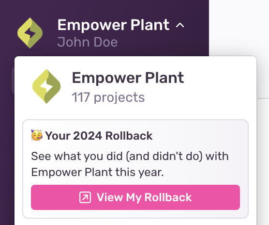

Sentry Rollback is a personalized wrap-up for each team member to look back at their year with Sentry. They will find illustrated content about how they and their organization used Sentry in 2024.

## When will Rollback be available?

Rollback will be available from December 10, 2024 to February 1, 2025.

## Which organizations are eligible for the experience?

Organizations with one or more members who viewed the Sentry app at least once in 2024 are eligible. Single-tenant organizations will not have a Rollback.

## Which members have access to Rollback?

Members will receive a Rollback for each organization they belong to, provided that they have interacted with that organization at least once in 2024. If a Rollback is available, a link will be located in the organization dropdown:

## What data is being used to power Rollback?

Qualifying members in eligible organizations will see data about their usage of  Sentry, as well as aggregated (in the form of averages and totals) data about their organization’s usage, for comparative purposes. For example, a particular member may see that they resolved 4 issues in 2024, compared to an average of 2 in their organization. Usage data includes:

- Account age
- Number of issues viewed, resolved, ignored, and assigned
- Number of times the user was mentioned in a suspect commit
- Number of times the user clicked play on a Replay
- Page views

## Can members share their Sentry Rollback experience?

Members may choose to share a summary card of their Rollback data at the end of the experience. This summary card contains only information about the member’s usage, without any of the organization-level comparative baselines.

## Can Sentry Rollback be turned off?

 Yes. Organization owners and managers can disable Sentry Rollback for their entire organization in [settings](https://sentry.io/settings/organization/).

## Learn More

<PageGrid />
