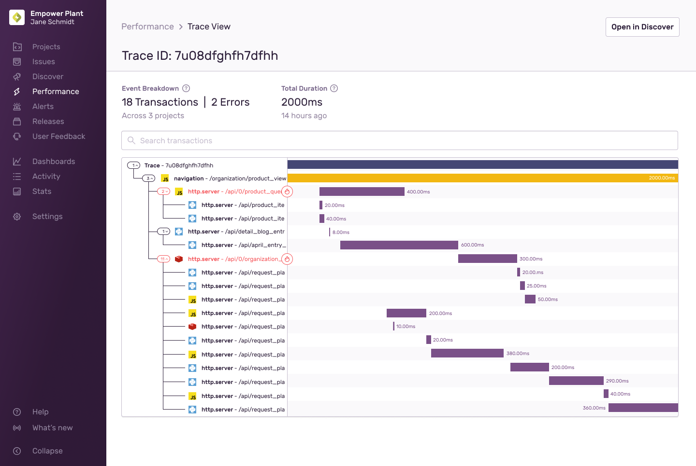

The trace view is designed to be your one-stop-shop when debugging performance or errors. It gives you full context on what was happening when an error or performance issue occurred, all in one place. The waterfall trace view allows you to see everything that may have occurred during a trace, including errors, performance issues, and any profiles that may have been collected.

The trace view allows you to drill down into the details of a single trace and visualize the high level transactions and spans that occurred withing that trace. This accelerate your ability to debug slow services, identify related errors, and root out bottlenecks without having to navigate around the Sentry product.

Sentry's default visualization of a trace is a waterfall like structure where the entries in the list represent chronological order, as well as ancestry. This means that you can follow the order of operations as well as track sub-operations.

The left side of the view shows the textual representation of operations while the right side shows their duration and any events which may have occurred during that time, like for example errors.

By default, the waterfall view will show you a list of transactions, however sometimes you need more granular data (spans). When that happens, click the + button on the left, and the waterfall will update to include the list of spans.

  <iframe
    src="https://demo.arcade.software/25H9paIDvBOQp5T3pFeW?embed&show_copy_link=true"
    title="Trace Details — Performance — sentry — Sentry"
    frameborder="0"
    loading="lazy"
    webkitallowfullscreen
    mozallowfullscreen
    allowfullscreen
    allow="clipboard-write"
    style={{
      colorScheme: "light",
      height: "100%",
      left: "0px",
      position: "absolute",
      top: "0px",
      width: "100%",
    }}
    title="Trace view -> Error"
  ></iframe>

In a similar sense, the view will surface any performance issues or profiles collected during that time.

Debugging is often not done alone, more often than not, it involves multiple people or teams, teams who might not share the same physical location. When that happens and you need to share links to your colleagues or highlight certain areas of the trace, simply click on the row in the list and share the URL - the person opening the link will land exactly where you are. The same goes for navigation, if you click on any row in the list, you can still navigate away from the page and your browsers back/forward buttons will bring you right back to where you left off.

If you have highlighted areas of interest in your trace and want an easy way to switch between them, like for example to perform comparison, simply pin the tabs. When a tab is pinned, it will be persisted througout the session. Focusing on a tab will take you right to it's entry in the list, so you will always know exactly where is, without having to do any manual scrolling.

  <iframe
    src="https://demo.arcade.software/yP3PFytK0ckfetjJTe52?embed&show_copy_link=true"
    title="Sentry"
    frameborder="0"
    loading="lazy"
    webkitallowfullscreen
    mozallowfullscreen
    allowfullscreen
    allow="clipboard-write"
    style={{
      colorScheme: "light",
      height: "100%",
      left: "0px",
      position: "absolute",
      top: "0px",
      width: "100%",
    }}
    title="Trace view - Tabbing"
  ></iframe>

Sometimes, duration gaps between entries can be very small, yet still very critical to your debugging effort, this is why the new view enables you to zoom into certain areas of the trace, either by double clicking on row elements, which zooms into the row you are scrolling to, or by using your mouse wheel.

  <iframe
    src="https://demo.arcade.software/U8JbMjFJR1KRiP4G4j4E?embed&show_copy_link=true"
    title="Trace Details — Performance — sentry — Sentry"
    frameborder="0"
    loading="lazy"
    webkitallowfullscreen
    mozallowfullscreen
    allowfullscreen
    allow="clipboard-write"
    style={{
      colorScheme: "light",
      height: "100%",
      left: "0px",
      position: "absolute",
      top: "0px",
      width: "100%",
    }}
    title="Trace view - Zooming"
  ></iframe>

The trace view has other features like search, which makes it easy for you to visualize matching spans and iterate over them by pressing the up or down arrow keys as well as tailoring the layout to your preferences. That said, this is not then end, and we are going to continue adding features that enable you to perform efficient investigation into whatever issues you are facing. If you have feedback or requests, please dont hesitate to reach out as we would love to hear how we can make your life easiers.
