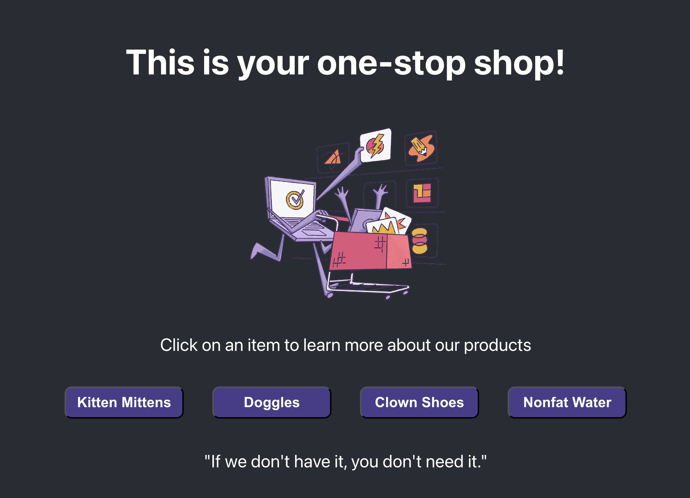

This section walks you through how to import the sample application into your local development environment, add the Sentry SDK, and initialize it.

If you're using your own source code, you can skip this section. Instead:

- Select your [platform](/platforms/) and follow its **Getting Started** guide to add the Sentry SDK to your code.
- Then, skip to the [next step](/product/sentry-basics/distributed-tracing/initialize-sentry-sdk-backend/).

## 1. Clone the Sample Application

The sample application is a basic frontend-only application using React and webpack.

1. Fork the [sample application's repository](https://github.com/getsentry/tracing-tutorial-frontend) on GitHub.

1. Clone the forked repository to your local environment:

   ```bash
   git clone git@github.com:<your_username>/tracing-tutorial-frontend.git
   ```

1. Open the `tracing-tutorial-frontend` project in your preferred code editor.

## 2. Add the Sentry React SDK

Sentry captures data by using a platform-specific SDK that you add to your application's runtime. To use the SDK, import and configure it in your source code. This demo project uses [Sentry's React SDK](https://github.com/getsentry/sentry-javascript/tree/develop/packages/react).

1. Install the Sentry React SDK using NPM.

   Make sure you're in the `tracing-tutorial-frontend` project folder.

   ```bash {tabTitle:npm}
   npm install @sentry/react --save
   ```

   ```bash {tabTitle:yarn}
   yarn add @sentry/react
   ```

   ```bash {tabTitle:pnpm}
   pnpm add @sentry/react
   ```

1. Import and initialize the SDK.

   Open `src/index.js` and add the following lines of code below the last import statement:

   ```javascript {filename:src/index.js} {12}
   import * as Sentry from "@sentry/react";

   Sentry.init({
     dsn: "your_DSN_key",
     integrations: [
       Sentry.browserTracingIntegration(),
       Sentry.replayIntegration(),
     ],
     // Tracing
     tracesSampleRate: 1.0, //  Capture 100% of the transactions
     // Set 'tracePropagationTargets' to control for which URLs distributed tracing should be enabled
     tracePropagationTargets: ["localhost", /^https:\/\/yourserver\.io\/api/],
     // Session Replay
     replaysSessionSampleRate: 0.1, // This sets the sample rate at 10%. You may want to change it to 100% while in development and then sample at a lower rate in production.
     replaysOnErrorSampleRate: 1.0, // If you're not already sampling the entire session, change the sample rate to 100% when sampling sessions where errors occur.
   });
   ```

   It's important to import and initialize the SDK as early as possible in your application's lifecycle so Sentry can capture errors throughout the lifecycle.

1. Add your DSN key to the Sentry SDK configuration.

   Paste in the DSN key value you copied from the project created in the [previous section](/product/sentry-basics/distributed-tracing/create-new-project/).

   ```javascript {filename:src/index.js}
   Sentry.init({
     dsn: "<your_DSN_key>",
     // ...
   });
   ```

1. Save the file.

The options set in `Sentry.init()` are called the SDK's configuration. The only required configuration option is the DSN. However, the SDK supports many other configuration options. Learn more in our [Configuration](/platforms/javascript/guides/react/configuration/) docs.

The configuration above enables Sentry's error monitoring feature, as well as [**Tracing**](/product/tracing/) and [**Session Replay**](/platforms/javascript/guides/react/session-replay) features. Take note of the `tracePropagationTargets` option, this is required to enable tracing on any urls your projects are running on. Since both of this tutorial's projects are running on `localhost`, we are all set.


## 3. Build and Run the Sample Application

In the `tracing-tutorial-frontend` project folder:

1. Install project dependencies.

   ```bash
   npm install
   ```

1. Start the application in develop mode.

   ```bash
   npm start
   ```

   Once the application starts, you'll see a confirmation message similar to this one in your terminal:

   ```bash
   Compiled successfully!

   You can now view tracing-demo in the browser.

      Local:            http://localhost:3000
      On Your Network:  http://10.0.0.39:3000
   ```

   > **Troubleshooting tip**: If the application fails to start due to syntax errors or errors for missing dependencies/modules, make sure you're using Node 18+ and install dependencies again. If you're using [nvm](https://github.com/nvm-sh/nvm), ensure you are on the right node version with `nvm use 18` and then `npm install`.

1. Open the sample application in your browser.

   The sample app should be running at [http://localhost:3000/](http://localhost:3000/) or the URL output in your terminal in the last step. You should see a sample e-commerce page; the buttons on this page won't work correctly and will trigger an uncaught runtime error until you get your backend up and running.

   

## Next

Nicely done! You now have a sample React app running with the Sentry SDK initialized. Next, [Add the Sentry SDK to Your Backend Project](/product/sentry-basics/distributed-tracing/initialize-sentry-sdk-backend/) to get Sentry running across the entire stack of your platform.
