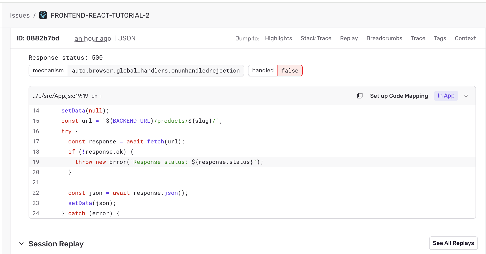

<Alert title="Optional step">

You've already set up distributed tracing across your stack in the previous steps. This step and the [next one](/product/sentry-basics/getting-started-tutorial/configure-suspect-commits/) are optional enhancements — worth doing, but not required.

</Alert>

When you ship JavaScript to production, your code is transformed — bundled, minified, and sometimes transpiled — to make it smaller and faster in the browser. That transformation makes stack traces unreadable: instead of the line of code that failed, you see something like `a.b.c at index-J_blQJy.js:1:21834`.

Source maps are the bridge back. They tell Sentry how to map the minified output to your original source. In this step, you'll generate source maps for the frontend app, upload them to Sentry, and trigger another error to see the difference.

{/* TODO: Screenshot showing a minified "before" stack trace next to a readable "after" stack trace. */}

The sample frontend app uses [Vite](https://vite.dev/) as its build tool, and the [Sentry Vite plugin](/platforms/javascript/guides/react/sourcemaps/uploading/vite/) both generates source maps and uploads them as part of your production build.

> Using a different bundler? Use the [Sentry Wizard](/platforms/javascript/sourcemaps/#uploading-source-maps) to configure source maps for webpack, Rollup, esbuild, Next.js, and others, then skip to step 3.

## 1. Install the Sentry Vite Plugin

In the `tracing-tutorial-frontend` project folder, install the plugin as a dev dependency:

```bash {tabTitle:npm}
npm install @sentry/vite-plugin --save-dev
```

```bash {tabTitle:yarn}
yarn add @sentry/vite-plugin --dev
```

```bash {tabTitle:pnpm}
pnpm add @sentry/vite-plugin --save-dev
```

## 2. Add an Auth Token

To upload source maps, the plugin needs an _auth token_ — a secret key that tells Sentry the upload is coming from you. You'll keep this token in a separate file instead of writing it directly into your code, so it stays private.

<OrgAuthTokenNote />

The Sentry Vite plugin automatically reads your token from a file named exactly `.env.sentry-build-plugin`. Create that file now:

1. In the **root** of the `tracing-tutorial-frontend` folder (the same folder that contains `package.json`), create a new file named exactly `.env.sentry-build-plugin` — including the leading dot.

1. Add your auth token to the file, replacing `___ORG_AUTH_TOKEN___` with the token you generated above:

   ```bash {filename:.env.sentry-build-plugin}
   SENTRY_AUTH_TOKEN=___ORG_AUTH_TOKEN___
   ```

1. Save the file. The sample project's `.gitignore` already lists `.env.sentry-build-plugin`, so your token won't be committed to git — keep it that way. Auth tokens should never be shared or pushed to a repository.

## 3. Configure the Plugin

Next, tell the plugin which Sentry **organization** and **project** to upload your source maps to. You'll need two values, both of which are _slugs_ — the short, lowercase names Sentry uses in URLs.

Here's how to find each one in Sentry:

- **Organization slug**: look at your Sentry URL — it's the part right before `.sentry.io`. For example, in `https://acme-inc.sentry.io/`, the organization slug is `acme-inc`. You can also find it under **Settings > General Settings**.
- **Project slug**: in the left sidebar, go to **Settings > Projects**, then click the **frontend** project you created earlier (not the backend one). The project slug is shown at the top of that project's settings page and in the page's URL.

Now open `vite.config.js` and add `sentryVitePlugin` as shown below, replacing `___ORG_SLUG___` and `___PROJECT_SLUG___` with the two values you just found:

```javascript {filename:vite.config.js}
import { defineConfig } from "vite";
import react from "@vitejs/plugin-react";
import { sentryVitePlugin } from "@sentry/vite-plugin";

export default defineConfig({
  build: {
    sourcemap: true,
  },
  plugins: [
    react(),
    sentryVitePlugin({
      org: "___ORG_SLUG___",
      project: "___PROJECT_SLUG___",
    }),
  ],
  server: {
    port: 3000,
  },
});
```

<Alert>

Your `org` and `project` here must point to the **same frontend project** as the DSN in `src/main.jsx`. Source maps are matched within a project — if your maps upload to one project but your errors report to another, Sentry won't be able to un-minify them.

</Alert>

By default, the plugin deletes the source map files from your build output after uploading them, so they're not served to your users in production.

## 4. Trigger the Error Again

1. Stop your dev server with `Ctrl + C` and create a production build:

   ```bash {tabTitle:npm}
   npm run build
   ```

   ```bash {tabTitle:yarn}
   yarn build
   ```

   ```bash {tabTitle:pnpm}
   pnpm build
   ```

   Look for the `Source Map Upload Report` in the output — it confirms the maps reached Sentry and lists each file by debug ID:

   ```bash
   > Analyzing 2 sources
   > Adding source map references
   > Bundling files for upload
   > Uploaded files to Sentry
   > Successfully uploaded source maps to Sentry
   ```

2. Serve the production build:

   ```bash {tabTitle:npm}
   npm run preview
   ```

   ```bash {tabTitle:yarn}
   yarn preview
   ```

   ```bash {tabTitle:pnpm}
   pnpm preview
   ```

3. Open the app (make sure the backend is still running on `http://localhost:3001`), open your browser's dev console, and perform an "Empty Cache and Hard Reload" so the new build is served. Then trigger the cross-project error again by clicking the **Nonfat Water** button.

4. Go to the **Issues** page in Sentry and open the new issue.

{/* TODO: Arcade walking through the rebuilt error and the un-minified stack trace. */}

The stack trace should now include file names, function names, line numbers, and the surrounding source code — the actual code that failed, instead of minified output.



## Next

Now Sentry can show you _where_ in your code an error happened. Next, [Configure Suspect Commits & Stack Trace Linking](/product/sentry-basics/getting-started-tutorial/configure-suspect-commits/) so it can also tell you _who_ likely introduced it and let you jump straight to the line on GitHub.
