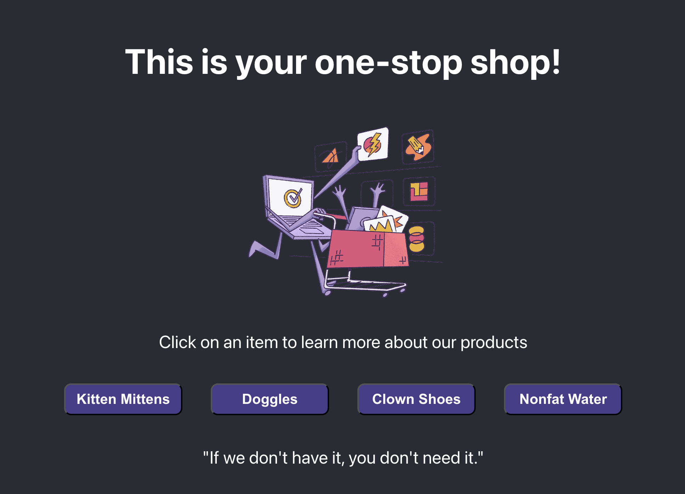

This section walks you through how to import the sample app into your local dev environment, then add and initialize the Sentry SDK.

If you're using your own source code, you can skip this section. Instead:

- Select your [platform](/platforms/) and follow its **Getting Started** guide to add the Sentry SDK to your code.
- Then, skip to the [next step](/product/sentry-basics/getting-started-tutorial/initialize-sentry-sdk-backend/).

## 1. Clone the Sample Application

The sample application is a frontend app built with React and [Vite](https://vite.dev/).

1. Fork the [sample application's repository](https://github.com/getsentry/tracing-tutorial-frontend) on GitHub.

1. Clone the forked repository to your local environment:

   ```bash
   git clone git@github.com:<your_username>/tracing-tutorial-frontend.git
   ```

1. Open the `tracing-tutorial-frontend` project in your preferred code editor.

## 2. Add the Sentry React SDK

Sentry captures data using a platform-specific SDK that you add to your app's runtime. To use the SDK, import and configure it in your source code. This demo project uses [Sentry's React SDK](https://github.com/getsentry/sentry-javascript/tree/develop/packages/react).

1. Install the Sentry React SDK.

   Make sure you're in the `tracing-tutorial-frontend` project folder.

   ```bash {tabTitle:npm}
   npm install @sentry/react --save
   ```

   ```bash {tabTitle:yarn}
   yarn add @sentry/react
   ```

   ```bash {tabTitle:pnpm}
   pnpm add @sentry/react
   ```

1. Import and Initialize the SDK.

   Open `src/main.jsx` and add the following lines of code below the last import statement. It's important to import and initialize the SDK as early as possible in your app's lifecycle so Sentry can capture errors throughout it.

   ```javascript {filename:src/main.jsx}
   import * as Sentry from "@sentry/react";

   Sentry.init({
     dsn: "<your_DSN_key>",
     integrations: [
       Sentry.browserTracingIntegration(),
       Sentry.replayIntegration(),
     ],
     // Capture 100% of transactions for tracing.
     tracesSampleRate: 1.0,
     // Enable distributed tracing for requests to these targets.
     tracePropagationTargets: ["localhost", /^https:\/\/yourserver\.io\/api/],
     // Session Replay sample rates.
     replaysSessionSampleRate: 0.1,
     replaysOnErrorSampleRate: 1.0,
   });
   ```

1. Add your DSN key to the Sentry SDK configuration.

   Replace `<your_DSN_key>` in the sample above with the DSN key value you copied from the frontend project you created in the [previous section](/product/sentry-basics/getting-started-tutorial/create-new-project/).

1. Save the file.

The options set in `Sentry.init()` are called the SDK's configuration. The only required option is the DSN; the SDK supports many others, which you can read about in our [Configuration](/platforms/javascript/guides/react/configuration/) docs.

The configuration above enables Sentry's error monitoring, [**Tracing**](/product/tracing/), and [**Session Replay**](/platforms/javascript/guides/react/session-replay/) features. The `tracePropagationTargets` option controls which URLs distributed tracing is enabled for. Since both of this tutorial's apps run on `localhost`, you're all set.


## 3. Build and Run the Sample Application

In the `tracing-tutorial-frontend` project folder:

1. Install project dependencies.

   ```bash {tabTitle:npm}
   npm install
   ```

   ```bash {tabTitle:yarn}
   yarn
   ```

   ```bash {tabTitle:pnpm}
   pnpm install
   ```

1. Start the application in development mode.

   ```bash {tabTitle:npm}
   npm run dev
   ```

   ```bash {tabTitle:yarn}
   yarn dev
   ```

   ```bash {tabTitle:pnpm}
   pnpm dev
   ```

   Once the application starts, you'll see a confirmation message similar to this one in your terminal:

   ```bash
   VITE v8.1.2  ready in 312 ms

   ➜  Local:   http://localhost:3000/
   ➜  Network: use --host to expose
   ```

   > **Troubleshooting tip**: If the application fails to start due to syntax errors or missing dependencies/modules, make sure you're using Node 18+ and install dependencies again. 

1. Open the sample application in your browser.

   The sample app should be running at [http://localhost:3000/](http://localhost:3000/) or the URL output in your terminal in the last step. You should see a sample e-commerce page; the buttons on this page won't work correctly and will trigger an uncaught runtime error until you get your backend up and running.

   

## Next

Nicely done! You now have a sample React app running with the Sentry SDK initialized. Next, [Add the Sentry SDK to Your Backend Project](/product/sentry-basics/getting-started-tutorial/initialize-sentry-sdk-backend/) to get Sentry running across your entire stack.
