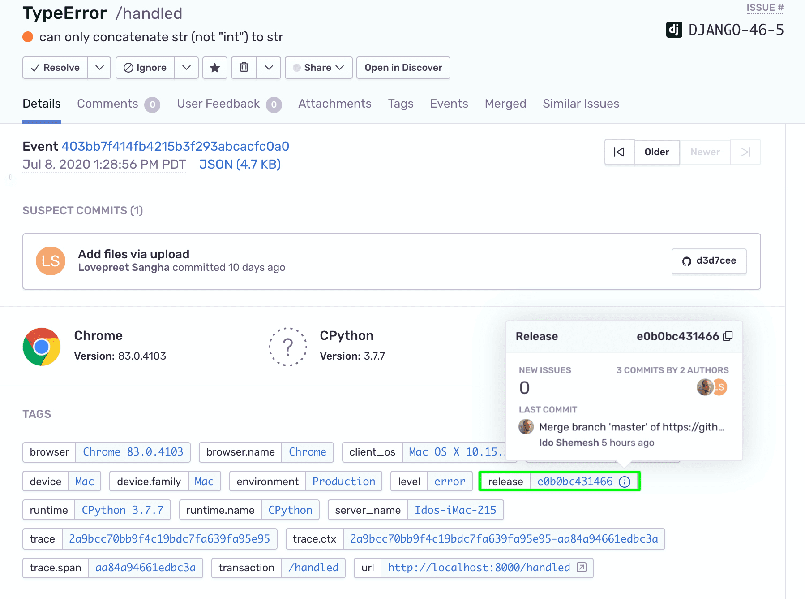
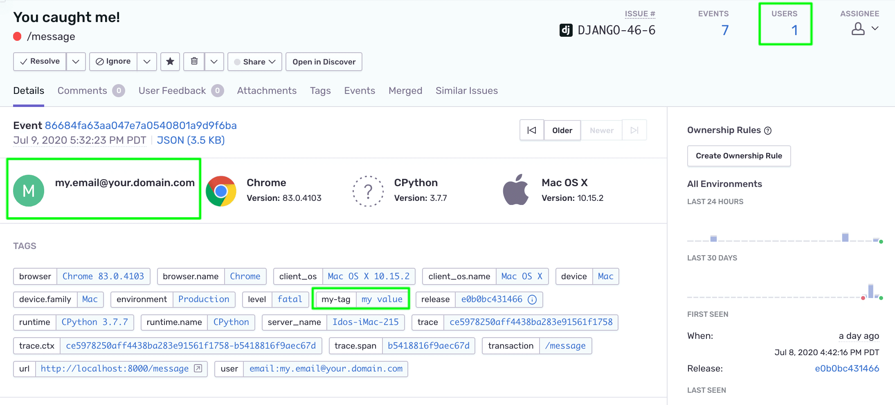

Once initialized in your code, the Sentry SDK will capture various types of events and notify you about them in real-time, depending on the alert rules you've configured. With the Django app already running on your [localhost](http://localhost:8000/), let's try them out.

<Alert>

If you're using your own source code, follow the instructions in [Getting Started](/platforms/python/integrations/django/) to introduce an error into your app.

</Alert>

## Unhandled Errors

The Sentry SDK will automatically capture and report any _unhandled error_ that occurs in your application runtime without any additional configuration or explicit handling. Generally, unhandled errors are errors that aren't caught by a `try/except` clause.

To trigger an unhandled error:

1. Run the local Django app.

2. Point your browser to `http://localhost:8000/unhandled`.

2. If you've set up an [alert rule](/product/alerts/create-alerts/), you should be notified about the error. Otherwise, open the [**Issues**](https://sentry.io/orgredirect/organizations/:orgslug/issues/) page in your Sentry account.

3. You should see the unhandled exception in the list of issues.

   

4. Click on the issue, to open the **Issue Details** page.

   

5. Notice that the event:

   - Is tagged with the `environment` and `release` options we've set in the previous tutorial with the tag `handled:no`, marking this event as an unhandled error.
   - Contains a suspect commit, made possible because of the commit-tracking feature we enabled earlier.
   - Contains the custom breadcrumb we added through the SDK.

     

## Handled Errors

The Sentry SDK contains several methods that you can use to **explicitly** report errors, events, and custom messages in except clauses, critical areas of your code, and so on.

### Capture Exception

1. Open the `views.py` file. Notice that we import `sentry_sdk` lib which contains the `capture_exception` method:

   ```python {filename: myapp/views.py}
   import sentry_sdk
   ```

2. The method is used to capture the exception handled by the except clause in `HandledErrorView`:

   ```python {filename: myapp/views.py}
   class HandledErrorView(APIView):
      def get(self, request):
         ...
         try:
             '2' + 2
         except Exception as err:
             sentry_sdk.capture_exception(err)

         return Response()
   ```

3. To try it out on your localhost, trigger the following endpoint: `http://localhost:8000/handled`.

4. Similar to what we did with the unhandled error, open the new issue's detail page.

5. Notice that the event is tagged with the same `environment` and `release` configuration options. Hover over the "i" icon in the release tag to reveal the release information and the commits associated with it.

   

6. Click on the release's "i" icon to navigate to the release page.

### Capture Message

Typically, `capture_message` is not emitted, but there are times when a developer may want to add a simple message within their app for debugging purposes, and `capture_message` is great for that.

1. In the `views.py` file, the `capture_message` method is made available through the `sentry_sdk` lib import.

2. You can use it anywhere within your app. In our example, we've created a dedicated view class, `CaptureMessageView`, to trigger and capture a message we want to track:

   ```python {filename: myapp/views.py}
   sentry_sdk.capture_message("You caught me!")
   ```

3. To try it out on your localhost, trigger the following endpoint: `http://localhost:8000/message`.

4. As before, open the new issue’s detail page from the **Issues** page.
   <Alert>
      You'll need to remove the `"issue.priority is high or medium"` filter from the "Custom Search" field on the [**Issues**](https://sentry.io/orgredirect/organizations/:orgslug/issues/) page to see all the issue types in the list.
   </Alert>


   

   > By default, captured messages are marked with a severity level tag `level:info`, as reflected in the tags section. However, the `capture_message` methods accept an **optional** severity level parameter.

5. In the `views.py` file, change the `capture_message` method to:

   ```python {filename: myapp/views.py}
   sentry_sdk.capture_message("You caught me!", "fatal")
   ```

6. Save the changes and trigger the `/message` endpoint again. Changes should be applied immediately through `StateReloader`.

7. Notice that the severity level tag on the new event now shows `level:fatal`.

## Enriching your Event Data

You can enrich your event and error data through the Sentry SDK by adding custom tags and user context attributes. In addition to providing more context to your errors, enriched data will expand your options to search, filter, and query through your event metadata. Learn more about the advantages of enriching your data in [Event Data](/product/sentry-basics/enrich-data/).

To enrich the data of the message events we've captured with `capture_message`:

1. In the `views.py` file, locate the line that triggers `sentry_sdk.capture_message`.

2. Replace that line with the following code:

   ```python {filename: myapp/views.py}
   sentry_sdk.set_tag("my-tag", "my value")
   sentry_sdk.user = { "email" : "my.email@your.domain.com" }
   sentry_sdk.set_extra("someVariable", "some data")

   sentry_sdk.capture_message("You caught me!", "fatal")
   ```

3. Save your changes and trigger the `/message` endpoint again.

4. Open the issue’s detail page from the [**Issues**](https://sentry.io/orgredirect/organizations/:orgslug/issues/) page.

5. Notice that:

   - The **user email** is now displayed on the details page and the number of unique users impacted by this event is reflected in the issue's header.
   - The **custom tag** is now available (and searchable) in the list of tags.
     

   - The **extra data** we set on the SDK is reflected in the "ADDITIONAL DATA" context.
     
