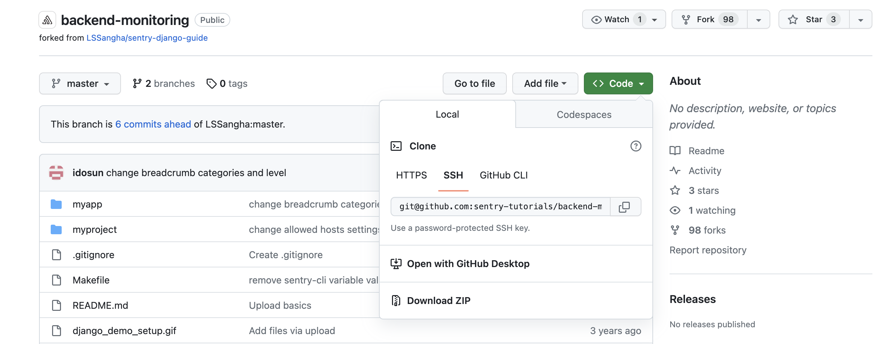

In this tutorial, you'll import the backend app source code into your local development environment, add the Sentry SDK, and initialize it.

<Alert>

If you're using your own source code, you can skip this tutorial and either:

- Follow the instructions in the [Getting Started](/platforms/python/) docs.
- Go directly to [the next step](/guides/integrate-backend/configuration-options/).

</Alert>

## Prerequisites

1. The demo app source code requires a Python development environment to build, install, and run the application. Make sure that you have the following in place:

   - A source code editor (like [VS-Code](https://code.visualstudio.com))
   - [Python](https://www.python.org/)
   - [Sentry-CLI](/cli/)

2. To start monitoring errors in your application you'll need to create a new project in your Sentry account.

## Step 1: Create a Project

Follow the steps below to create a new Sentry project for a sample Django application:

1. Log in to your [Sentry organization](https://sentry.io).

1. Select **Projects** from the left side navigation menu to display the list of all your projects.

1. Click "Create Project" and configure it as appropriate for your application:

    - **Choose your platform**: Select the language or framework for your project based on the code you wish to monitor. In this case, choose **Django**.

    - **Set your alert frequency**: For the purpose of this tutorial, select **I'll create my own alerts later**.

      > If you're wary of alert fatigue, learn more about how to set up your alerts in [Alerts Best Practices](/product/alerts/best-practices/).

    - **Name your project and assign it a team**: Name your project in the **Project name** field and assign a team by selecting one in the **Team** dropdown (or click **+** to create a new team).

    - Click **Create Project**. This takes you to the quick Configure Django SDK guide, which provides an overview of how to configure the SDK. This tutorial covers the SDK setup in more detail.

1. Copy the DSN key and keep it handy. Each project has a unique DSN (Data Source Name). The DSN tells the SDK where to send events, so events are associated with the right project. You'll need to paste the DSN key into your source code later so the errors generated in this tutorial go to your new project.

   > You can also find a project's DSN anytime in **[Project] > Settings > Client Keys (DSN)**.

## Step 2: Get the Code

1. Open the sample [code repository](https://github.com/sentry-tutorials/backend-monitoring) on GitHub.

2. Click on "Fork" and select the target GitHub account you wish this repository to be forked into.

3. Once the fork is complete, click on "Clone or download" and copy the repository URL. You can do this using HTTPS, SSH or via GitHub CLI.

   

4. Clone the forked repository to your local environment:

   ```bash
   > git clone <repository HTTPS or SSH url>
   ```

5. Now that the sample code is available locally, open the `backend-monitoring` project in your preferred code editor.

## Step 3: Enable Commit Tracking for Your Repository

Sentry can help you resolve your errors faster by suggesting a [suspect commit](/product/sentry-basics/integrate-frontend/configure-scms/) that might have introduced the error into your codebase. This is enabled by configuring _commit tracking_. Integrating your source code management solution and adding your code repositories is required to enable commit tracking. Learn more in our [releases documentation](/product/releases/?platform=node/suspect-commits/).

1. Open your Sentry account and navigate to **Settings > Integrations** to enable the GitHub integration and add your `backend-monitoring` repository. For more detailed information, follow the steps described in [our GitHub documentation](/organization/integrations/source-code-mgmt/github/).

## Step 4: Install the SDK

Sentry captures data by using a platform-specific SDK within your application runtime. To use the SDK, import, initialize, and configure it in your source code.

1. Install the `sentry-sdk` by defining the dependency in the `requirements.txt` file. The SDK documentation and release information are available in the [Sentry SDK](https://github.com/getsentry/sentry-python) GitHub repository.

2. Open the `settings.py` file (located under `./backend-monitoring/myproject/settings.py`). This is where we import, initialize, and configure the Sentry SDK in our application.


   ```python {filename: myproject/settings.py}
   import sentry_sdk

   sentry_sdk.init(
       dsn="YOUR_DSN",  # replace with your DSN
       ...
   )
   ```
   > In `settings.py` replace `YOUR_DSN` with the `DSN` key value you copied from the project created in the [project creation tutorial](/guides/integrate-frontend/create-new-project/).


## Step 5: Install Dependencies and Run the Demo App

To build and run the demo application on your localhost:

1. Open a shell terminal and change your directory to the `backend-monitoring` project root folder.

2. If you haven't installed Python, do so by running the following:

   ```bash
   brew install python
   ```

3. Create a Python virtual environment in the project root.

   ```bash
   python -m venv .venv
   ```

   > You can name the virtual environment whatever you like. We named our ".venv".

4. To activate the virtual environment, run:

   ```bash
   source .venv/bin/activate
   ```

5. Install Sentry's command-line tool to use release tracking and GitHub integration for commit data:

   ```bash
   python -m pip install "sentry-cli"
   ```

6. Open the `Makefile` included in the project's root folder. The file is used here to mimic a CI/CD flow.

7. Follow the `deploy` target execution flow.

Commands mentioned within the `Makefile` will be explained in detail in the next part of the tutorial, [Configuration Options](/product/sentry-basics/integrate-backend/configuration-options/).

 <Alert>
In addition to installing Python requirements and running the server, we also use the `sentry-cli` to create a new Sentry release and associate commits to that release. Sentry will look through these commits when flagging a suspect commit.
</Alert>

8. To execute the `sentry-cli` commands, follow these [instructions](/product/sentry-basics/integrate-frontend/upload-source-maps/#step-1-prepare-the-build-environment) to obtain the values for your `SENTRY_AUTH_TOKEN`, `SENTRY_ORG`, and `SENTRY_PROJECT` environment variables.

   

   > The `sentry-cli` can be configured by providing these values either through environment variables or through a dedicated configuration file. Learn more in [Sentry CLI: Configuration and Authentication](/cli/configuration/).

9. Run the following command to install the required Python libraries, set up the Sentry Release, and run the Django server:

    ```bash
    make deploy
    ```

    

    > Notice that a new release is created in the terminal and commits are associated with it. Once the deploy finishes successfully, you'll see the confirmation in your terminal.

## Next

[Configuration Options](/guides/integrate-backend/configuration-options/)
