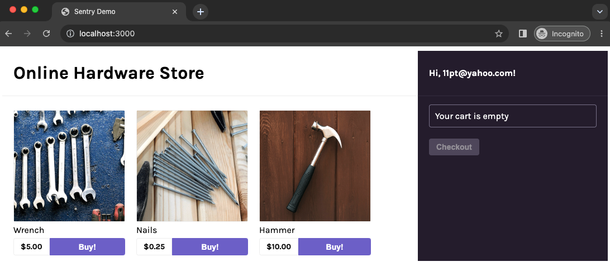

This section walks you through how to import the sample application into your local development environment, add the Sentry SDK, and initialize it.

If you're using your own source code, you can skip this section. Instead:

- Select your [platform](/platforms/) and follow its **Getting Started** guide to add the Sentry SDK to your code.
- Then, skip to the [next step](/guides/integrate-frontend/generate-first-error/).

## 1. Clone the Sample Application

The sample application is a basic frontend-only application using React and webpack.

1. Fork the [sample application's repository](https://github.com/getsentry/frontend-tutorial) on GitHub.

1. Clone the forked repository to your local environment:

   ```bash
   git clone git@github.com:<your_username>/frontend-tutorial.git
   ```

1. Open the `frontend-tutorial` project in your preferred code editor.

## 2. Initialize the Sentry React SDK

Sentry captures data by using a platform-specific SDK that you add to your application's runtime. To use the SDK, import and configure it in your source code. This demo project uses [Sentry's React SDK](https://github.com/getsentry/sentry-javascript/tree/develop/packages/react).


Open src/index.js where you will find the 'Sentry.init()' call after the last import statement. Paste the DSN key value you copied from the project created in the [previous section](https://github.com/product/sentry-basics/integrate-frontend/create-new-project/) into the call and save this file:

```javascript {filename:src/index.js}
import * as Sentry from "@sentry/react";

Sentry.init({
  dsn: "<your_DSN_key>",
  integrations: [Sentry.browserTracingIntegration(), Sentry.replayIntegration()],

  // Set tracesSampleRate to 1.0 to capture 100%
  // of transactions for performance monitoring.
  tracesSampleRate: 1.0,

  // Capture Replay for 10% of all sessions,
  // plus for 100% of sessions with an error
  replaysSessionSampleRate: 0.1,
  replaysOnErrorSampleRate: 1.0,
});
```

It's important to import and initialize the SDK as early as possible in your application's lifecycle so Sentry can capture errors throughout the lifecycle.

<Include name="platforms/configuration/options/js-config-options" />

The options set in `Sentry.init()` are called the SDK's configuration. The only required configuration option is the DSN.
However, the SDK supports many other configuration options. Learn more in our [Configuration](/platforms/javascript/guides/react/configuration/) docs.

The configuration above enables Sentry's error monitoring feature, as well as its [Performance](/platforms/javascript/guides/react/performance) (tracing) and [Session Replay](/platforms/javascript/guides/react/session-replay) features.

## 3. Build and Run the Sample Application

In the `frontend-tutorial` project folder:

1. Install project dependencies.

   ```bash
   npm install
   ```

1. Start the application in develop mode.

   ```bash
   npm start
   ```

   Once the application starts, you'll see a confirmation message similar to this one in your terminal:

   ```bash
   <i> [webpack-dev-server] Project is running at:
   <i> [webpack-dev-server] Loopback: http://localhost:3000/
   ...
   webpack 5.87.0 compiled successfully in 1306 ms
   ```

   > **Troubleshooting tip**: If the application fails to start due to syntax errors or errors for missing dependencies/modules, make sure you're using Node 18+ and install dependencies again. Run `nvm use 18` and then `npm install`.

1. Open the sample application in your browser.

   The sample app should be running at [http://localhost:3000/](http://localhost:3000/) or the URL output in your terminal in the last step.

   

## Next

At this point, you have a sample React app running with the Sentry SDK initialized. Next, [Capture Your First Error](/product/sentry-basics/integrate-frontend/generate-first-error/) to start using Sentry's error monitoring feature.
