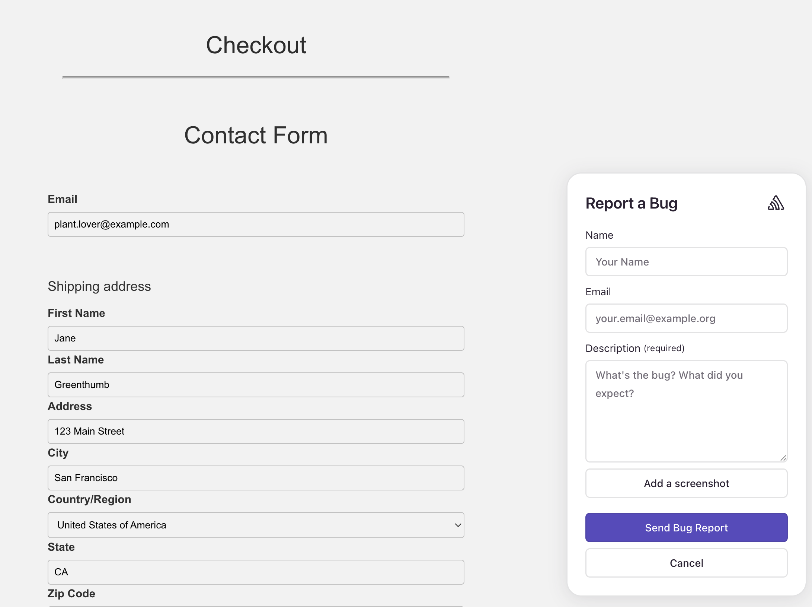
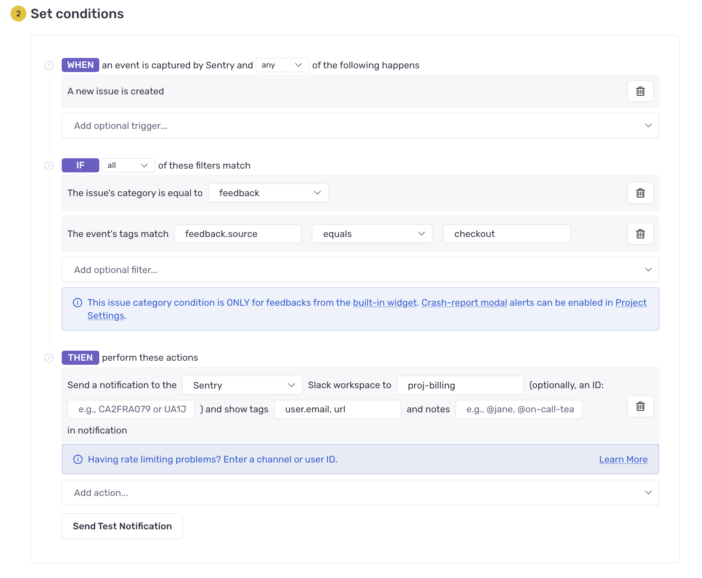
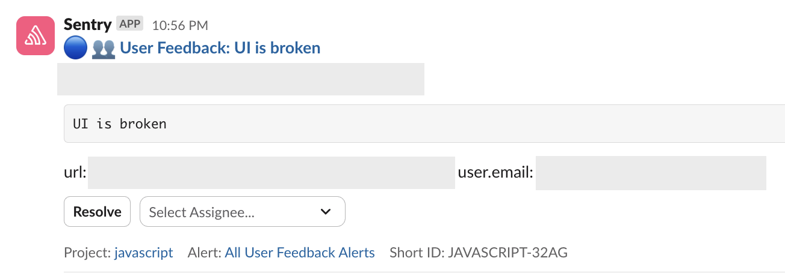
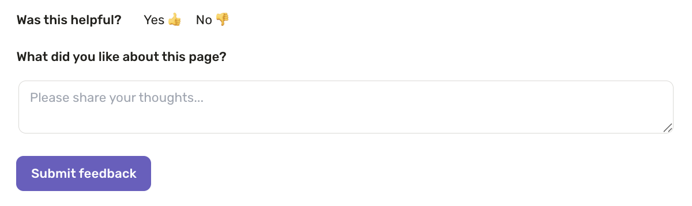

Sentry's [User Feedback Widget](/product/user-feedback/) is a powerful tool for capturing qualitative insights from real users, and is especially valuable during the rollout of new or beta features. Alternatively, it can be used to collect feedback from your fellow team members during an internal release. 

If you treat user feedback as a core signal in product development, especially for betas and early adopter programs, your final product will be better. We recommend adding feedback reviews into planning, stand-ups, or retros; then you can use feedback trends to inform product direction and roadmap decisions.

This 4-step guide will walk you through implementing and instrumenting User Feedback for your application.

## 1. Embed the Widget Contextually
Bring the widget to the user; instead of making them find it.

Embed the feedback widget directly into experimental or high-impact feature areas. For example, on your checkout screen:



### Basic Implementation

Before implementing, make sure you've set up the User Feedback integration for your platform. See the [User Feedback setup documentation](/product/user-feedback/setup/) for platform-specific installation instructions.

Here's a simple example of how to open the feedback form with a button click. This example shows a React implementation. The specific code will vary based on your platform.

**Javascript Example: Simple Feedback Button**

```javascript
import * as Sentry from "@sentry/react";

function FeedbackButton() {
  const feedback = Sentry.getFeedback();
  
  if (!feedback) {
    return null;
  }

  return (
    <button
      onClick={async () => {
        const form = await feedback.createForm();
        form.appendToDom();
        form.open();
      }}
    >
      Give Feedback
    </button>
  );
}
```

## 2. Customize Placeholder Text
Personalized prompts lead to better feedback. Tailor the placeholder text to the feature's context.

You can customize the text prompt shown to users in the feedback form. The configuration option varies by platform. It's commonly `messagePlaceholder` for frontend SDKs or `labelComments` for backend crash-report modals.

<details>
<summary>**JavaScript Example**</summary>

```javascript
const form = await feedback.createForm({
  messagePlaceholder: 'How was your experience with checkout?',
});
```

</details>

Here are examples of placeholder text to guide users:

> How was your experience with [your feature's name]?

> How can we make your experience better? 

> We're still building out [your feature's name] - how can we make it better?

It's best to customize your prompts for clarity and relevance; this will guide the user to provide useful input. Use friendly language to encourage honest, casual feedback.


## 3. Add Custom Tags to Feedback Submissions For Better Routing

If you have multiple feedback buttons in your application that are embedded into different features, tags are critical in order to enable faster alert routing and triaging for the right teams.

You can auto-apply tags based on the widget’s placement. For example, use a custom tag like `feedback.source:checkout`. This allows for routing in Slack and filtering in dashboards. We recommend you define and standardize tags using a single key, such as `feedback.source`.


## 4. Set Up Alerts to Relevant Channels
Feedback is only useful if seen by the right folks.

You can send User Feedback directly into the appropriate team’s channel—whether you use Slack, Microsoft Teams, or Discord (see [complete list of integrations](/product/alerts/create-alerts/routing-alerts/#integrations)). For example, you can tag feedback `feedback.source:checkout` and always have it go to your `#proj-billing` channel in Slack. With this workflow, engineers see feedback in near-real time and take ownership.

Follow the steps below to set up feedback alerts to relevant channels:

1. Create a [New Alert Rule](https://sentry.io/alerts/new/issue/) in Sentry.
2. Scroll to the "Set conditions" section and set the "IF" filter to `The issue's category is equal to… "Feedback"` and `The event's tags match... [your custom tag]`.
3. In the “THEN” filter, select `Send a [your integration] notification` and then add details of the channel you'd like to send the feedback to. You can also add tags you’d like to see on the feedback alert. For example, `user.email`.
4. Add an alert name and owner.




Once set up, here's what an example alert looks like:



## Example Use Cases

### Thumbs Up/Down Buttons

One approach you can take is using thumbs up/down buttons placed contextually within the feature that will trigger the feedback form to open. You can track whether a user clicked on the 👍 or 👎 for each feedback with [custom tags](/platforms/javascript/enriching-events/tags/). The tag will appear on the User Feedback Details page, and optionally on the feedback alert itself after feedback is submitted.

**Clever customizations to consider:**
- Use different `messagePlaceholder` text for positive vs. negative feedback ("What did you like most?" vs. "How can we improve?")
- Add custom tags like `feedback.type:positive` or `feedback.type:negative` to easily filter sentiment
- Customize `successMessageText` to encourage specific actions ("Thanks! Want to share more?" vs. "Thanks for helping us improve!")
- Hide name/email fields (`showName: false`, `showEmail: false`) for quick, frictionless feedback



<details>
<summary>**See Example JavaScript Code Snippet**</summary>

```javascript
"use client";

import * as Sentry from "@sentry/react";
import { Fragment } from "react";

export default function ThumbsUpDownButtons({source}: {source: string) {
  const feedback = Sentry.getFeedback();
  
  return (
    <Fragment>
      <strong>Was this helpful?</strong>
      <button
        title="I like this"
        onClick={async () =>{
          const form = await feedback?.createForm({
            messagePlaceholder: 'What did you like most?',
            tags: {
              component: 'ThumbsUpDownButtons',
              'feedback.source': source,
              'feedback.type': 'positive',
            }
          });
          form?.appendToDom();
          form?.open();
        }}
      >
        Yes 👍
      </button>

      <button
        title="I don't like this"
        onClick={async () =>{
          const form = await feedback?.createForm({
            messagePlaceholder: 'How can we improve?',
            tags: {
              component: 'ThumbsUpDownButtons',
              'feedback.source': source,
              'feedback.type': 'negative',
            }
          });
          form?.appendToDom();
          form?.open();
        }}
      >
        No 👎
      </button>
    </Fragment>
  );
}
```

</details>

<br />

### Beta Feature Feedback

When rolling out a new or experimental feature, add a persistent feedback button directly within the feature UI. Use custom tags to identify which beta feature the feedback relates to, making it easy to aggregate insights and track feedback trends over time.

**Cusotmizations for Beta Feedback:**
- Enable screenshots (`enableScreenshot: true`) so users can show specific UI issues or suggestions
- Auto-populate user info (`useSentryUser`) to reduce friction for logged-in users
- Customize the button label (`triggerLabel: "Give Feedback on [Feature Name]"`) to be feature-specific
- Use `colorScheme` or custom CSS to match your beta feature's branding
- Add a callback (`onSubmitSuccess`) to show a custom "Thanks for being a beta tester!" message

**Example implementation:**
Add a "Give Feedback" button or link within your beta feature's interface, tagged with `feedback.source:beta-feature-name` and `feedback.type:beta`. This ensures all feedback goes to your product team's dedicated channel.

### Post-Transaction Feedback

Trigger a feedback prompt after users complete critical actions like checkout, sign-up, or onboarding. This captures their immediate experience while it's fresh in their minds. Use tags to differentiate between transaction types.

**Customizations for Post-Transaction Feedback:**
- Customize `formTitle` and `messagePlaceholder` to match the transaction ("How was checkout?" vs. "How was sign-up?")
- Set `isEmailRequired: true` for post-transaction feedback so you can follow up on issues
- Use `successMessageText` to reinforce the completed action ("Thanks! Your order is on its way")
- Add `onFormClose` callback to redirect users to a confirmation page or next step
- Match your brand colors with custom CSS variables (`--accent-background`, `--foreground`)

**Example implementation:**
After a successful checkout, display a subtle feedback prompt asking "How was your checkout experience?" Tag it with `feedback.source:checkout` and `feedback.type:post-transaction` to route it to your billing or checkout team.


<PageGrid />
