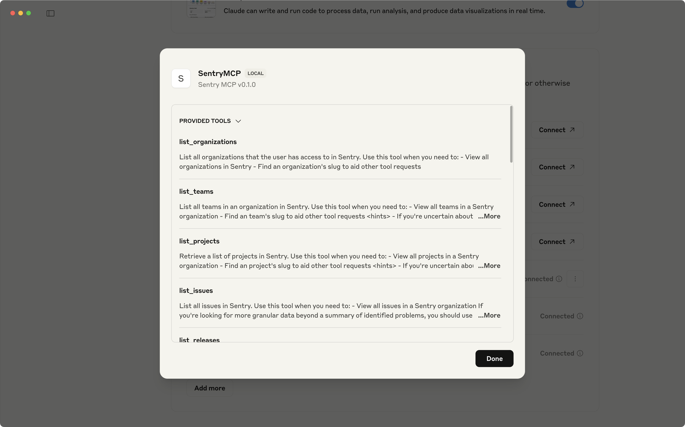
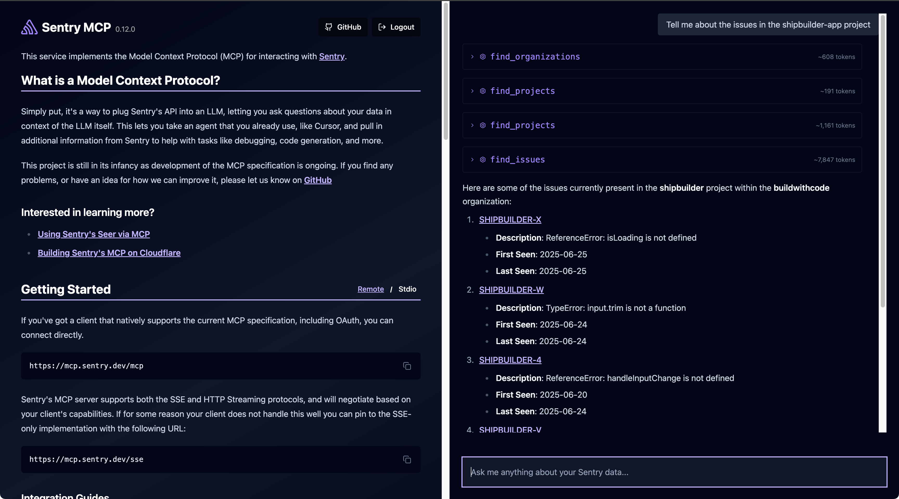
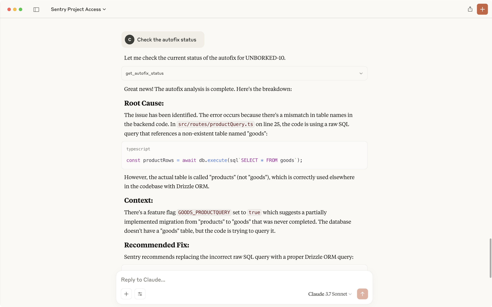

<Alert>
  The Sentry MCP Server has been released for production, however MCP is a
  developing technology and changes should be expected. There will be bugs.
  Please reach out on [GitHub](https://github.com/getsentry/sentry-mcp/issues)
  if you have any feedback or concerns.
</Alert>

## Overview

The [Sentry MCP Server](https://mcp.sentry.dev) provides a secure way of bringing Sentry's full issue context into systems that are able to leverage the [Model Context Protocol (MCP)](https://modelcontextprotocol.io/introduction). Sentry hosts and manages a remote MCP server, which you can connect to and leverage centrally. With the MCP, you can:

- Access Sentry issues and errors
- Search for errors in specific files
- Query projects and organizations
- List and create Sentry DSN's for projects
- Invoke Seer to automatically fix issues and retrieve the status and details of an issue fix

The Sentry MCP Server includes support for modern MCP features:

- **Remote hosted (preferred) or local STDIO mode** - The hosted version provides lower friction and always includes the latest functionality and stability
- **OAuth support** - Authenticate using your existing Sentry organization for seamless access to your projects
- **Streamable HTTP with graceful SSE fallback** - Automatic fallback ensures compatibility across different clients
- **16+ tool calls and prompts** - Comprehensive toolset for bringing Sentry context into LLM interactions

<VimeoEmbed id="1080588938?h=1e437d4874" />

## Getting Started

### OAuth Configuration (Recommended)

For clients that support OAuth, you can use the streamlined configuration that provides automatic authentication:

```json
{
  "mcpServers": {
    "Sentry": {
      "url": "https://mcp.sentry.dev/mcp"
    }
  }
}
```

This configuration:

- Enables OAuth authentication with your Sentry organization
- Uses Streamable HTTP transport with automatic SSE fallback
- Provides access to all 16+ available tools
- Automatically handles authentication and session management

With OAuth configuration, you'll be prompted to:

1. Accept the OAuth authorization
2. Login via your existing Sentry organization
3. Grant access to the necessary permissions

<Alert>
  If you've joined a new Sentry organization, log out of your LLM's MCP
  integration and log back in to refresh access.
</Alert>

Once authenticated, you'll see the tools become available in your MCP client.



### Remote MCP Configuration (Legacy)

For clients that don't support OAuth, you can continue using the existing Remote MCP endpoint configuration:

```json
{
  "mcpServers": {
    "Sentry": {
      "command": "npx",
      "args": ["-y", "mcp-remote@latest", "https://mcp.sentry.dev/mcp"]
    }
  }
}
```

### Local STDIO Mode

Alternatively, if you don't want the Remote-MCP server, you can run the MCP Server locally in STDIO mode by following the instructions in the [README](https://github.com/getsentry/sentry-mcp). This is particularly useful for self-hosted Sentry installations.

To use STDIO mode, you'll need a Sentry User Auth Token with the following scopes:

- `org:read`
- `project:read`
- `project:write`
- `team:read`
- `team:write`
- `event:write`

Launch the STDIO transport:

```bash
npx @sentry/mcp-server@latest --access-token=sentry-user-token --host=sentry.example.com
```

You can also use environment variables:

```bash
SENTRY_ACCESS_TOKEN=your-token
SENTRY_HOST=your-sentry-host
```

### mcp.sentry.dev (live demo)

The [Sentry MCP page](https://mcp.sentry.dev) provides a simple way to configure and test the MCP server. From this web client you can authenticate with your Sentry organization and access a hosted MCP server for testing.



## Available Tools

The Sentry MCP Server provides comprehensive tools for interacting with Sentry data:

### Core Tools

- **Organizations**: List and query organization information
- **Projects**: Find, list, and create projects
- **Teams**: Manage and query team information
- **Issues**: Access issue details, search, and analyze problems
- **DSNs**: List and create Data Source Names for projects

### Analysis Tools

- **Error Searching**: Find errors in specific files or across projects
- **Issue Analysis**: Detailed issue investigation with context
- **Seer Integration**: Invoke Sentry's AI agent for root cause analysis and automated fixes

### Advanced Features

- **Release Management**: Query and analyze release information
- **Performance Monitoring**: Access transaction and performance data
- **Custom Queries**: Execute complex searches across Sentry data

## Example Usage

Here are some example prompts you can use with the Sentry MCP:

- Tell me about the issues in my `project-name`
- Check Sentry for errors in `components/UserProfile.tsx` and propose solutions
- Diagnose issue `PROJECT-123` and propose solutions
- Create a new project in Sentry for `new-service-name` and setup local instrumentation
- Use Sentry's Seer to analyze and propose a solution for issue `PROJECT-456`
- Show me the most recent releases for my organization
- Find all unresolved crashes in my React Native app



## Verified Clients

The Sentry MCP Server has been verified to work in:

### Claude for Desktop

Access developer tools via `CMD + ,` → `Developer` → `Edit Config` → edit the `claude_desktop_config.json` file

### Claude.ai

Navigate to `Settings` → `Profile` → Scroll to `Integrations`, select `Add More`, and add the Sentry MCP server URL `https://mcp.sentry.dev/mcp`

### Claude Code

Since recently reaching 1.0, Claude Code has native support for remote hosted MCP servers. From your CLI enter `claude mcp add --transport http sentry https://mcp.sentry.dev/mcp` and then access Claude Code with `claude`.

Once in, you'll be prompted to authenticate with OAuth to Sentry.

### Codex

From your CLI, enter `codex mcp add sentry -- npx -y mcp-remote@latest https://mcp.sentry.dev/mcp` and then access Codex with `codex`.

Once in, you'll be prompted to authenticate with Sentry using OAuth.

### Cursor

Available via `Cursor` → `Settings` → `Cursor Settings` → `MCP` following the promps to configure Sentry MCP. Cursor 1.0+ includes enhanced MCP support with OAuth and Streamable HTTP.

You can still edit the `mcp.json` file manually if you prefer.

### Amp

Add via the Amp VS Code extension settings screen or by updating your settings.json file:

```json
"amp.mcpServers": {
    "sentry": {
        "command": "npx",
        "args": [
          "-y",
          "mcp-remote@latest",
          "https://mcp.sentry.dev/mcp"
        ]
      }
}
```

**Amp CLI Setup:**

Add via the `amp mcp add` command below

```bash
amp mcp add sentry -- npx -y mcp-remote@latest https://mcp.sentry.dev/mcp
```


### VS Code and GitHub Copilot

Add the server using `CMD+Shift+P` and selecting `MCP: Add Server`

### Warp

Available via `Settings` -> `MCP Servers` -> `Manage MCP Servers` -> `Add MCP Server` -> `Sentry` -> `https://mcp.sentry.dev/mcp`.

```json
{
  "Sentry": {
    "command": "npx",
    "args": ["-y", "mcp-remote@latest", "https://mcp.sentry.dev/mcp"],
    "env": {},
    "working_directory": null
  }
}
```

### Windsurf

Configure via the `Configure MCP` option in Cascade (CMD + L)

### Other Clients

The Sentry MCP Server follows standard MCP protocols and should work with any client that supports:

- OAuth authentication (recommended)
- Remote MCP servers
- SSE or Streamable HTTP transport

## Integration with Seer

The Sentry MCP Server provides seamless integration with [Seer](/product/ai-in-sentry/seer/), Sentry's AI agent. You can:

- **Trigger Seer Analysis**: Initiate automated root cause analysis for issues
- **Get Fix Recommendations**: Receive AI-generated solutions for bugs and performance issues
- **Monitor Fix Status**: Track the progress of Seer's analysis and implementation

**Note**: MCP and Seer are complementary tools. MCP brings Sentry context into your LLM, while Seer is purpose-built for deep issue analysis and automated debugging. You can use MCP to invoke Seer for complex debugging workflows.

## Troubleshooting

### Common Issues

**OAuth Authentication Problems**

- Ensure your client supports OAuth authentication
- Try the legacy Remote MCP configuration if OAuth isn't working
- Check that you have the necessary permissions in your Sentry organization

**Connection Issues**

- Verify the MCP server URL is correct: `https://mcp.sentry.dev/mcp`
- For legacy setups, use: `https://mcp.sentry.dev/sse`
- Check your client's MCP configuration syntax

**Missing Tools**

- Ensure authentication completed successfully
- Verify your Sentry organization access
- Check for any error messages in your client's console

For additional support, visit the [GitHub repository](https://github.com/getsentry/sentry-mcp) or contact Sentry support.
