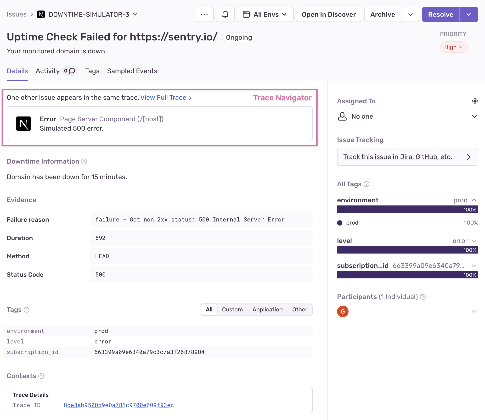

An uptime issue is a grouping of detected downtime events for a specific URL. A downtime event is generated by
active uptime alerts when HTTP requests fail to meet our
[uptime check criteria](/product/alerts/uptime-monitoring/#uptime-check-criteria).

## Traced Errors

Uptime checks made against web services configured with one of Sentry's supported SDKs contain a
[trace](/concepts/key-terms/tracing/) that can be used to track detected errors resulting from failed HTTP uptime checks. The trace navigator allows you to browse through potential root causes of your downtime and is a powerful  tool for quickly identifying and resolving issues.

## Issue Lifecycle

Uptime issues are grouped by the monitored URL and created upon the first detected downtime. Sentry automatically resolves an ongoing uptime issue when the monitored URL returns to a healthy status and meets our [uptime check criteria](/product/alerts/uptime-monitoring/#uptime-check-criteria). If the URL experiences subsequent downtime, the issue's status will change to regressed.
