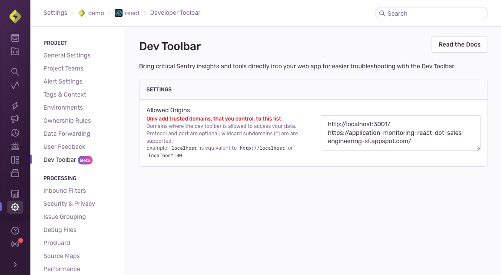

<Alert>
  The Sentry Toolbar is currently in **beta**. Beta features are still in progress and may have bugs. Please reach out on
  [GitHub](https://github.com/getsentry/sentry-toolbar/issues) if you have any feedback or concerns.
</Alert>

## Pre-Requisites

For the Sentry Toolbar to work best, [enable tracing](/platforms/javascript/tracing/) in your app. With tracing enabled, the Sentry Toolbar will be able to associate issues and feedback with the current URL in the browser location.

## 1. Allow Domains

Since the Sentry Toolbar will be visible to users within your app, it's important to consider which environments should render it. See the [FAQ: _"In what environments should I enable the Sentry Toolbar?"_](/product/sentry-toolbar/faq/#in-what-environments-should-i-enable-the-dev-toolbar) for tips.

You will need to edit the [Project Settings](https://sentry.io/orgredirect/organizations/:orgslug/settings/projects/) page to allow the Toolbar to connect to Sentry. Add any production, staging, or development domains to the list. Only add domains that you trust and control to this list.



## 2. Install

If you are developing a React based application, it's time to add the Toolbar into your `package.json` file.

Or, you can skip ahead to the next step to find the CDN configuration instructions.

```bash {tabTitle: npm}
npm install --save @sentry/toolbar
```
```bash {tabTitle: yarn}
yarn add @sentry/toolbar
```

## 3. Configure

Finally, whether you have a React application or are loading the Toolbar from the CDN, you need to initialize the Toolbar using JavaScript. This will prompt any visitor to login to your Sentry organization.

```javascript {tabTitle: React}
import {useSentryToolbar} from '@sentry/toolbar';

useSentryToolbar({
  // Remember to conditionally enable the Toolbar.
  // This will reduce network traffic for users
  // who do not have credentials to login to Sentry.
  enabled,

  initProps: {
    organizationSlug: 'acme',
    projectIdOrSlug: 'website',
  },
})
```
```html {tabTitle: CDN}
<html>
<head>...</head>
<body>
    ...
    <!--
    Put this at the bottom of your page so it doesn’t
    block other critical JavaScript.

    Remember to conditionally include the Toolbar
    script. This will reduce network traffic for users
    who do not have credentials to login to Sentry.
    -->
    <script src="https://browser.sentry-cdn.com/sentry-toolbar/latest/toolbar.min.js"></script>
    <script>
    window.SentryToolbar.init({
      organizationSlug: 'acme',
      projectIdOrSlug: 'website',
    });
    </script>
</body>
</html>
```

See the [FAQ: _"How can I conditionally initialize the Toolbar?"_](/product/sentry-toolbar/faq/#how-can-i-conditionally-initialize-the-toolbar) for help implementing conditions for different environments.

### Init Configuration Options

At minimum, you must set `organizationSlug` and `projectIdOrSlug`.

The complete list of options is here:

| Option | Type | Description | Default Value |
| ------ | ---- | ----------- | ------------- |
| `organizationSlug` | `string` | The organization that users should login to. For example \'acme\' | *Required Value* |
| `projectIdOrSlug` | `string \| number` | The project for which this website/webapp is associated. | *Required Value* |
| `environment (optional)` | `string \| string[] \| undefined` | The environment of this deployment. Used to narrow search results in the Toolbar UI. Set to `undefined` or `""` or `[]` if you want to see results from all environments. | `undefined` |
| `placement (optional)` | `'right-edge' \| 'bottom-right-corner'` | Where to render the Toolbar on the screen. | `'right-edge'` |
| `theme (optional)` | `'system' \| 'dark' \| 'light'` | Whether to use dark or light mode. | `'system'` |
| `featureFlags (optional)` | `FeatureFlagAdapter \| undefined` | See [Feature Flag Panel](/product/sentry-toolbar/setup//#feature-flag-Panel) below | `undefined` |
| `sentryOrigin (optional)` | `string \| undefined` | The origin where Sentry can be found. Used for loading the connection to Sentry, and generating links to the website. For example: `'https://acme.sentry.io'` | `'https://sentry.io'` |
| `domId (optional)` | `string \| undefined` | The `id` given to the \<div\> that is created to contain the Toolbar html. | `'sentry-toolbar'` |
| `debug (optional)` | `string \| undefined` | A comma separated string of debug targets to enable. Example: `'logging,state'`. If the list contains 'all' or 'true' then all targets will be enabled. Valid targets: `'logging' 'login-success' 'settings' 'state'` | `undefined` |
| `mountPoint (optional)` | `HTMLElement \| () => HTMLElement \| undefined` | Where to mount the Toolbar in the DOM. | `document.body` |
| `transactionToSearchTerm (optional)` | `(transactionName: string) => string` | Hook to transform transactionName into a search term | See [transactionToSearchTerm.ts](https://github.com/getsentry/sentry-toolbar/blob/main/src/lib/utils/transactionToSearchTerm.ts) |

### Extra React Hook Options

The React hook supports some other top-level options. The defaults values are:

```javascript {tabTitle:React}
useSentryToolbar({
  initProps: {
    organizationSlug: 'acme',
    projectIdOrSlug: 'website',
  },

  // Optional:
  enabled: true,

  // Optional: Either `version` or `cdn`
  // If both are set then `cdn` will override `version`
  version: 'latest',
  cdn: 'https://browser.sentry-cdn.com/sentry-toolbar/latest/toolbar.min.js',
})
```

| Options | Type | Description | Default Value |
| ------- | ---- | ----------- | ------------- |
| `enabled` | `boolean (optional)` | Conditionally initialize the toolbar. Set this to false to avoid requesting the toolbar code on the browser, or to safely unmount an existing toolbar instance | `true` |
| `version` | `string (optional)` | Request a speicifc version of the toolbar from the CDN. It's recommended to use `latest` for automatic updates. See https://github.com/getsentry/sentry-toolbar/releases for a list of available release tags. | `'latest'` |
| `cdn` | `string (optional)` | Overrides the `version` field above. Setting the CDN is useful if you want to self-host a specific version of the Toolbar. | `'https://browser.sentry-cdn.com/sentry-toolbar/latest/toolbar.min.js'` |


### Unmounting the Toolbar

If you have called `SentryToolbar.init({...})` to render the Toolbar, but now want to manually remove or unmount it from the page, you can call the cleanup function that is returned from `init()`. This will unmount all the injected HTML and CSS. Login credentials will not be removed, so you can re-insert the toolbar and still be authenticated.

If you are using the React hook, then the toolbar will unmount when the React component is unmounted. Or if you set `enabled: false`.

```javascript
const unmountToolbar = window.SentryToolbar.init({ ... });

// sometime later...
unmountToolbar();
```
```javascript {tabTitle:React}
useSentryToolbar({
  enabled: false, // The toolbar will not be mounted
  initProps: {
    ...
  },
})
```

## Feature Flag Panel

<Alert>
  If you're using feature flags inside your product then also setup [Feature Flag Evaluation and Change Tracking](/platforms/javascript/feature-flags/) within your SDK.
</Alert>

In order to integrate your feature flagging platform with the Sentry Toolbar, you will need an adapter that can read flag data from your provider. It will also store and retrieve a list of overrides to apply to your local browser session.

There is a built-in `OpenFeatureAdapter` that is compatible with the [open-feature/js-sdk-contrib](https://github.com/open-feature/js-sdk-contrib). To use it, call the `SentryToolbar.OpenFeatureAdapter` implementation.

```html {tabTitle: CDN}
<script>
// Define your provider
const provider = new FlagdWebProvider({...});

// Set the provider into the OpenFeature SDK
OpenFeature.setProvider(provider);

window.SentryToolbar.init({
  ...
  // Set the provider into the OpenFeatureAdapter
  featureFlags: window.SentryToolbar.OpenFeatureAdapter({provider})
});
</script>
```
```typescript {tabTitle: React}
import {OpenFeature} from '@openfeature/web-sdk';
import {FlagdWebProvider} from '@openfeature/flagd-web-provider';

// Define your provider
const provider = new FlagdWebProvider({...});

// Set the provider into the OpenFeature SDK
OpenFeature.setProvider(provider);

window.SentryToolbar.init({
  ...
  // Set the provider into the OpenFeatureAdapter
  featureFlags: window.SentryToolbar.OpenFeatureAdapter({provider})
});
```

You can also create your own adapter by implementing the [`FeatureFlagAdapter` interface](https://github.com/getsentry/sentry-toolbar/blob/main/src/lib/types/featureFlags.ts).

The adapter interface is:
```typescript
type FlagValue = boolean | string | number | undefined;
type FlagMap = Record<string, FlagValue>;
interface FeatureFlagAdapter {
  /**
   * All known flag names and their evaluated values.
   */
  getFlagMap: () => Promise<FlagMap>;

  /**
   * Any overridden or manually set flags and values.
   */
  getOverrides: () => Promise<FlagMap>;

  /**
   * Manually set a flag to be a specific value, overriding the evaluated value.
   */
  setOverride: (name: string, override: FlagValue) => void;

  /**
   * A callback to clear all overrides from this browser.
   */
  clearOverrides: () => void;

  /**
   * Deeplink into your external feature-flag provider and find out more about
   * this specific flag.
   */
    urlTemplate?: undefined | ((name: string) => string | URL | undefined);
}
```

[MockFeatureFlagAdapter.tsx](https://github.com/getsentry/sentry-toolbar/blob/main/src/env/demo/MockFeatureFlagAdapter.tsx) is an example adapter to use as a reference.
