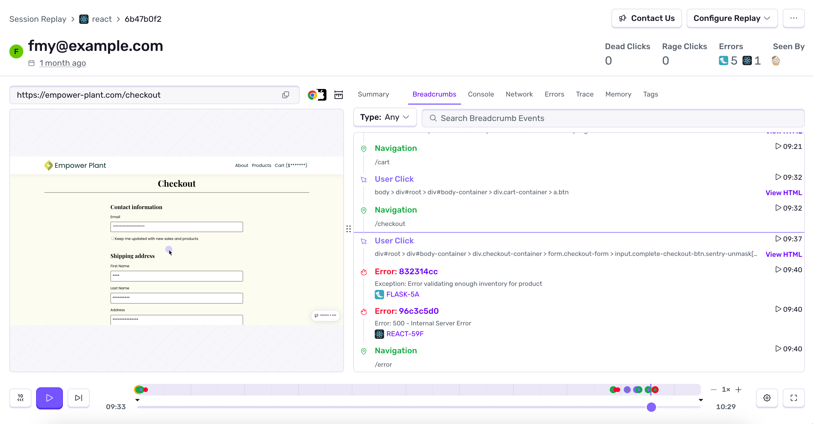
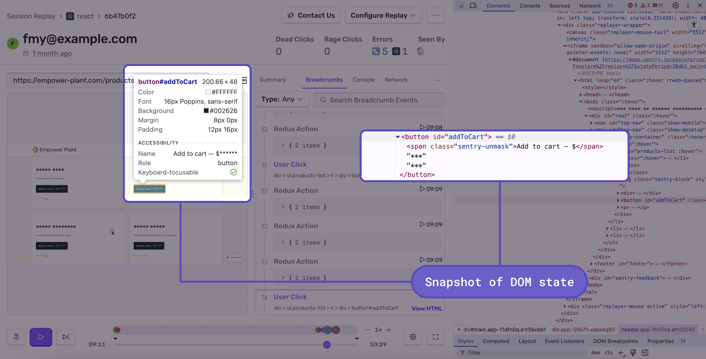

Session Replay gives you video-like reproductions of real user sessions, effectively putting [DevTools](https://developer.chrome.com/docs/devtools/overview/) in your production environment. Each replay ties together user interactions, network requests, DOM events, console messages, errors, and traces on a single timeline.

**Key capabilities:**

- **Full session context** — See clicks, navigations, scrolls, and input in relation to network requests, console logs, and DOM mutations.
- **DOM state inspection** — Click on any element in the replay player to inspect the underlying DOM tree, including HTML structure and attributes, at that point in time.
- **Error and trace correlation** — Replays are linked to errors on the [Issue Details](/product/issues/issue-details/) page and slow transactions on the [Transaction Summary](/product/dashboards/sentry-dashboards/transaction-summary/) page. [Backend errors](/product/session-replay/web/#replays-for-backend-errors) are included in the replay timeline, [breadcrumbs](/product/issues/issue-details/breadcrumbs/), and error list.
- **User Feedback integration** — Replays automatically attach to [User Feedback](/product/user-feedback/) submissions, capturing up to 60 seconds of activity before the user reported the issue. You can watch exactly what the user experienced and read their description side by side.
- **Frustration detection** — [Rage clicks and dead clicks](/product/issues/issue-details/replay-issues/rage-clicks/) are surfaced in the replay timeline so you can jump directly to moments of user frustration.
- **AI-powered replay summaries** — Get an automatic play-by-play of what happened during a session without watching the full replay. Requires the **Show Generative AI Features** setting in **Settings > General**.
- **Custom recording control** — Start, stop, and flush replays programmatically based on any application logic: specific users, URLs, feature flags, support widget interactions, or custom events. See [Understanding Sessions](/platforms/javascript/session-replay/understanding-sessions/) for the full API and examples.



## What is Session Replay?

A session replay is **not** a video recording. It's a video-like reproduction of a user session, built using the [rrweb recording library](https://www.rrweb.io/). Replays are created from snapshots of your web application's DOM state (the browser's in-memory representation of HTML). When each snapshot is played back, you see a recording of what the user did throughout their entire session, including pageloads, refreshes, and navigations.

Because replays capture the actual DOM, you can click on any element in the replay player to inspect its HTML structure and attributes — just like you would with browser DevTools, but for a production session that already happened.



The start of a session replay recording can be triggered by:

- A user session being part of a sampling rate, as controlled by [`replaysSessionSampleRate`](/platforms/javascript/session-replay/#sampling). (When a user loads a page, a decision is made whether to sample it or not.)
- An error occurring during a session that's not being recorded. The session is then recorded based on [`replaysOnErrorSampleRate`](/platforms/javascript/session-replay/#sampling).
- Manually calling the [`replay.start()`](/platforms/javascript/session-replay/understanding-sessions/#manually-starting-replay) method.

The end of a session replay recording can be triggered by:

- User inactivity within the tab or page that's being recorded. (It's considered inactivity when a user doesn't click or navigate around the site for more than 15 minutes. Mouse scrolls, mouse movements, and keyboard events don't currently qualify as activity.)
- User closing the tab or page that's being recorded.
- A recording reaching the maximum replay duration limit. (Currently, this is 60 minutes.)
- Manually calling the [`replay.stop()`](/platforms/javascript/session-replay/understanding-sessions/#manually-stopping-replay) method.

<Alert>

Unlike [sessions](/product/releases/health/#session) on the **Releases** page, user sessions in Session Replay can span multiple page loads.

</Alert>

## Supported SDKs

Session Replay supports all browser-based applications.
This includes static websites, single-page applications, and also server-side-rendered. This includes frameworks such as:
[Django](/platforms/python/integrations/django/),
[Spring](/platforms/java/guides/spring-boot/),
[ASP.NET](/platforms/dotnet/guides/aspnetcore/),
[Laravel](/platforms/php/guides/laravel/),
[Express](/platforms/javascript/guides/express/) and
[Rails](/platforms/ruby/guides/rails/).
If you don't use `npm` or `yarn`, you can use [our Loader `script` tag](/platforms/javascript/install/loader/) on your main HTML template.

The Sentry SDK that records the replay runs on the client's browser, and it's built-in to `@sentry/browser` and our browser framework SDKs:

- [Vanilla JavaScript](/platforms/javascript/session-replay/)
- [Angular](/platforms/javascript/guides/angular/session-replay/)
- [Astro](/platforms/javascript/guides/astro/session-replay/)
- [Capacitor](/platforms/javascript/guides/capacitor/session-replay/)
- [Electron](/platforms/javascript/guides/electron/session-replay/)
- [Ember](/platforms/javascript/guides/ember/session-replay/)
- [Gatsby](/platforms/javascript/guides/gatsby/session-replay/)
- [Next.js](/platforms/javascript/guides/nextjs/session-replay/)
- [React](/platforms/javascript/guides/react/session-replay/)
- [Remix](/platforms/javascript/guides/remix/session-replay/)
- [Svelte](/platforms/javascript/guides/svelte/session-replay/)
- [SvelteKit](/platforms/javascript/guides/sveltekit/session-replay/)
- [Vue](/platforms/javascript/guides/vue/session-replay/)

<Include name="session-replay-for-backend-errors.mdx" />

Make sure you've set up [trace propagation](/product/sentry-basics/concepts/tracing/#trace-propagation) in your backend projects. For example:

```javascript
Sentry.init({
  dsn: "___PUBLIC_DSN___";
  tracePropagationTargets: ["https://myproject.org", /^\/api\//],
});
```

<Include name="session-replay-for-backend-support.mdx" />
