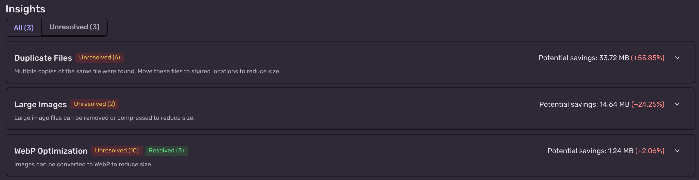
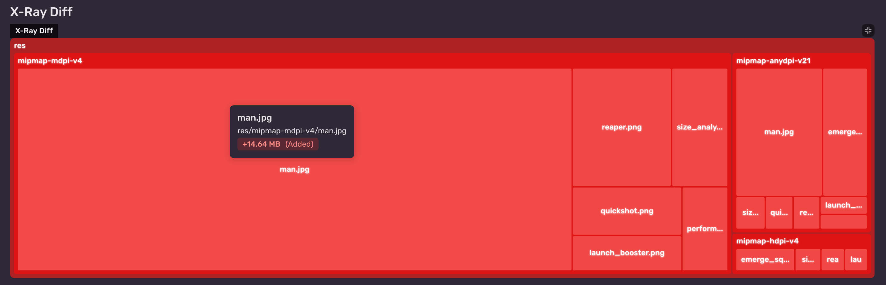
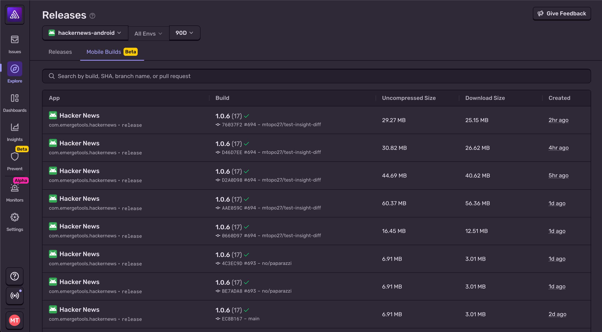
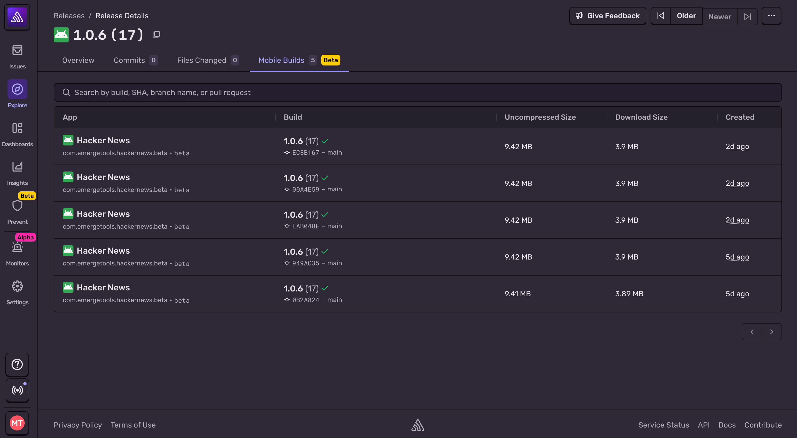

<Include name="size-analysis/ea" />

Size Analysis monitors your mobile app size to prevent regressions before they reach users. Upload builds from CI to spot regressions early, understand what's inside each bundle, and keep release artifacts lean.

## Why Track App Size?

- Faster downloads reduce install drop-off
- Install size is linked to uninstall rates, particularly for customers with limited storage or slower connections
- Size bloat can have downstream technical impact: longer build times, startup times, code complexity, etc.

## Features

### Build Details

Size Analysis breaks down your mobile app so you can see exactly where size is coming from. It surfaces Insights that recommend concrete fixes, such as compressing images or stripping debug info.

Size Analysis also provides actionable insights on how you can reduce your app's size. Insights are tailored to each platform. Dive deeper in:

- [Android](/platforms/android/size-analysis/insights/)
- [iOS](/platforms/apple/guides/ios/size-analysis/insights/)
- [React Native](/platforms/react-native/size-analysis/insights/)
- [Flutter](/platforms/dart/guides/flutter/size-analysis/insights/)

### Build Comparison

Compare any two builds to see what changed, review module-level diffs, and confirm that optimizations worked. Build comparisons are automatically generated when [uploading as part of CI](/product/size-analysis/integrating-into-ci/), but can also be manually triggered for any two builds.

#### Insight Diff

The Insight diff shows the changes in insights between the two builds. This diff will show if a new insight is present in the build or if an insight as been addressed.

#### Table Diff

The table diff shows every file change between the two builds. This diff will show if the file was added, removed, or changed. By default, the table hides changes under 500 B, but you can toggle this directly in the table.

#### X-Ray Diff

The X-Ray diff shows a visual representation of the file changes between the two builds. This diff will show if the file was added, removed, or changed.

### Status Checks

Integrate into CI Size Analysis results on pull requests. You can track size on every commit to ensure there are no unnecessary size increases.

Learn how to set it up in the [CI integration guide](/product/size-analysis/integrating-into-ci/).

## Finding Uploaded Builds

You can find uploaded builds through the Releases page. Builds will show up in two places:

1. When a Mobile Project is selected on the Releases page, you will see a "Mobile Builds" tab. This tab will list all the builds for the project.

   

2. Mobile Builds will show up in a single Release's details page. Here you will see every build for the Release's version.

   

## Upload Guides

You can follow the platform guides to learn how to upload builds for Size Analysis:

- [Android](/platforms/android/size-analysis/)
- [iOS](/platforms/apple/guides/ios/size-analysis/)
- [React Native](/platforms/react-native/size-analysis/)
- [Flutter](/platforms/dart/guides/flutter/size-analysis/)

### Upload Metadata

Below is the metadata included in your build, regardless of the platform.

<Include name="size-analysis/upload-metadata" />

<PageGrid />
