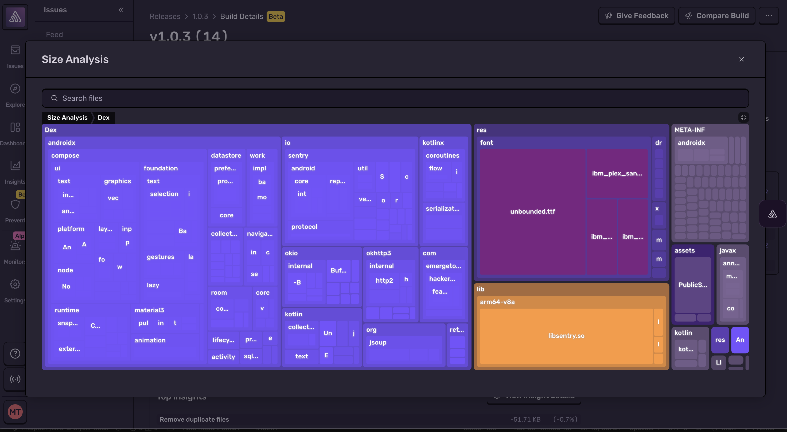
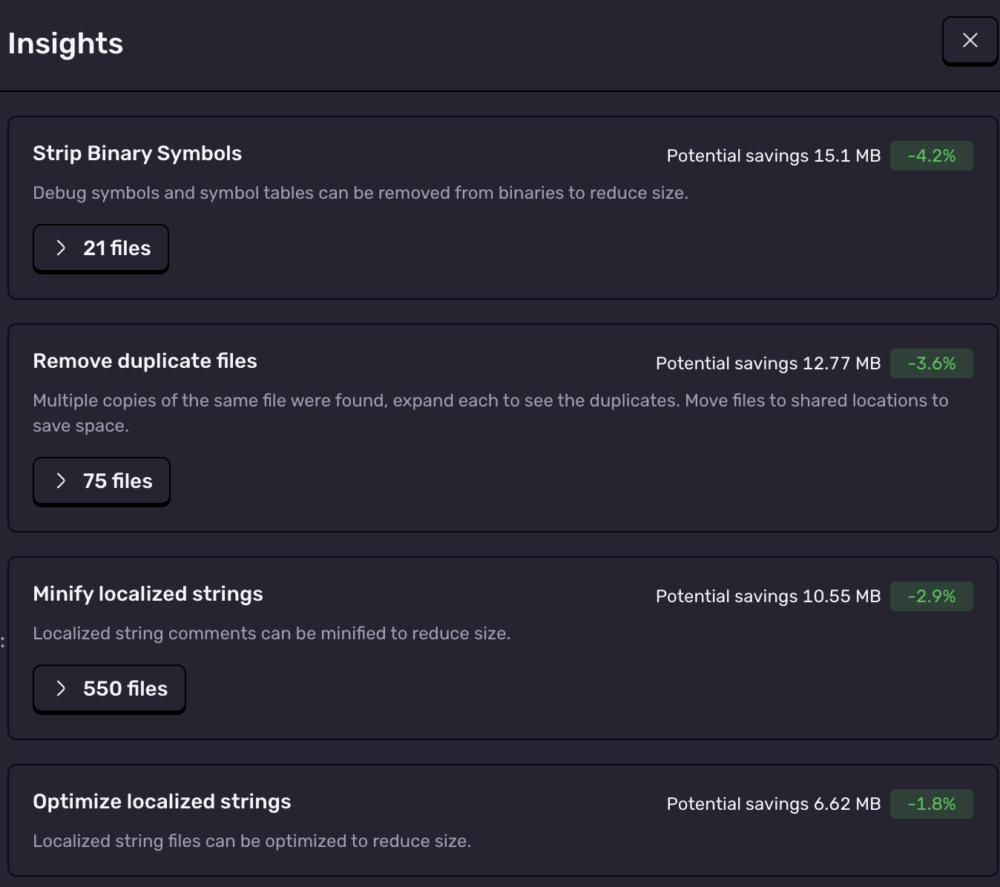
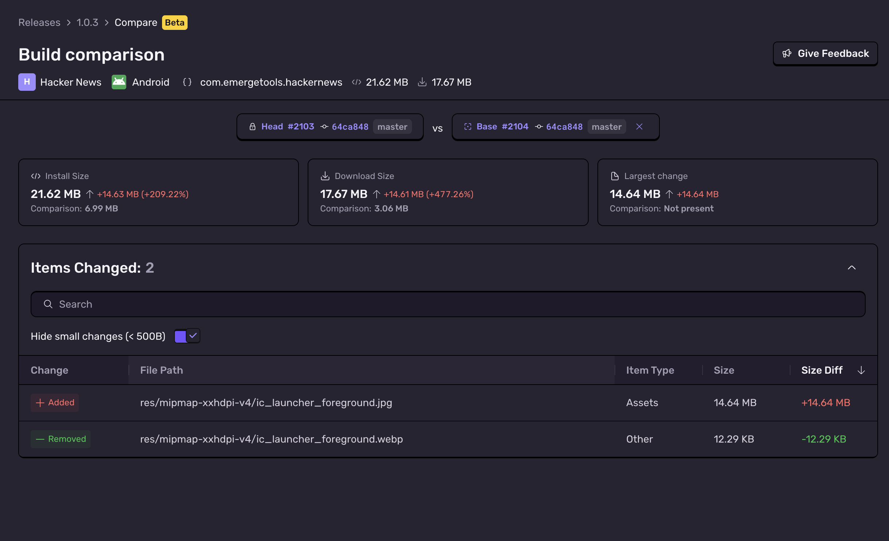

<Include name="size-analysis/ea" />

Size Analysis monitors your mobile app size to prevent regressions before they reach users. Upload builds from CI to spot regressions early, understand what's inside each bundle, and keep release artifacts lean.

## Why Track App Size?

- Faster downloads reduce install drop-off
- Install size is linked to uninstall rates, particularly for customers with limited storage or slower connections
- Size bloat can have downstream technical impact: longer build times, startup times, code complexity, etc.

## Features

### Build Details

Size Analysis breaks down your mobile app so you can see exactly where size is coming from. It surfaces Insights that recommend concrete fixes, such as compressing images or stripping debug info.

Size Analysis also provides actionable insights on how you can reduce your app's size. Insights are tailored to each platform. Dive deeper in:

- [Android](/platforms/android/size-analysis/insights/)
- [iOS](/platforms/apple/guides/ios/size-analysis/insights/)
- [React Native](/platforms/react-native/size-analysis/insights/)
- [Flutter](/platforms/dart/guides/flutter/size-analysis/insights/)

### Build Comparison

Compare any two builds to see what changed, review module-level diffs, and confirm that optimizations worked.

### Status Checks

Integrate into CI Size Analysis results on pull requests. You can track size on every commit to ensure there are no unnecessary size increases.

Learn how to set it up in the [CI integration guide](/product/size-analysis/integrating-into-ci/).

## Upload Guides

You can follow the platform guides to learn how to upload builds for Size Analysis:

- [Android](/platforms/android/size-analysis/)
- [iOS](/platforms/apple/guides/ios/size-analysis/)
- [React Native](/platforms/react-native/size-analysis/)
- [Flutter](/platforms/dart/guides/flutter/size-analysis/)

### Upload Metadata

Below is the metadata included in your build, regardless of the platform.

<Include name="size-analysis/upload-metadata" />

<PageGrid />
