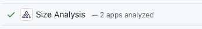
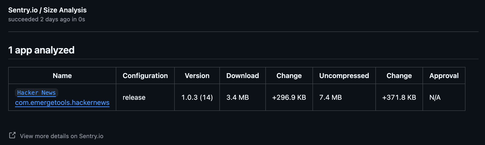

<Include name="size-analysis/github-only" />

## Github

The GitHub integration brings Size Analysis directly into your pull request workflow by adding status checks. This alerts developers to the size impact their code changes have on the app build, and can optionally block the pull request from being merged on large size increases.

### Installation

1. Install the Sentry Github App by following the installation instructions in the [GitHub integration documentation](https://docs.sentry.io/organization/integrations/source-code-mgmt/github/).

   a. If you have previously installed the Sentry App, ensure you have accepted the latest permissions in order to receive Status Checks.

2. Set up Size Analysis by following the guide for [iOS](/platforms/apple/guides/ios/size-analysis/) or [Android](/platforms/android/size-analysis/).

3. Create a workflow to upload base branch builds.

<Alert level="info" title="Release builds">
  We recommend uploading Release builds in CI since they are representative of
  what your end users see and provide cleaner diffs.
</Alert>

Size Analysis works by comparing a head vs a base build, similar to how code review compares your new code to the baseline code. First, we need to upload base builds:

```yml {filename:sentry_size_analysis_main.yml}
name: Sentry Size Analysis Upload

on:
  push:
    branches: [main] // or whatever is used

jobs:
  build_and_upload:
    // ...
```

Confirm that builds uploaded from this workflow have the correct `sha` metadata value, as well as no `base_sha` being set.

4. Create a workflow to upload pull request builds.

Next, we need the head build uploads:

```yml {filename:sentry_size_analysis_pull_request.yml}
name: Sentry Size Analysis Upload

on:
  pull_request:
    branches: [main] // or whatever is used

jobs:
  build_and_upload:
    // ...
```

Confirm that builds uploaded from this workflow have the correct `sha` and `base_sha` metadata values.

5. Confirm the status check appears

After configuring both workflows and sending the correct metadata, the status check should appear on every commit:



6. View the detailed breakdown

Clicking on the "Details" button above should bring you to a more detailed breakdown of the changes.



## Troubleshooting

### Not Seeing Status Checks

Check that:

- The Sentry GitHub App is installed and has access to your repository
- You're correctly uploading builds for size analysis from all base branch builds
- You're correctly uploading builds for size analysis from the PR branch.
- Your builds that you want to compare have the same build configuration (for example, both are `Release` builds)
- Your builds contain all the [required metadata](/product/size-analysis/#upload-metadata)

### Missing Base Build

The first time you set up Size Analysis, your main branch may not have any builds yet:

1. Merge a PR or push to your main branch to trigger a build
2. Future PRs will be able to compare against this base build

### Unexpected Size Changes Show in the Comparison

This could be due to a few things:

1. The wrong base build is being selected. Check that the Git information in both head/base builds match what you expect for your pull request.
2. The compiler optimized code in a different way. The analysis is being performed on the compiled output of the app, and sometimes the compiler can optimize code in slightly different ways depending on your code changes, for example with function outlining.
3. The build environment is different between head/base builds. For iOS analyses, make sure the same version of Xcode is being used for both the builds.
