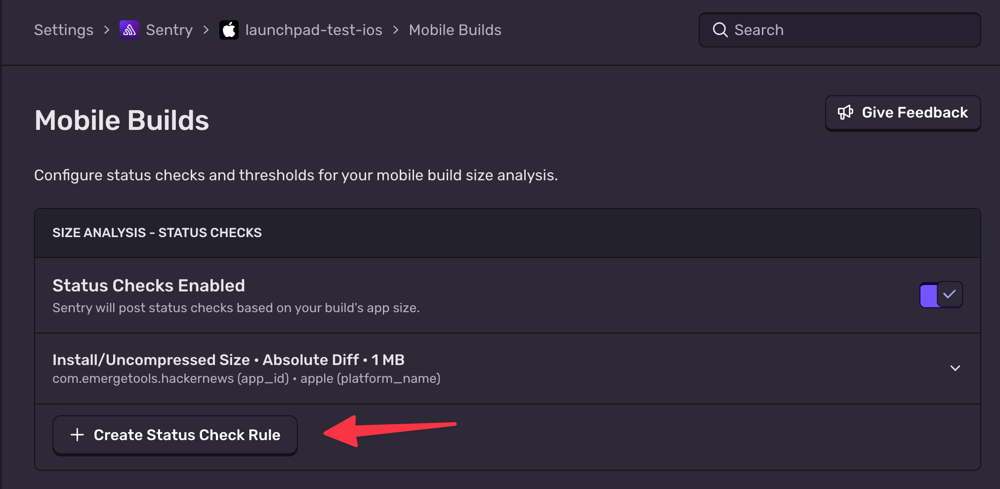
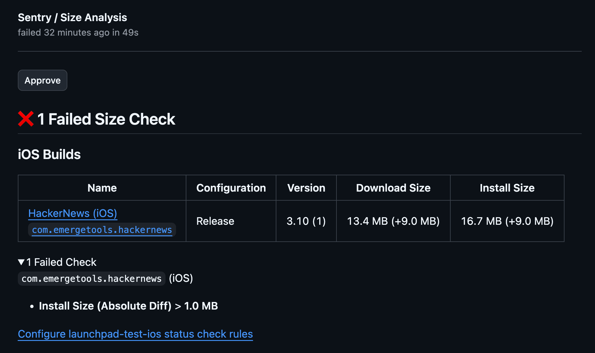

<Include name="size-analysis/github-only" />

## Github

The GitHub integration brings Size Analysis directly into your pull request workflow by adding status checks. This alerts developers to the size impact their code changes have on the app build, and can optionally block the pull request from being merged on large size increases.

Size Analysis works by comparing a head vs a base build, similar to how code review compares your new code to the baseline code.

### Installation

1. Install the Sentry Github App by following the installation instructions in the [GitHub integration documentation](https://docs.sentry.io/organization/integrations/source-code-mgmt/github/).

   a. If you have previously installed the Sentry App, ensure you have accepted the latest permissions in order to receive Status Checks.

2. Set up Size Analysis by following the guide for [iOS](/platforms/apple/guides/ios/size-analysis/) or [Android](/platforms/android/size-analysis/).

3. Modify an existing workflow or create a new workflow to upload base builds from your main or default branch to Sentry:

<Alert level="info" title="Release builds">
  We recommend uploading Release builds in CI since they are representative of
  what your end users see and provide cleaner diffs.
</Alert>

```yml {filename:sentry_size_analysis_main.yml}
name: Sentry Size Analysis Upload

on:
  push:
    branches: [main]

jobs:
  build_and_upload: // Add your upload command here from the respective iOS or Android guide
```

**Example workflows:**

- [Android main branch workflow](https://github.com/EmergeTools/hackernews/blob/main/.github/workflows/android_emerge_upload.yml) - Handles both push to main and pull requests in a single workflow
- [iOS main branch workflow](https://github.com/EmergeTools/hackernews/blob/main/.github/workflows/ios_emerge_upload_main.yml) - Separate workflow for main branch

Confirm that builds uploaded from this workflow have the correct `sha` metadata value, as well as no `base_sha` being set.

4. Modify an existing workflow or create a new workflow to upload head builds from your pull request branches:

```yml {filename:sentry_size_analysis_pull_request.yml}
name: Sentry Size Analysis Upload

on:
  pull_request:
    branches: [main]

jobs:
  build_and_upload: // Add your upload command here from the respective iOS or Android guide
```

**Example workflows:**

- [Android pull request workflow](https://github.com/EmergeTools/hackernews/blob/main/.github/workflows/android_emerge_upload.yml) - Combined main and PR workflow
- [iOS pull request workflow](https://github.com/EmergeTools/hackernews/blob/main/.github/workflows/ios_emerge_upload_pr.yml) - Separate PR workflow

Confirm that builds uploaded from this workflow have the correct `sha` and `base_sha` metadata values.

For more options on controlling which builds get processed for Size Analysis, see [Configuring Size Analysis Uploads](/product/size-analysis/#configuring-size-analysis-uploads).

5. Confirm the status check appears

After configuring both workflows and sending the correct metadata, the status check should appear on every commit:


6. View the detailed breakdown

Clicking on the "Details" button above should bring you to a more detailed breakdown of the changes.


## Configuring Status Check Rules

By default, status checks are **neutral**, they report size information but won't block your PR. To enforce size limits, create rules that fail the check when thresholds are exceeded.

### Creating a Rule

1. Go to **Settings > Projects > [Your Project] > Mobile Builds**
2. In the "Size Analysis - Status Checks" panel, make sure **Status Checks Enabled** is toggled on
3. Click **Create Status Check Rule**



Each rule has three parts:

| Setting         | Options                                     | Description                        |
| --------------- | ------------------------------------------- | ---------------------------------- |
| **Metric**      | Install Size, Download Size                 | Which size measurement to evaluate |
| **Measurement** | Absolute Size, Absolute Diff, Relative Diff | How to evaluate the metric         |
| **Threshold**   | Number (MB or %)                            | The limit that triggers a failure  |

**Measurement types:**

- **Absolute Size**: Fails if the total size exceeds the threshold (e.g., app must stay under 100 MB)
- **Absolute Diff**: Fails if the size increase exceeds the threshold (e.g., no PR can add more than 5 MB)
- **Relative Diff**: Fails if the percentage increase exceeds the threshold (e.g., no PR can increase size by more than 2%)

### Filtering Rules

Rules can target specific builds using filters:

- `app_id` - Filter by application identifier
- `platform_name` - Filter by platform (iOS, Android)
- `build_configuration_name` - Filter by build configuration (Release, Debug)
- `git_head_ref` - Filter by branch name

Leave filters empty to apply the rule to all builds.

### Example: Block PRs That Add More Than 2 MB to Install Size

1. Create a new rule
2. Set **Metric** to "Install Size"
3. Set **Measurement** to "Absolute Diff"
4. Set **Threshold** to "1 MB"
5. Set desired filters
6. Save the rule

When a PR increases install size by more than 1 MB, the status check will fail. From here you can click into the diff to investigate or "Approve" the status check.



## Troubleshooting

### Not Seeing Status Checks

Check that:

- The Sentry GitHub App is installed and has access to your repository
- You're correctly uploading builds for size analysis from all base branch builds
- You're correctly uploading builds for size analysis from the PR branch.
- Your builds that you want to compare have the same build configuration (for example, both are `Release` builds)
- Your builds contain all the [required metadata](/product/size-analysis/#upload-metadata)

### Missing Base Build

The first time you set up Size Analysis, your main branch may not have any builds yet:

1. Merge a PR or push to your main branch to trigger a build
2. Future PRs will be able to compare against this base build

### Unexpected Size Changes Show in the Comparison

This could be due to a few things:

1. The wrong base build is being selected. Check that the Git information in both head/base builds match what you expect for your pull request.
2. The compiler optimized code in a different way. The analysis is being performed on the compiled output of the app, and sometimes the compiler can optimize code in slightly different ways depending on your code changes, for example with function outlining.
3. The build environment is different between head/base builds. For iOS analyses, make sure the same version of Xcode is being used for both the builds.
