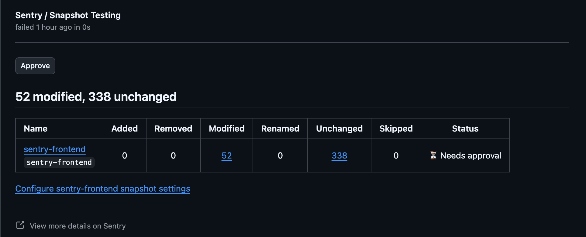

<Include name="feature-available-for-user-group-early-adopter" />

<Include name="snapshots/github-only" />

## GitHub

The GitHub integration brings Snapshots directly into your pull request workflow by adding status checks. This alerts reviewers to any visual changes a pull request introduces, and requires approval before the check passes.

Snapshots works by comparing a head vs. base build, similar to how code review compares your new code to the baseline code.

### Installation

1. Install the Sentry GitHub App by following the installation instructions in the [GitHub integration documentation](/organization/integrations/source-code-mgmt/github/).

If you have previously installed the Sentry App, ensure you have accepted the latest permissions in order to receive Status Checks.

2. Generate snapshots in your build using the tool that fits your platform. Common options include:
   - Playwright (web)
   - Paparazzi or Roborazzi
   - XCUITest snapshots
   - Laravel Dusk (PHP)
   - Any tool that produces PNG or JPEG files

   For a production reference, see Sentry's [`frontend-snapshots.yml`](https://github.com/getsentry/sentry/blob/master/.github/workflows/frontend-snapshots.yml) workflow.

3. Modify an existing workflow or create a new workflow to upload snapshots on pushes to your main branch and on pull requests:

```yml {filename:sentry_snapshots.yml}
name: Sentry Snapshots Upload

on:
  push:
    branches: [main]
  pull_request:
    branches: [main]

jobs:
  snapshots:
    # Add your snapshot generation step here
    # Then upload with `sentry-cli build snapshots` — see /product/snapshots/uploading-snapshots/
```

Confirm that snapshots uploaded on `push` have the correct `head-sha` and no `base-sha` set, and that snapshots uploaded on `pull_request` have both `head-sha` and `base-sha` set.

4. Confirm the status check appears

After configuring the workflow, a **Snapshot Testing** status check will appear on every pull request.



For details on the review and approval flow, see [Reviewing Snapshots](/product/snapshots/reviewing-snapshots/).

## Troubleshooting

### Status Check Not Appearing

Check that:

- The Sentry GitHub App is installed and has access to your repository.
- You're uploading snapshots from both your main branch (on `push`) and your pull request branches (on `pull_request`).
- The `--app-id` value matches between the head and base uploads.
- Your uploads include the correct git metadata (auto-detected in CI).

### Missing Base Build

The first time you set up Snapshots, your main branch may not have any uploads yet:

1. Merge a PR or push to your main branch to trigger an upload.
2. Future PRs will be able to compare against this base build.

### Wrong Base Snapshot Selected

If diffs look unexpected, the wrong base may be selected. When checking out the PR commit, use the PR head SHA (not the merge commit) so Sentry resolves the correct base:

```yml
- uses: actions/checkout@v4
  with:
    ref: ${{ github.event.pull_request.head.sha || github.sha }}
```
