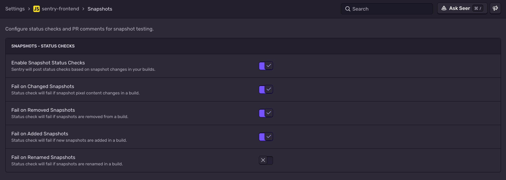
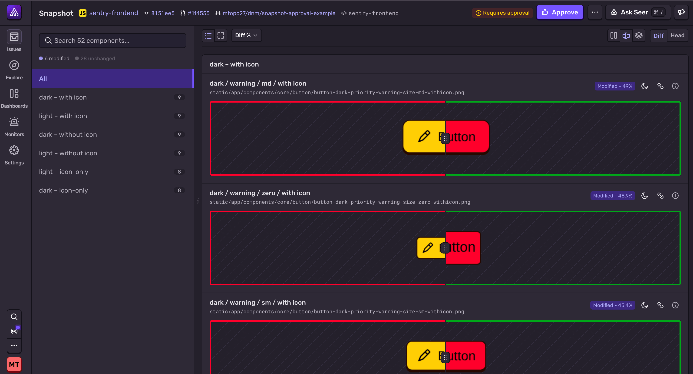
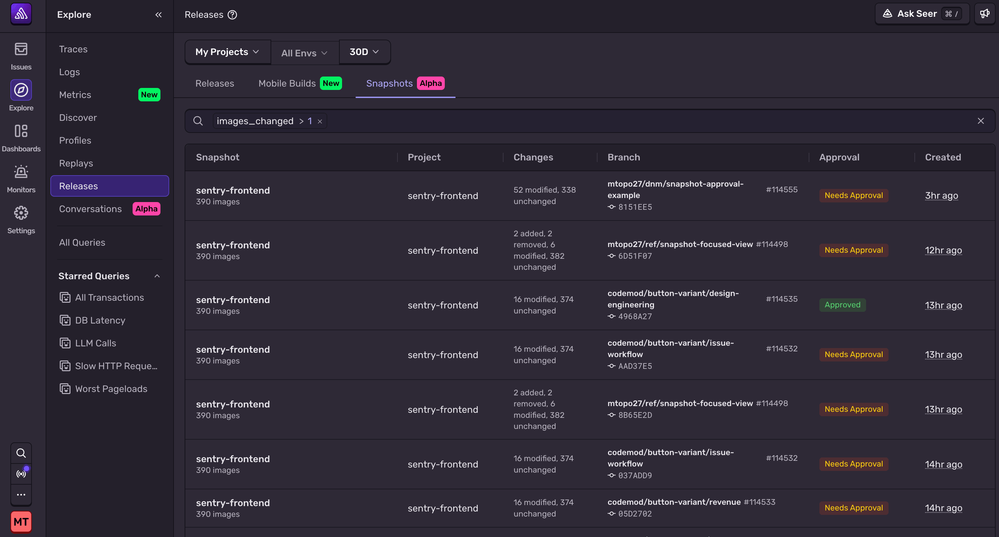
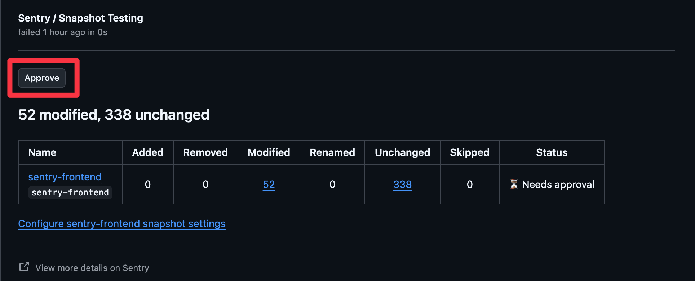
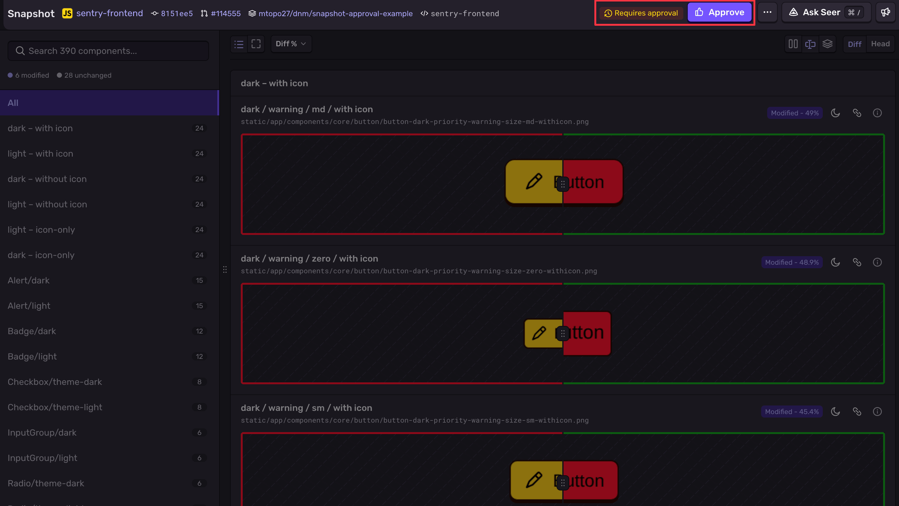

<Include name="feature-available-for-user-group-early-adopter" />

## Snapshot Comparisons

Snapshot comparisons use each upload's git metadata. Sentry compares the current upload to the upload with the same `app_id` whose `sha` matches the current upload's `base_sha`.

For example, you upload a snapshot with:

```yaml
id: 1
app_id: my_project.snapshots
sha: 123ABC
```

You then upload another snapshot:

```yaml
id: 2
app_id: my_project.snapshots
sha: 456DEF
base_sha: 123ABC
```

Sentry compares the snapshot images from upload 2 against the snapshots from upload 1. You do not need to maintain separate golden snapshots. Sentry uses git metadata, like a code review.

### Diff Thresholds

You can set a diff threshold to ignore small pixel changes. The diff threshold is a float between `0.0` and `1.0`. Sentry reports an image as changed only when the share of changed pixels is greater than the threshold. For example, `diff_threshold: 0.01` ignores changes of 1% or less.

You can Set diff thresholds in two ways:

1. Globally, for the whole upload: `sentry-cli build snapshots ./snapshots --app-id web-frontend --diff-threshold 0.01`
2. Locally, for one snapshot: add `diff_threshold` to the snapshot's [JSON metadata](/product/snapshots/uploading-snapshots/#json-metadata) file

If a global value and local value are set, the local value takes precedence.

## Status Checks

After you upload snapshots from a pull request branch, a **Snapshot Testing** GitHub Check appears on the pull request. If no snapshots changed, the check passes. By default, if any snapshots were modified or removed, the check fails and requires approval.


For setup instructions, see [Integrating Into CI](/product/snapshots/integrating-into-ci/).

### Status Check Settings

In your project settings, you can configure status check behavior to conditionally fail based on the number of modified, removed, added, or renamed snapshots.



## Sentry UI

You can view all images for an upload in the Sentry UI.You can filter for specific statuses (modified, added, removed, renamed, unchanged) and view the diff in three modes: split, wipe, and onion:

- **Split** — Side-by-side view of base and current branch with a diff overlay highlighting changed pixels.
- **Wipe** — Drag a slider across the image to compare base and current branch.
- **Onion** — Overlay both images with an adjustable opacity slider.



### Finding Snapshots

You can get to a specific snapshot from the links on the status check or through the Sentry Releases page.



## Approving Changes

There are two ways to approve snapshot changes:

Clicking the **Approve** button on the GitHub Check Run



Clicking **Approve** in the Sentry UI



Approving in either place will resolve the failing check. If a new commit is pushed after approval, Sentry re-approves the check when the snapshot changes match the previously approved changes. If they differ, the check requires approval again.

## Settings

Configure snapshot behavior in **Project Settings > Mobile Builds > Snapshots**.

| Setting                   | Default | Description                                           |
| ------------------------- | :-----: | ----------------------------------------------------- |
| Status Checks Enabled     |   On    | Post GitHub Check Runs for snapshot comparisons.      |
| Fail on Added Snapshots   |   Off   | Require approval when new snapshots are added.        |
| Fail on Removed Snapshots |   On    | Require approval when existing snapshots are removed. |
