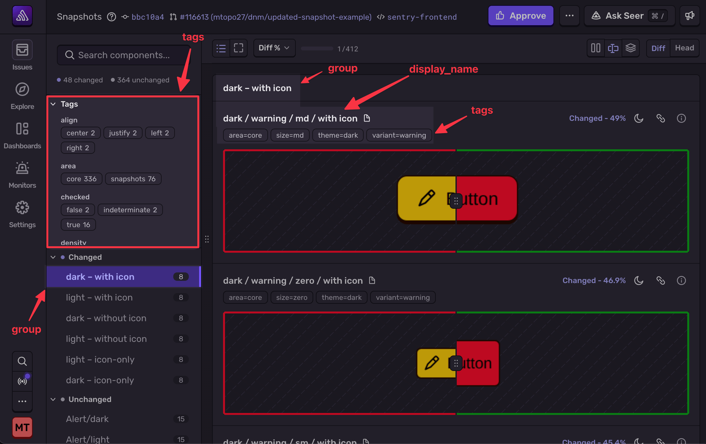

<Include name="feature-stage-beta.mdx" />

<Include name="snapshots/ci-alert" />

Snapshots works for any platform with a frontend. You can view specific platform examples [here](/product/snapshots#recommended-platform-workflows). This page covers the general upload structure and metadata schema.

## Upload command

You upload snapshots with the `sentry-cli snapshots upload` command, which takes a directory of images and optional JSON metadata files.

```bash
sentry-cli snapshots upload <output-dir> \
  --auth-token "$SENTRY_AUTH_TOKEN" \
  --app-id <app-id> \
  --project <project-slug>
```

For the full command reference, including auto-detected git metadata, see [Snapshots (CLI)](/cli/snapshots/). For an end-to-end CI setup, see [Integrating Into CI](/product/snapshots/integrating-into-ci/).

### Upload Structure

Each snapshot is a `.png` image with an optional `.json` metadata file of the same base name and path. You can optionally organize snapshots into subdirectories. If using subdirectories, the filename property in the Sentry UX will include the subdirectory path.

```
snapshots/
├── homepage.png
├── homepage.json
├── settings/
│   ├── profile.png
│   ├── profile.json
│   ├── billing.png
│   └── billing.json
```

Filenames are the identity key for each snapshot. Keep them stable across runs so Sentry can accurately diff head against base.

### JSON Metadata

You can include an optional JSON file to add metadata to each image:

```json
{
  "display_name": "Billing Page",
  "group": "Settings",
  "tags": {
    "surface": "billing",
    "team": "growth"
  },
  "diff_threshold": 0.01,
  "canvas_theme": "dark",
  "context": {
    "component": "BillingPage",
    "variant": {
      "plan": "team",
      "trial": true
    }
  }
}
```

| Field            | Type   | Description                                                                                                                                                            |
| ---------------- | ------ | ---------------------------------------------------------------------------------------------------------------------------------------------------------------------- |
| `display_name`   | string | Human-readable label shown in the comparison viewer.                                                                                                                   |
| `group`          | string | Groups related snapshots in the UI sidebar.                                                                                                                            |
| `tags`           | object | Key-value string labels attached to the snapshot. Use them to filter and group snapshots in the viewer, for example by theme, viewport, or component variant.          |
| `diff_threshold` | number | Value from `0.0` to `1.0`. Sentry reports the image as changed only when the share of changed pixels is greater than this value. `0.01` ignores changes of 1% or less. |
| `canvas_theme`   | string | `"light"` or `"dark"`. Controls the background canvas Sentry renders behind the snapshot image in the web UI. Display metadata only; it doesn't change the rendered image. |
| `context`        | object | Arbitrary key-value context that tools and LLMs can use to help diagnose changes. Values can be strings, numbers, booleans, or nested objects.                         |



### Supported Formats

Snapshots supports the following image formats:

- PNG
- JPEG

## Selective Testing

If you only generate a subset of your snapshots per CI run — for example, because you run only affected tests — pass the `--selective` flag:

```bash
sentry-cli snapshots upload ./snapshots --app-id web-frontend --selective
```

When an upload is marked as selective, Sentry only diffs the snapshots you uploaded. Any snapshot that exists in the base build but was not included in the upload is treated as **unchanged** (skipped) rather than removed.

### Detecting Removals and Renames

<Include name="snapshots/detecting-removals-renames" />

For the full `sentry-cli snapshots upload` flag reference, see [Snapshots (CLI)](/cli/snapshots/).
