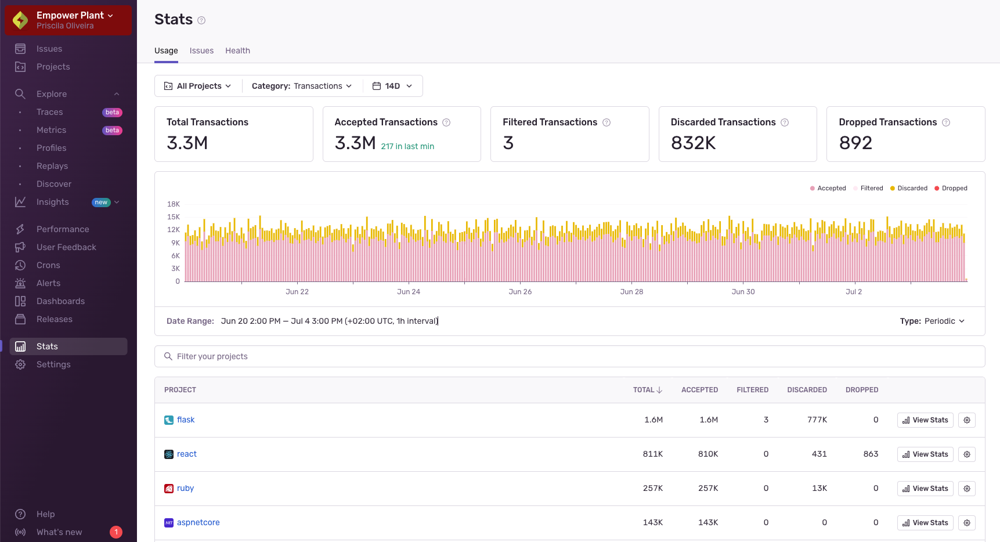

The **Stats** page has three tabs: [Usage](#usage-stats), [Issues](#issue-stats), and [Health](#health-stats).

The "Usage" tab shows your organization’s event and attachments usage, while also providing a high-level overview of how different projects are using Sentry. The "Issues" tab shows a breakdown of the issues assigned to your team and how they triaged them, while the "Health" tab provides an overview of your team’s project health.

## Usage Stats

The "Usage" tab provides an overview of the events (errors and transactions) and attachments that Sentry has received across your entire organization. It includes a detailed breakdown of each project's consumption categorized as _Accepted_, _Filtered_, _Discarded_, or _Dropped_.

#### Accepted

Events and attachments that were successfully processed and stored.

#### Discarded

Events and attachments discarded on the client side due to the sampling configuration in the SDK or other factors.

#### Filtered

| Reason                                                                              | Meaning                                                                            |
| ----------------------------------------------------------------------------------- | ---------------------------------------------------------------------------------- |
| [Browser Extensions](/concepts/data-management/filtering/#browser-extension-errors) | Filtered by browser extension.                                                     |
| Error Message                                                                       | Filtered based on specific error message.                                          |
| Filtered Transactions                                                               | Filtered because it was a call to a filtered transaction.                          |
| Ip Address                                                                          | Filtered by IP address.                                                            |
| Invalid CSP                                                                         | Filtered due to an invalid Content Security Policy (CSP) policy.                   |
| [Legacy Browsers](/concepts/data-management/filtering/#legacy-browser-filters)      | Filtered out certain legacy versions of browsers that are known to cause problems. |
| Localhost                                                                           | Filtered due to localhost restriction.                                             |
| Release Version                                                                     | Filtered by release name (version).                                                |
| [Web Crawlers](/concepts/data-management/filtering/#web-crawler-errors)             | Identified as known web crawler.                                                   |
| ? (Others)                                                                          | Filtered due to other generic filtering rules not specified above.                 |

#### Dropped

Events and attachments discarded by the system due to rate limits, quotas, spike protection, [size limits](/concepts/data-management/size-limits), or invalid data. You can see the common reasons below:

| Reason                          | Meaning                                                                                                                 |
| ------------------------------- | ----------------------------------------------------------------------------------------------------------------------- |
| Abuse                           | Activated when Sentry is misused.                                                                                       |
| Auth Client                     | The SDK did not send a client identifier. In Relay, this is no longer required.                                         |
| Auth Version                    | The protocol version sent by the SDK is not supported and parts of the payload may be invalid.                          |
| Cardinality Limited             | Exceeded internally defined cardinality limit.                                                                          |
| Content Type                    | The content type for a specific endpoint was not allowed.                                                               |
| Cors                            | The request origin is not allowed for the project.                                                                      |
| Disallowed Method               | A store request was received with an invalid method.                                                                    |
| Duplicate                       | An event with the same id has already been processed for this project.                                                  |
| Duplicate Item                  | An envelope was submitted with two items that need to be unique.                                                        |
| Empty Envelope                  | The envelope contains no items.                                                                                         |
| Feature Disabled                | The envelope contains no items.                                                                                         |
| Internal                        | An error in Relay caused event ingestion to fail.                                                                       |
| Invalid Compression             | The payload had an invalid compression stream.                                                                          |
| Invalid Envelope                | Parsing an event envelope failed (likely missing a required header).                                                    |
| Invalid Json                    | Parsing the event JSON payload failed due to a syntax error.                                                            |
| Invalid Minidump                | The file submitted as minidump is not a valid minidump file.                                                            |
| Invalid Msgpack                 | Parsing the event msgpack payload failed due to a syntax error.                                                         |
| Invalid Multipart               | Parsing a multipart form-data request failed.                                                                           |
| Invalid Replay Event            | Sentry failed to parse the replay so we dropped it.                                                                     |
| Invalid Replay Event No Payload | Sentry failed to parse the replay so we dropped it.                                                                     |
| Invalid Replay Event Pii        | Sentry failed to parse the replay so we dropped it.                                                                     |
| Invalid Replay Record Event     | Sentry failed to parse the replay so we dropped it.                                                                     |
| Invalid Replay Video Event      | Sentry failed to parse the replay so we dropped it.                                                                     |
| Invalid Span                    | A span is not valid after normalization.                                                                                |
| Invalid Transaction             | The event is parseable but semantically invalid. This should only happen with transaction events.                       |
| Missing Minidump Upload         | A minidump file was missing for the minidump endpoint.                                                                  |
| Multi Project Id                | The project id in the URL does not match the one specified for the public key.                                          |
| No Data                         | The store request was missing an event payload.                                                                         |
| No Event Payload                | An event envelope was submitted but no payload could be extracted.                                                      |
| Payload                         | Parsing the event JSON payload failed due to a syntax error.                                                            |
| Process Unreal                  | Symbolic failed to extract an Unreal Crash report from a request sent to the Unreal endpoint.                           |
| Profiling                       | Profiling related dropped reasons.                                                                                      |
| Project Id                      | There was no valid project id in the request or the required project does not exist.                                    |
| Project State                   | A project state returned by the upstream could not be parsed.                                                           |
| Project State Pii               | A project state returned by the upstream contained datascrubbing settings that could not be converted to PII config.    |
| Rate Limited                    | Exceeded allowed event rate.                                                                                            |
| Spike Protection                | Activated to protect from any sudden quota-depleting spike.                                                             |
| Security Report                 | Triggered to prevent any sudden spikes that could deplete the quota.                                                    |
| Security Report Time            | The security report was not recognized due to missing data.                                                             |
| Timestamp                       | The timestamp of an event was required for processing and either missing out of the supported time range for ingestion. |
| Too Large                       | The event payload exceeds the maximum size limit for the respective endpoint.                                           |
| Transaction Sampled             | The envelope, which contained only a transaction, was dropped by the dynamic sampling rules.                            |

On this page, you can track projects that have experienced recent spikes in activity or are particularly active, which may require closer attention. Additionally, you have the flexibility to adjust the displayed date range, enabling you to narrow down to a specific period or zoom out for a broader overview.

While primarily designed for organization admins, this page is accessible to all team members. This inclusivity is beneficial, especially when non-admin team members need to review these statistics. It allows them to investigate why events associated with their specific projects might be discarded, dropped or filtered.

With the dropdowns at the top of the page, you can set whether the page displays stats for errors, transactions, or attachments, as well as the date range. With the date selector, the time period can be set from an hour to a maximum of 90 days, and all of the page elements change dynamically when you update this setting.

<Note>
  This page does not include data about sessions because they are not a billable
  event type.
</Note>

### Usage Cards

The cards on the page provide high-level usage stats about events and attachments, including the total number of either for the period, as well as which ones were accepted, filtered, discarded or dropped.

### Summary Chart

The chart on this page displays a breakdown of events and attachments over the selected date range. Depending on the date range that you set the chart to display, each bar in the chart represents a different amount of time or interval. For example, if you set the chart to display seven days, each bar in the chart represents one hour, but if you set it to display 90 days, each bar represents one day. You can also use the “Type” dropdown to set whether the chart shows a cumulative count of events or attachments, or a daily (or hourly) count.

When you set a date range that results in intervals of one day or more, the time zone is displayed in UTC to ensure consistency for users across different time zones. For time periods with intervals of less than 24 hours, the time zone is based on your "Timezone" setting in **User Settings > Account Details**.

### Project Usage Stats Table

The “Project” table provides insight into per-project usage of your errors, transactions, and attachments over time. The table shows you the total errors, transactions, or attachments. Those are further broken down into the accepted, filtered, and dropped categories.

Each project in the table has individual settings, which you can access from by clicking the settings icon (gear wheel) next to the name of the project. For instance, you might want to go to the project settings so you can limit the quota consumed by its DSNs. Clicking the name of the project takes you to the **Project Details** page.

The table displays only the projects of the teams that you belong to, unless you have permissions to see all projects.

## Issues Stats

<Include name="feature-available-for-plan-business.mdx" />

The "Issues" tab shows activity about issues assigned to your team; how many new issues were detected, how many resolved issues regressed, and how they were triaged.

#### All Unresolved Issues

The "All Unresolved Issues" chart and table show new and returning issues per project in the last seven days, as well as those that haven’t been resolved or archived in the past.

#### New and Returning Issues

The "New and Returning Issues" chart and table show the new, regressed, and escalating issues that were assigned to your team.

#### Issues Triaged

The "Issues Triaged" chart and table show how many new and returning issues were reviewed by your team each week. Reviewing an issue includes marking it as reviewed, resolving it, assigning it to another team, or deleting it.

#### Age of Unresolved Issues

The "Age of Unresolved Issues" chart and table show how long ago the oldest seven unresolved issues were first created for the projects your team owns, sorted by their age.

#### Time to Resolution

The "Time to Resolution" chart shows the mean time it took for issues to be resolved by your team each week.

## Health Stats

<Include name="feature-available-for-plan-business.mdx" />

The "Health" tab shows information about the overall health of your projects; the crash free sessions, user misery of your team’s key transactions, the number of alerts triggered by your team’s alert rules, and the number of releases per project.

#### Crash Free Sessions

The "Crash Free Sessions" table shows the percentage of sessions that didn’t cause a crash for the selected date range.

#### User Misery

The "User Misery" table shows transactions where users experienced load times four times the project’s configured threshold, with the number of unique users for each of those transactions.

#### Metric Alerts Triggered

The "Metric Alerts Triggered" chart and table show alert rules that have been triggered for the projects your team owns.

#### Number of Releases

The "Number of Releases" chart and table show the releases that were created for each of your team's projects.
