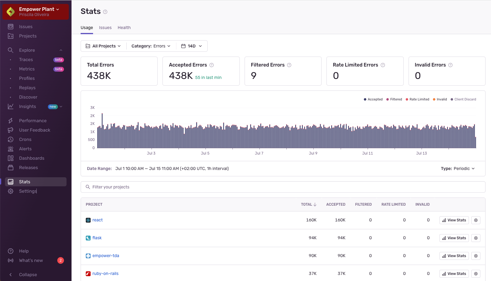

The [**Stats**](https://sentry.io/orgredirect/organizations/:orgslug/stats/) page is an overview of the usage data that Sentry receives across your entire organization. It allows you to spot projects that have experienced recent spikes in activity or are showing more errors than others and may require a closer look. You can also adjust the displayed date range, enabling you to narrow down to a specific time period or zoom out for a broader view.

With the dropdowns at the top of the page, you can set whether the page displays stats for errors, transactions, or attachments, as well as the date range. With the date selector, the time period can be set from an hour to a maximum of 90 days, and all of the page elements change dynamically when you update this setting.

<Alert>
  This page does not include data about sessions because they are not a billable
  event type.
</Alert>

There are three tabs available on the page: [Usage](#usage-stats), [Issues](#issue-stats), and [Health](#health-stats).

The "Usage" tab shows your organization’s event and attachments usage, while also providing a high-level overview of how different projects are using Sentry. The "Issues" tab shows a breakdown of the issues assigned to your team and how they triaged them, while the "Health" tab provides an overview of your team’s project health.

## Usage Stats

The "Usage" tab provides an overview of the events (errors and transactions) and attachments that Sentry has received across your entire organization. It includes a detailed breakdown of each project's consumption categorized as _Accepted_, _Filtered_, _Rate Limited_, _Invalid_ or _Client Discard_.

### Accepted

Events and attachments that were successfully processed and stored.

### Filtered

Filtered events and attachments intentionally excluded based on defined settings. Common reasons include:

- **Browser Extensions**: Filtered by browser extension.
- **Chunk Load Errors**: Filtered when code chunks can’t be found on the server.
- **Error Message**: Filtered based on specific error messages.
- **Filtered Transaction**: Filtered because it was a call to a filtered transaction.
- **Invalid CSP**: Filtered due to an invalid Content Security Policy (CSP) policy.
- **Ip Address**: Filtered by IP address.
- **Legacy Browsers**: Filtered by certain legacy versions of browsers that are known to cause problems.
- **Localhost**: Filtered due to localhost restriction.
- **Release Version**: Filtered by release name (version).
- **React Hydration Errors**: Filtered due to a mismatch between the server-rendered and initial client User Interface.
- **Web Crawlers**: Identified as a known web crawler.

For more details, please consult the [Inbound Filters](/concepts/data-management/filtering/) documentation.

### Rate Limited
Events and attachments discarded due to rate limits or quota. The following reasons are currently defined:

- **Disabled**:  Data was received for a feature or function that is not available to your organization.
- **DSN Limit**: Traffic exceeded a rate limit defined on the client key (DSN). See [Rate Limits](/pricing/quotas/#rate-limits) for more information.
- **Global Limit**: Traffic exceeded an organization-wider or project-wide rate limit. This setting is no longer available to most organizations.
- **Quota**: The monthly quota of your subscription was depleted and there is no pay-as-you-go budget left. See [Adjusting your Quota](/pricing/quotas/#adjusting-your-quota) for more information.
- **Spike Protection**: Activated to protect from a sudden spike in event volume. See [Spike Protection](/pricing/quotas/spike-protection/) for more information.
- **Internal Limit**: A rate limit for excessive volume was enforced by Sentry. These limits are not configurable.

### Invalid
Events and attachments might be discarded if they don't match the expected format or contain data that can't be processed. The following reasons are currently defined:

- **Disallowed Domain**: A request from an unallowed origin was sent to Sentry. Check project settings to configure allowed domains.
- **Duplicate**: An event with the same id has already been processed for this project. Sentry does not allow duplicate events and only stores the first one.
- **Empty**: An empty request or a request missing its primary data component was submitted.
- **Invalid Data**: Data sent by the SDK was invalid and does not meet the basic schema. This likely indicates an SDK implementation bug. Please report a bug if this issue persists.
- **Invalid Request**: The HTTP submission was invalid or was missing required information. This is likely due to a problem in the SDK implementation. Please report a bug if this issue persists.
- **Minidump**: The minidump in a minidump upload request was missing or invalid. See the [Minidumps documentation](/platforms/native/guides/minidumps/) for details on how to upload minidumps.
- **Payload**: The HTTP submission was incomplete and could not be processed. This is likely due to a network failure.
- **Project Missing**: The specified Sentry project is disabled or project information in the submitted request was inconclusive.
- **Sampling**: Tracing data that is discarded during sampling.
- **Security Report**: An invalid or unsupported security report was submitted. If this report originates from an up-to-date browser, please report a bug to Sentry. See [Security Policy Reporting](/security-legal-pii/security/security-policy-reporting/) for more information.
- **Too Large**: The HTTP submission or its contained data exceeds size limits. See [this document](https://develop.sentry.dev/sdk/data-model/envelopes/#size-limits) for the precise limits.
- **Unreal**: An unsupported or invalid Unreal Engine crash report was submitted. If this request originates from a recent or development version of the Unreal Engine, please report a bug to Sentry. See [Unreal Engine](/platforms/unreal/) for more information.
- **Internal**: An internal problem at Sentry prevented regular processing or storage of the submitted information.

### Client Discard
Events and attachments discarded by the SDK. The following reasons are currently defined:

- **Queue Overflow**: An SDK internal queue (for example, a transport queue) overflowed.
- **Cache Overflow**: An SDK internal cache (for example, an offline event cache) overflowed.
- **Ratelimit Backoff**: The SDK dropped events because a previous rate limit instructed the SDK to back off.
- **Network Error**: Events were dropped due to network errors, and were not retried.
- **Sample Rate**: An event was dropped because of the configured sample rate.
- **Before Send**: An event was dropped in `before_send`.
- **Event Processor**: An event was dropped by an event processor; this may also be used for ignored exception/errors.
- **Send Error**: An event was dropped because of an error when sending it (for example, a 400 response).
- **Internal SDK Error**: An event was dropped due to an internal SDK error (for example, a web worker crash).
- **Insufficient Data**: An event was dropped due to a lack of data in the event (for example, not enough samples in a profile).
- **Backpressure**: An event was dropped due to downsampling caused by the system being under load.

For more details, please consult the [Client Reports](https://develop.sentry.dev/sdk/telemetry/client-reports/#envelope-item-payload) documentation.

### Usage Cards

The cards on the page provide high-level usage stats about events and attachments, including the total number of either for the time period specified. You can also see which ones were accepted, filtered, rate limited, or invalid.

### Summary Chart

The chart on this page displays a breakdown of events and attachments over the selected date range. Depending on the date range that you set the chart to display, each bar in the chart represents a different amount of time or interval. For example, if you set the chart to display seven days, each bar in the chart represents one hour, but if you set it to display 90 days, each bar represents one day. You can also use the “Type” dropdown to set whether the chart shows a cumulative count of events or attachments, or a daily (or hourly) count.

When you set a date range that results in intervals of one day or more, the time zone is displayed in UTC to ensure consistency for users across different time zones. For time periods with intervals of less than 24 hours, the time zone is based on your "Timezone" setting in **User Settings > Account Details**.

### Project Usage Stats Table

The “Project” table provides insight into per-project usage of your errors, transactions, and attachments over time. The table shows you the total errors, transactions, or attachments. Those are further broken down into the accepted, filtered, and dropped categories.

Each project in the table has individual settings, which you can access from by clicking the settings icon (gear wheel) next to the name of the project. For instance, you might want to go to the project settings so you can limit the quota consumed by its DSNs. Clicking the name of the project takes you to the **Project Details** page.

The table displays only the projects of the teams that you belong to, unless you have permissions to see all projects.

## Issues Stats

<Include name="feature-available-for-plan-business.mdx" />

The "Issues" tab shows activity about issues assigned to your team; how many new issues were detected, how many resolved issues regressed, and how they were triaged.

#### All Unresolved Issues

The "All Unresolved Issues" chart and table show new and returning issues per project in the last seven days, as well as those that haven’t been resolved or archived in the past.

#### New and Returning Issues

The "New and Returning Issues" chart and table show the new, regressed, and escalating issues that were assigned to your team.

#### Issues Triaged

The "Issues Triaged" chart and table show how many new and returning issues were reviewed by your team each week. Reviewing an issue includes marking it as reviewed, resolving it, assigning it to another team, or deleting it.

#### Age of Unresolved Issues

The "Age of Unresolved Issues" chart and table show how long ago the oldest seven unresolved issues were first created for the projects your team owns, sorted by their age.

#### Time to Resolution

The "Time to Resolution" chart shows the mean time it took for issues to be resolved by your team each week.

## Health Stats

<Include name="feature-available-for-plan-business.mdx" />

The "Health" tab shows information about the overall health of your projects; the crash free sessions, user misery of your team’s key transactions, the number of alerts triggered by your team’s alert rules, and the number of releases per project.

#### Crash Free Sessions

The "Crash Free Sessions" table shows the percentage of sessions that didn’t cause a crash for the selected date range.

#### User Misery

The "User Misery" table shows transactions where users experienced load times four times the project’s configured threshold, with the number of unique users for each of those transactions.

#### Metric Alerts Triggered

The "Metric Alerts Triggered" chart and table show alert rules that have been triggered for the projects your team owns.

#### Number of Releases

The "Number of Releases" chart and table show the releases that were created for each of your team's projects.
