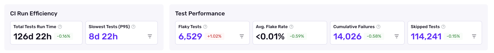

Sentry Test Analytics provides actionable insights into your CI test runs, helping you identify flaky tests, track failures, and optimize your test suite for faster, more reliable deployments.

## Why Use Test Analytics?

- **Spot Flaky Tests:** Quickly identify and address tests that fail intermittently, reducing noise and wasted debugging time
- **Track Failures and Trends:** Monitor cumulative failures, slowest tests, and overall test run efficiency to improve CI reliability
- **Get Actionable Insights:** See which lines of code failed within tests, and prioritize fixes
- **Leverage Sentry Integration:** Access test analytics alongside your error and performance data for a unified developer experience

## Getting Started

<Alert>
  Sentry Test Analytics is currently in <strong>beta</strong>. Beta features are still a work in progress and may have bugs.
</Alert>


To use Sentry Test Analytics, you'll need to install the [Sentry app](https://github.com/apps/sentry) on your GitHub organization or specific repositories. Once installed, choose your JUnit XML Report framework and [set your permissions](#permissions-and-repository-tokens) using a repository secret.

<Alert>
**The only test result file format we support is JUnit XML**. Most test frameworks support outputting test results in this format, with some configuration.

Each testing framework will have slight differences in the JUnit XML format it outputs, but we aim to support all of them.
</Alert>

**There are two ways to upload your test results:**

### 1. Use GitHub Actions to Run Your CI
If you are already using GitHub Actions, you can use the `getsentry/prevent-action` script to upload your test results.

```yaml
- name: Upload test results to Sentry
  if: ${{ !cancelled() }}
  uses: getsentry/prevent-action@v0
  with:
    token: ${{ secrets.SENTRY_PREVENT_TOKEN }}
```

You can also use [Open ID Connect](https://docs.github.com/en/actions/concepts/security/openid-connect) instead of the prevent tokens a way to authenticate your GitHub Actions workflow.

### 2. Use [Sentry Prevent CLI](/product/test-analytics/sentry-prevent-cli/) to Upload Testing Reports
If you do not use Github Actions, install the Sentry Prevent CLI using `pip install sentry-prevent-cli` (for Python), or use a binary platform.

```bash {tabTitle:macos}
curl -L https://github.com/getsentry/sentry-prevent-cli/releases/latest/download/sentry-prevent-cli-macos -o sentry-prevent-cli
chmod +x sentry-prevent-cli
```

```bash {tabTitle:linux}
curl -L https://github.com/getsentry/sentry-prevent-cli/releases/latest/download/sentry-prevent-cli-linux -o sentry-prevent-cli
chmod +x sentry-prevent-cli
```

```bash {tabTitle:alpine linux}
curl -L https://github.com/getsentry/sentry-prevent-cli/releases/latest/download/sentry-prevent-cli-alpine -o sentry-prevent-cli
chmod +x sentry-prevent-cli
```

```bash {tabTitle:windows}
curl -L https://github.com/getsentry/sentry-prevent-cli/releases/latest/download/sentry-prevent-cli-windows.exe -o sentry-prevent-cli.exe
```

```bash {tabTitle:linux arm64}
curl -L https://github.com/getsentry/sentry-prevent-cli/releases/latest/download/sentry-prevent-cli-linux-arm64 -o sentry-prevent-cli
chmod +x sentry-prevent-cli
```

```bash {tabTitle:alpine linux arm64}
curl -L https://github.com/getsentry/sentry-prevent-cli/releases/latest/download/sentry-prevent-cli-alpine-arm64 -o sentry-prevent-cli
chmod +x sentry-prevent-cli
```

Then, upload your test results using the CLI:

```bash
sentry-prevent-cli upload --report-type test-results --token <PREVENT_TOKEN>
```

### Run Your Test Suite
Now that you've configured your CI to upload your test results, you can inspect the workflow logs to see if the call to Sentry succeeded. You need to have some failed tests to view the failed tests report.

## Viewing Test Analytics

After your workflow runs, view failed tests in the [failed tests dashboard](https://sentry.io/prevent/tests/?filterBy=failedTests), or in your GitHub pull request comments.


### Reading Test Analytics Data
You can see a complete overview of your test analytics in the [test analytics dashboard](https://sentry.io/prevent/tests/).     
**Note**: The `All Branches`dashboard refreshes every 24 hours.



- `Failed Tests`: Shows all failed tests across all branches. Because of this, the _total run time_ may be higher than the filtered time range selected.
- `Flaky Tests`: These are tests that go from fail to pass or pass to fail compared to the default branch. This analysis will only run when: 
  - The commit is merged
  - The commit is on the default branch (commit.branch == repo.branch)
  - Flake detection is enabled on your yaml (default is true)
  - Either: The repo is public (regardless of plan type); Or: The repo is private, and is above free or team plan types
- `Cumulative Failures`: Shows the number of individual test failures, only on the default branch.

##  Permissions and Repository Tokens
When configuring Test Analytics, you'll be asked to choose your upload permissions. For GitHub Actions, you can use [OpenID Connect](https://docs.github.com/en/actions/security-for-github-actions/security-hardening-your-deployments/about-security-hardening-with-openid-connect), or generate a repository token. Using the CLI, generate a repository token.

You can find a list of repository tokens on the Sentry Prevent [tokens page](https://sentry.io/prevent/tokens/).


## Read Next

<PageGrid />
