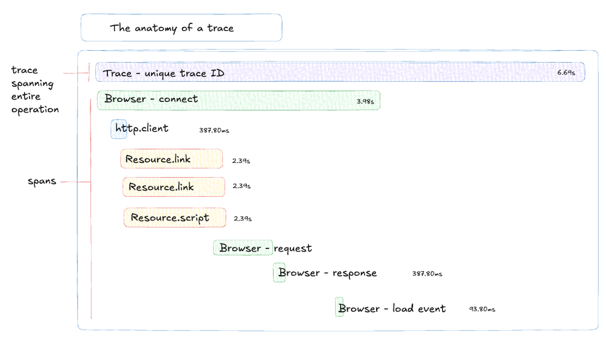
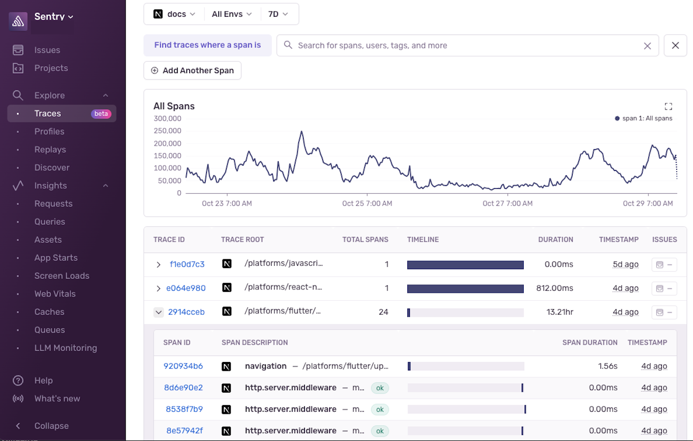
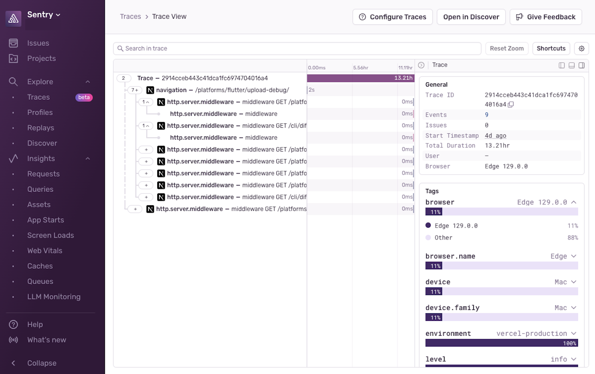
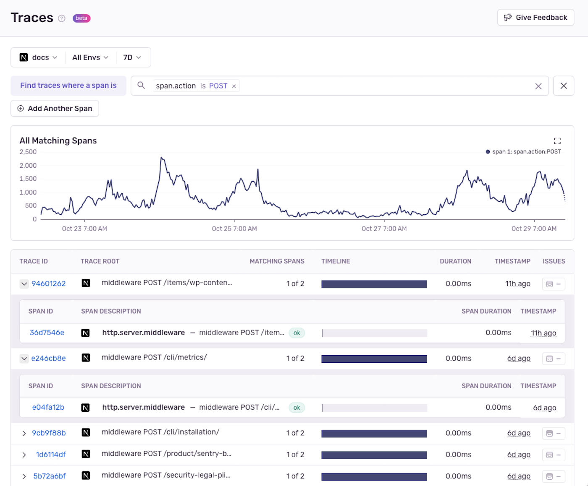
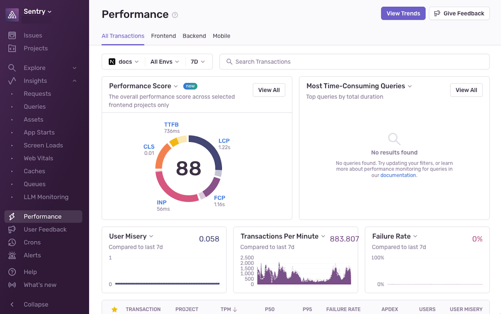

## What's Tracing?

Tracing is the process of capturing the timing and flow of requests and operations as they happen in your application. It's a powerful debugging tool, helping you identify which link in a sequence of events may be causing a problem, such as slow performance.

### What's Distributed Tracing?

Distributed tracing provides a unified view of how a single request moves from the frontend to the backend and beyond. This is particularly useful in modern applications, which are often composed of multiple separate services working together. To get a distributed view of your application, instrument Sentry in both your frontend and your backend.

With distributed tracing, you can identify performance bottlenecks that are affecting your application no matter where in your application's workflow they occur. You can then use Sentry tools such as the [Trace Explorer](/product/explore/traces/) or [Trace View](/concepts/key-terms/tracing/trace-view/) page to dig deeper and find the root cause of the problem. Distributed tracing is particularly helpful for identifying problems in production that you can't debug using console logs, such as race conditions, [N+1 queries](/product/issues/issue-details/performance-issues/n-one-queries/), and [caching issues](/product/insights/caches/).

### What's a Trace?

A trace is a record of a series of connected events and operations coming from your application. Each trace has a string of globally unique characters called a trace ID that's passed between frontend and backend services. The trace ID connects all the actions that take place, starting from the moment a user performs an action on the frontend, all the way through to the actions this triggers across your application and services. Each trace is composed of multiple spans.

### What's a Span?
A span is a named, timed operation that represents a part of the application workflow. The data captured for each span provides granular insights into specific tasks, like API requests or database queries. Multiple spans are pieced together to create a trace, providing a comprehensive overview of how your application works. This makes it easier to troubleshoot and analyze performance issues.

### What's a Transaction?

In Sentry, a "transaction" is a specific unit that represents any event that your application sends to Sentry, like loading a web page or processing an API call. Each transaction is made up of one or more spans. Transactions have a unique transaction ID and include the associated child spans that capture the operation’s entire process from start to finish.

## How to Use Tracing in Sentry

If you instrument Sentry for a single part of your app (just the frontend for example), looking at a trace will provide useful context for debugging issues within that app or service. But to get the most out of tracing in Sentry, you'll need to instrument the frontend, the backend, and any services in-between with Sentry's SDK. Once this is done, there are several places where you can view and interact with tracing data:

### Traces to Trace View

You can view all the traces in your organization by going to the [Traces](https://sentry.io/orgredirect/organizations/:orgslug/traces/) page in Sentry. You'll see a chart and a list of traces and be able to see at-a-glance how long each trace took to complete and the number of spans it contains.

If you want more information, click on any trace ID. This will take you to the [Trace View](/concepts/key-terms/tracing/trace-view/) page, which provides a more detailed view of the trace and its spans. Here, you'll see a waterfall view of the spans in the trace, which will show you how much time each service and operation took to complete, and may give you an indicator of where a problem may be coming from. 

Alternatively, you can use the search bar to look for spans by name, project, or other criteria. You can also use the tags section to filter spans by specific tags. Learn more about the Sentry [Trace Explorer](/product/explore/traces/).

### Performance to Trace View

Depending on the size and volume of your app, you may have a lot of traces to sort through. The [Performance](https://sentry.io/orgredirect/organizations/:orgslug/performance/) page in Sentry is a good place to get a high-level, aggregated view of your application's performance and focus in on the traces you care about. You'll see a list of transactions for specific pages, endpoints and parts of your application. Clicking on the transaction ID will take you to the Trace View page for that transaction. Learn more about using Sentry's [Performance Monitoring](/product/performance/).

## How Tracing Can Help You Debug

Sentry’s tracing lets you follow each request across various services, databases, and functions. This makes it easier to find exactly where an error occured or a performance bottleneck started. Below, you'll find some real-world scenarios where tracing saved the day.

### Debug Slowdowns Across Your Integrations

When debugging integrations or a microservice architecture, you'll likely run into issues where the root cause is tricky to discover, especially when it's a performance issue. At Sentry, we make sure to add spans whenever we’re working with external services, like Slack. Because of this, when our users started experiencing a 4-second delay in receiving Sentry alerts via Slack, we were able to go to the [Trace View](/concepts/key-terms/tracing/trace-view/) and quickly narrow down which task was causing the slowdown and deploy a fix quickly. Read more about the details of [debugging Sentry’s Slack Integration](https://blog.sentry.io/debugging-a-slack-integration-with-sentrys-trace-view/).

### Improve Core Web Vitals

While everyone is sharing Lighthouse scores, we all know that the true determination of healthy web vitals is when your actual users are using your application in their authentic environments. Sentry offers real insights and analysis of your application in the real world, and while tracing can be leveraged to reactively solve issues, you can also use it to proactively discover opportunities to improve your application performance. In fact, this blog post describes [how you can improve performance before your web page even loads](https://blog.sentry.io/how-to-make-your-web-page-faster-before-it-even-loads/).

### Debug New Code Bases Faster

Tracing can even give you the power to debug unfamiliar codebases. Although this benefit is not often discussed, a lot of time can be saved when debugging applications instrumented with Tracing, even if the codebase is completely new to you. Being able to trace actual user journeys throughout your application and see what happens across your entire stack contextualizes issues without even needing to recreate the issue locally. Read more about other ways [tracing helps developers debug](https://blog.sentry.io/everyone-needs-to-know-how-to-trace/) various issues here.

