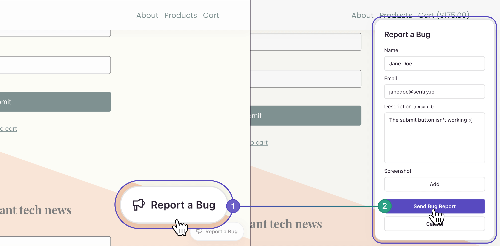
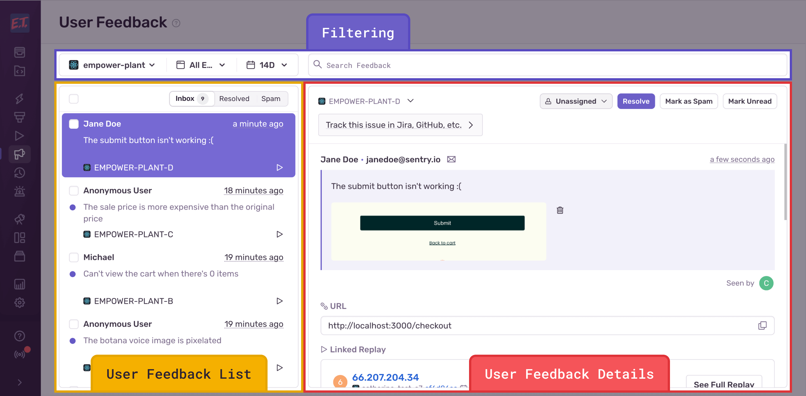
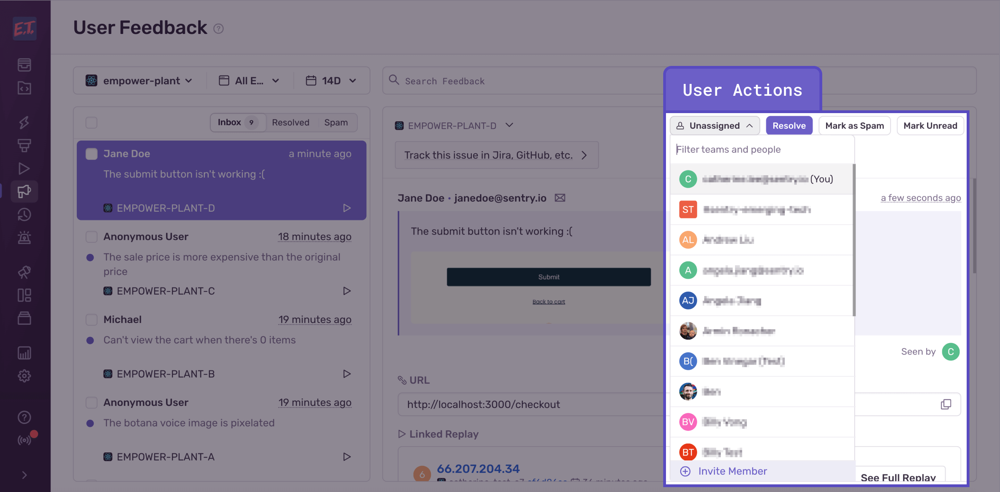

Sentry automatically detects errors thrown by your application, such as performance issues and user experience problems like rage clicks. But there are other frustrations your users may encounter (broken permission flows, broken links, typos, misleading UX, business logic flaws, and so on).

That’s where Sentry’s User Feedback Widget and Crash-Report Modal features come in. Setting up one or both, lets you collect feedback from your end-users when they run into bugs in your application. Sentry then links that feedback to available rich debugging context, including errors, replays, and tags such as URL, allowing you to get to the root of the problem faster.

For example, using [Session Replay](/product/session-replay/) with the User Feedback Widget could save you time, helping you quickly understand the context of the user problem by seeing exactly what they experienced before submitting their feedback.

## User Feedback Widget

The User Feedback Widget is an out-of-the-box, persistent widget you can add anywhere on your web application. It allows users to submit feedback quickly and easily any time they encounter something that isn’t working as expected. Learn more about how to install and customize it [here](https://docs.sentry.io/product/user-feedback/setup/).

Feedback collected via the Feedback Widget may have some or all of the following information (depending on what you mark as required and what’s available from the error context):

- Description from the user
- Screenshot from the user
- User email
- Associated replay event (with up to 60 seconds of replay recording before the user submitted the feedback)
- Learn more about how to set up Session Replay [here](/product/session-replay/getting-started/).
- URL of the page the user was on when they submitted the feedback
- Tags

## Crash-Report Modal

Another way to collect feedback is by installing the Crash-Report Modal. This allows users to submit feedback after they experience an error via an automatic modal that pops up after an error occurs. Learn more about how to install and customize it [here](https://docs.sentry.io/platforms/javascript/enriching-events/user-feedback/#embeddable-javascript-widget).

Feedback collected via the Crash-Report Modal will have the following information:

- Description from the user
- Sentry Issue preview and link to the Issue Details page
- URL of the page the user was on when they submitted the feedback
- Tags

## Where to View User Feedback

Whether you choose to collect user feedback via the Feedback Widget, the Crash-Report Modal, or both, you’ll be able to view it from the **User Feedback** page. The page is chronologically-organized with the most recent, unresolved feedback at the top. You can click on individual feedback to see more details all in one view, similar to your e-mail inbox. The right-hand side shows the **User Feedback Details** view, which includes the user’s description and any available debugging context.

You can narrow down the results in the feedback list by using the project, environment, and date range filters.

## Triaging User Feedback Submissions

You can either manually resolve user feedback submissions on the **User Feedback Details** view by clicking the “Resolve” button in the top-right corner, or bulk resolve by multi-selecting the feedback:

You can also assign a team member to a specific user feedback submission on the **User Feedback Details** view. If you come across user feedback that you consider spam, select the feedback(s) and click "Mark as Spam". This feedback will then be filtered out and moved to the "Spam" heading. 

## Searching for User Feedback

You can search by feedbacks using the search box. It can, for example, allow you to search by feedback sent on a specific page.

Example search: `url:*/payments/*`

For a list of search fields, refer to the [search documentation](/concepts/search/searchable-properties/user-feedback/).

## Spam Detection for User Feedback
By default, Sentry auto-detects user feedback submissions that are likely to be spam and puts them in the “Spam” folder on the **User Feedback** page. This improves the quality and actionability of the feedback that are in the main list. To improve the quality of your alerts, feedback that's labeled as spam will bypass any User Feedback Alert Rules you may have configured.

To make automatic spam detection possible, we use a Large Language Model that classifies messages. This language model is internal to Google Cloud Platform and no data is stored or persisted. This is part of our existing [sub-processor agreement](https://sentry.io/legal/dpa/#subprocessors).

If you’d like to opt out of spam detection, turn off "Enable Spam Detection" in [Settings](https://sentry.io/orgredirect/organizations/:orgslug/settings/) > Projects > [Project Name] > User Feedback (under “Project”).

## Getting User Feedback Alerts

If you have Sentry's default issue alert ("Alert me on every new issue") turned on for the project(s) with user feedback set up, then you should automatically get alerted every time new user feedback comes in via the User Feedback Widget.

If you don't have Sentry's default issue alert turned on, follow these steps to set up alerts for every new feedback:

1. Create a [New Alert Rule](https://sentry.io/alerts/new/issue/) in Sentry.
2. Scroll to the "Set conditions" section and set the "IF" filter to `The issue's category is equal to… "Feedback"`.
3. Choose which actions to perform in the “THEN” filter.
4. Add an alert name and owner.

To get notifications when crash-report feedback comes in, make sure to turn on "Enable Crash Report Notifications" in Settings > Projects > [Project Name] > User Feedback.
