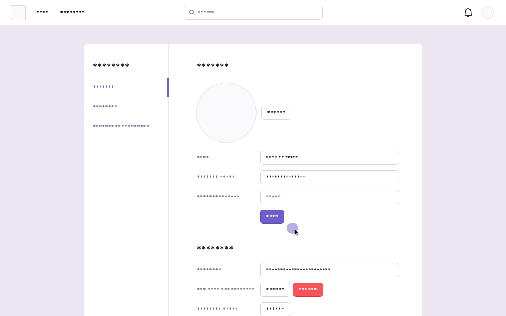

<Include name="session-replay-web-report-bug.mdx" />

With the extra scrutiny and sensitivity around session replay products and the logging of user interactions (e.g., text inputs, page visits, mouse movements, clicks, and scrolls) on websites and applications, we built our own session replay product with an eye towards privacy.

Sentry's Session Replay is not an actual “screen” recording, but instead a recording of changes in the web browsers' Document Object Model (DOM) (i.e., the data representation of the page). This important distinction means that the data captured by Session Replay can be searched and stripped.

We provide our customers with a range of [configuration options](/platforms/javascript/session-replay/privacy/) to control how much (or how little) data is collected. Customers can use our privacy controls to help ensure no sensitive user data leaves the browser. Customers can also use [server-side scrubbing](/security-legal-pii/scrubbing/server-side-scrubbing/) capabilities to further filter and remove sensitive user data, or our deletion capabilities to delete individual recordings after ingestion.

Below we expand on what data is potentially collected, how they are treated by default, and what additional controls are available to customers. At the bottom of this page you'll also find our [Legal & Privacy FAQ](#legal-and-privacy-faq).

## How Session Replay Approaches Data Capture

### HTML Content

To reduce the risk of Personally Identifiable Information (PII) being ingested and stored on our servers, Sentry’s Session Replay SDK is designed to be “private by default”. The Session Replay SDK in its default configuration redacts **all** HTML text nodes and images before it leaves the browser. During playback, redacted text nodes and images are clearly denoted using asterisks and static gray boxes, respectively.

To see unredacted HTML content – for example, your static navigation items, menus, and links – you may additionally opt-in static HTML elements that are known not to contain PII by denoting those elements with the `sentry-unmask` class name. It’s strongly recommended not to opt-in any known, user-generated content.

Alternatively, you can turn off the default privacy configuration, which will cause all text nodes and images to be transferred unredacted. This is only recommended when working with static content websites known not to contain any sensitive user information. Note that when using this configuration option, failure to carefully identify HTML elements containing PII means risking sensitive content leaving the user’s browser.

To learn more, including other additional configuration options, see [Session Replay Privacy](/platforms/javascript/session-replay/privacy/).

### User Input

In addition to HTML content, Session Replay records key user interactions like mouse movements, mouse clicks, and keyboard presses. By default, all user keypresses are redacted and replaced with asterisks. Captured mouse movements are limited to source and target destinations (for example, where the mouse came from and where it went, not the exact path). A low-fidelity approximation of this movement is recreated during playback.

### Breadcrumbs and other Metadata

To assist in debugging, Session Replay captures additional metadata like console.log entries, network requests, browser, operating system, and more. By default, Sentry scans this data on the server and automatically removes potentially sensitive strings like credit card numbers, social security numbers, API tokens, and more. This same process is applied to other Sentry event types like Errors and Transactions.

To learn more see [Server-Side Data Scrubbing](/security-legal-pii/scrubbing/server-side-scrubbing/).

## Legal and Privacy FAQ

**Q: Can I use Session Replay and comply with the GDPR and CCPA?**

A: Yes, we offer a [Data Processing Addendum (DPA)](https://sentry.io/legal/dpa/) to cover GDPR and CCPA requirements for any personal data sent to Sentry, including via our Session Replay product. You can enter into our DPA by following the instructions [here](https://sentry.io/trust/privacy/).

**Q: I have an existing DPA with Sentry, does it apply to Session Replay?**

A: Yes, see above. The data processing and security commitments in our DPA apply to the personal data you send to the Sentry service (including via our Session Replay product).

**Q: I have an existing Business Associate Addendum (BAA) with Sentry, does it apply to Session Replay?**

A: Yes, [our BAA](https://sentry.io/legal/baa/) covers HIPAA requirements for any protected health information (PHI) sent to the Sentry service (including if you elect to do so via our Session Replay product).

**Q: Do I need to change my legal policies or notices to use Session Replay?**

A: As with all user data that you submit to Sentry for processing on your behalf, you are responsible for providing appropriate notices to your users. How you choose to configure Session Replay and your own site or app will ultimately determine the contents and presentation of your user privacy notices.

**Q: Do I need to obtain consent from my users to use Session Replay?**

A: As with notices (see above), you need to consider whether or not you have to obtain user consent. In the U.S. in particular, we've noticed an [increase in lawsuits under U.S. state wiretapping laws](https://iapp.org/resources/article/us-litigation-series-website-tracking/) that involve session replay software. You should evaluate the risk based on your location, service, and customer type, and whether you want to mitigate the risk by obtaining consent from your users to collect data about their interaction with your services via Session Replay.

**Q: What should consent for Session Replay look like?**

A: Consent can take different forms, including using consent banners or similar technology, as well as consent incorporated into your terms of service with users. The type of consent you want to present (if any) is going to depend largely upon your assessment of the risks based on your location, service, and customers.

Here's an example of consent language:

> Provider may use and collect data and learnings about customer's use of the Provider service, including customer's behavior within the Provider service, such as clicks, scrolls, mouse movements, keystrokes, page refreshes, and other user session information to operate, improve, and support the Provider service and for other lawful business purposes.

**Q: How do I configure Sentry SDK's for Session Replay to be compatible with a consent banner?**

A: If you choose to utilize a consent banner, you can find [technical guidance](https://sentry.zendesk.com/hc/en-us/articles/37358708239003-How-can-I-delay-replay-recording-until-a-user-consents) to configure Session Replay SDKs to initiate only after user consent is obtained.

**Q: Where is Session Replay data hosted?**

See our [subprocessor list](https://sentry.io/legal/subprocessors/) for our infrastructure hosting location, which applies to all data within your specific Sentry instance, including Session Replay data.

**Q: How long do you retain Session Replay data?**

Please see [our security policy](https://sentry.io/security/). Our data retention policy applies to the overall Sentry service, including Session Replay.

*The information on this page is for information purposes only and does not constitute legal advice. You should consult with your own legal counsel to determine how relevant laws and regulations apply to your specific situation, taking into account your specific configuration and use of Sentry and Session Replay, and to ensure your compliance.*
