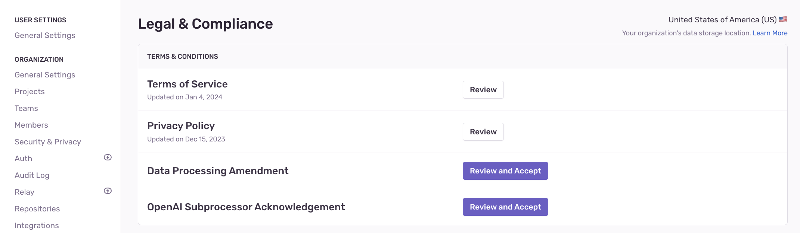

You can self-serve most legal and compliance documentation for your organization by navigating to _Your Organization's Settings_ > Legal & Compliance. When you're logged into your Sentry account, you'll be able to review or accept these agreements as an authorized individual on behalf of your organization.

Available legal documents include:

- [Terms of Service](https://sentry.io/terms/)
- [Privacy Policy](https://sentry.io/privacy/)
- [Data Processing Addendum (DPA)](https://sentry.io/legal/dpa/5.0.0/)
- [Business Associate Amendment (BAA)](https://sentry.io/legal/baa/) (Business plans or higher)
