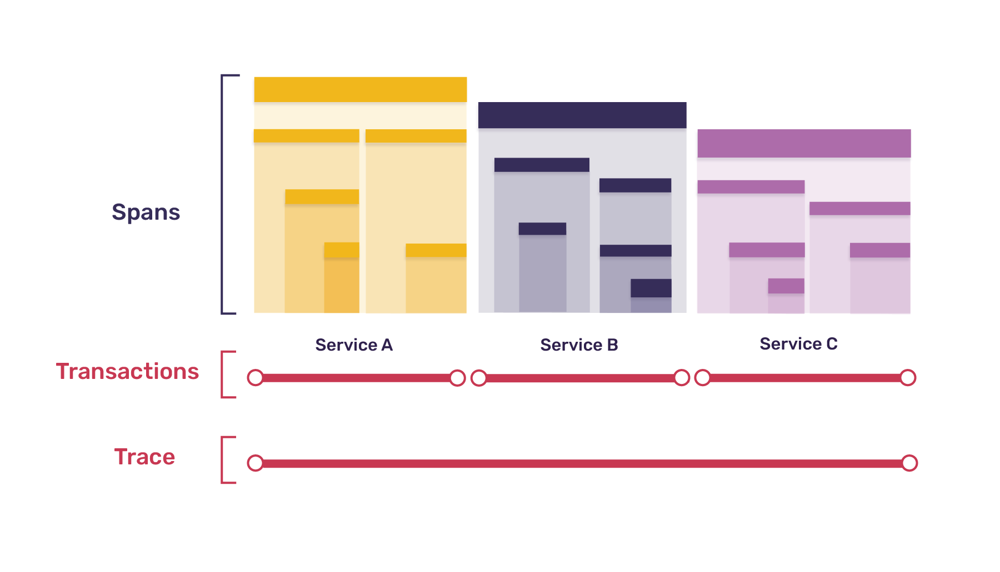
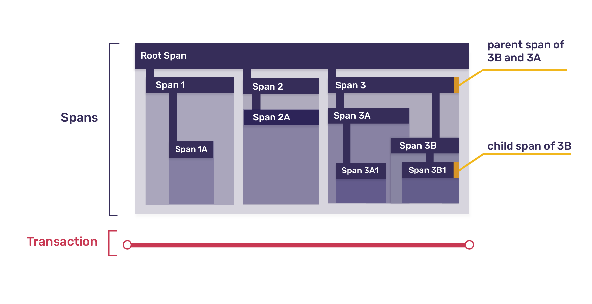
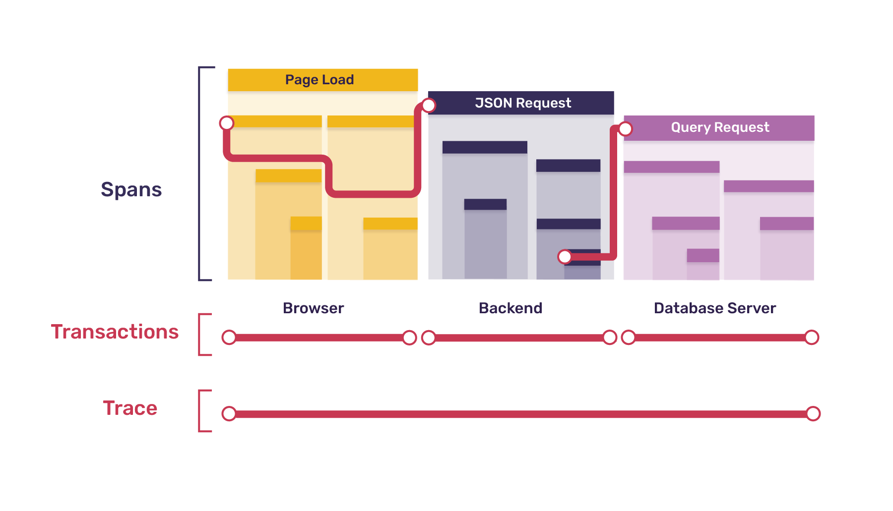

Enabling tracing augments your existing error data by capturing interactions among your software systems. With tracing, Sentry tracks your software performance, measuring things like throughput and latency, and can also display the impact of errors across multiple systems. Tracing makes Sentry a more complete monitoring solution, helping you both diagnose problems and measure your application's overall health more easily. Tracing in Sentry provides insights such as:

- What occurred for a specific error event or issue
- The conditions that cause bottlenecks or latency issues in your application
- The endpoints or operations that consume the most time

## What is Tracing?

To begin, a note about what tracing is not: Tracing is not profiling. Though the goals of profiling and tracing overlap quite a bit, and though they can both be used to diagnose problems in your application, they differ in terms of what they measure and how the data is recorded.

A [profiler](https://en.wikipedia.org/wiki/Profiling_(computer_programming)) may measure any number of aspects of an application's operation: the number of instructions executed, the amount of memory being used by various processes, the amount of time a given function call takes, and many more. The resulting profile is a statistical summary of these measurements.

A [tracing tool](https://en.wikipedia.org/wiki/Tracing_(software)), on the other hand, focuses on _what_ happened (and when), rather than how many times it happened or how long it took. The resulting trace is a log of events which occurred during a program's execution, often across multiple systems. Though traces most often - or, in the case of Sentry's traces, always - include timestamps, allowing durations to be calculated, measuring performance is not their only purpose. They can also show the ways in which interconnected systems interact, and the ways in which problems in one can cause problems in another.

### Why Tracing?

Applications typically consist of interconnected components, which are also called services. As an example, let's look at a modern web application, composed of the following components, separated by network boundaries:

- Frontend (Single-Page Application)
- Backend (REST API)
- Task Queue
- Database Server
- Cron Job Scheduler

Each of these components may be written in a different language on a different platform. Each can be instrumented individually using a Sentry SDK to capture error data or crash reports, but that instrumentation doesn't provide the full picture, as each piece is considered separately. Tracing allows you to tie all of the data together.

In our example web application, tracing means being able to follow a request from the frontend to the backend and back, pulling in data from any background tasks or notification jobs that request creates. Not only does this allow you to correlate Sentry error reports, to see how an error in one service may have propagated to another, but it also allows you to gain stronger insights into which services may be having a negative impact on your application's overall performance.

Before learning how to enable tracing in your application, it helps to understand a few key terms and how they relate to one another.

### Traces, Transactions, and Spans

A **trace** represents the record of the entire operation you want to measure or track - like page load, an instance of a user completing some action in your application, or a cron job in your backend. When a trace includes work in multiple services, such as those listed above, it's called a **distributed trace**, because the trace is distributed across those services.

Each trace consists of one or more tree-like structures called **transactions**, the nodes of which are called **spans**. In most cases, each transaction represents a single instance of a service being called, and each span within that transaction represents that service performing a single unit of work, whether calling a function within that service or making a call to a different service. Here's an example trace, broken down into transactions and spans:

Because a transaction has a tree structure, top-level spans can themselves be broken down into smaller spans, mirroring the way that one function may call a number of other, smaller functions; this is expressed using the parent-child metaphor, so that every span may be the **parent span** to multiple other **child spans**. Further, since all trees must have a single root, one span in every transaction always represents the transaction itself, with all other spans in the transaction descending from that root span. Here's a zoomed-in view of one of the transactions from the diagram above:

To make all of this more concrete, let's consider our example web app again.

### Example: Investigating Slow Page Load

Suppose your web application is slow to load, and you'd like to know why. A lot has to happen for your app to first get to a usable state: multiple requests to your backend, likely some work - including calls to your database or to outside APIs - completed before responses are returned, and processing by the browser to render all of the returned data into something meaningful to the user. So which part of that process is slowing things down?

Let's say, in this simplified example, that when a user loads the app in their browser, the following happens in each service:

- _Browser_
  - 1 request each for HTML, CSS, and JavaScript
  - 1 rendering task, which sets off 2 requests for JSON data
^
- _Backend_
  - 3 requests to serve static files (the HTML, CSS, and JS)
  - 2 requests for JSON data
    - 1 requiring a call to the database
    - 1 requiring a call to an external API and work to process the results before returning them to the frontend
^
- _Database Server_
  - 1 request which requires 2 queries
    - 1 query to check authentication
    - 1 query to get data

_Note:_ The external API is not listed precisely because it's external, and you therefore can't see inside of it.

In this example, the entire page-loading process, including all of the above, is represented by a single **trace**. That trace would consist of the following **transactions**:

- 1 browser transaction (for page load)
- 5 backend transactions (one for each request)
- 1 database server transaction (for the single DB request)

Each transaction would be broken down into **spans** as follows:

- _Browser Page-load Transaction_: 7 spans
  - 1 root span representing the entire page load
  - 1 span each (3 total) for the HTML, CSS, and JS requests
  - 1 span for the rendering task, which itself contains
    - 2 child spans, one for each JSON request

Let's pause here to make an important point: Some, though not all, of the spans listed here in the browser transaction have a direct correspondence to backend transactions listed earlier. Specifically, each request span in the browser transaction corresponds to a separate request transaction in the backend. In this situation, when a span in one service gives rise to a transaction in a subsequent service, we call the original span a parent span to _both_ the transaction and its root span. In the diagram below, the squggly lines represent this parent-child relationship.

In our example, every transaction other than the initial browser page-load transaction is the child of a span in another service, which means that every root span other than the browser transaction root has a parent span (albeit in a different service).

In a fully-instrumented system (one in which every service has tracing enabled) this pattern will always hold true. The only parentless span will be the root of the initial transaction; every other span will have a parent. Further, parents and children will always live in the same service, except in the case where the child span is the root of a child transaction, in which case the parent span will live in the calling service and the child transaction/child root span will live in the called service.

Put another way, a fully-instrumented system creates a trace which is itself a connected tree - with each transaction a subtree - and in that tree, the boundaries between subtrees/transactions are precisely the boundaries between services. The diagram above shows one branch of our example's full trace tree.

Now, for the sake of completeness, back to our spans:

- _Backend HTML/CSS/JS Request Transactions_: 1 span each
  - 1 root span representing the entire request (child of a browser span)
^
- _Backend Request with DB Call Transaction_: 2 spans
  - 1 root span representing the entire request (child of a browser span)
  - 1 span for querying the database (parent of the database server transaction)
^
- _Backend Request with API Call Transaction_: 3 spans
  - 1 root span representing the entire request (child of a browser span)
  - 1 span for the API request (unlike with the DB call, _not_ a parent span, since the API is external)
  - 1 span for processing the API data
^
- _Database Server Request Transaction_: 3 spans
  - 1 root span representing the entire request (child of the backend span above)
  - 1 span for the authentication query
  - 1 span for the query retrieving data

To wrap up the example: after instrumenting all of your services, you might discover that - for some reason - it's the auth query in your database server that is making things slow, accounting for more than half of the time it takes for your entire page load process to complete. Tracing can't tell you _why_ that's happening, but at least now you know where to look!

### Further Examples

This section contains a few more examples of tracing, broken down into transactions and spans.

#### Measuring a Specific User Action

If your application involves e-commerce, you likely want to measure the time between a user clicking "Submit Order" and the order confirmation appearing, including tracking the submitting of the charge to the payment processor and the sending of an order confirmation email. That entire process is one trace, and typically you'd have transactions (_T_) and spans (_S_) for:

- The browser's full process (_T_ and root span _S_)
  - XHR request to backend\* (_S_)
  - Rendering confirmation screen (_S_)
^
- Your backend's processing of that request (_T_ and root span _S_)
  - Function call to compute total (_S_)
  - DB call to store order\* (_S_)
  - API call to payment processor (_S_)
  - Queuing of email confirmation\* (_S_)
^
- Your database's work updating the customer's order history (_T_ and root span _S_)
  - Individual SQL queries (_S_)
^
- The queued task of sending the email (_T_ and root span _S_)
  - Function call to populate email template (_S_)
  - API call to email-sending service (_S_)

_Note:_ Starred spans represent spans that are the parent of a later transaction (and its root span).

#### Monitoring a Background Process

If your backend periodically polls for data from an external service, processes it, caches it, and then forwards it to an internal service, each instance of this happening is a trace, and you'd typically have transactions (_T_) and spans (_S_) for:

- The cron job that completes the entire process (_T_ and root span _S_)
  - API call to external service (_S_)
  - Processing function (_S_)
  - Call to caching service\* (_S_)
  - API call to internal service\* (_S_)
^
- The work done in your caching service (_T_ and root span _S_)
  - Checking cache for existing data (_S_)
  - Storing new data in cache (_S_)
^
- Your internal service's processing of the request (_T_ and root span _S_)
  - Anything that service might do to handle the request (_S_)

_Note:_ Starred spans represent spans that are the parent of a later transaction (and its root span).

### Tracing Data Model

> "Show me your flowchart and conceal your tables, and I shall continue to be mystified. Show me your tables, and I won't usually need your flowchart; it'll be obvious."
>
> -- [Fred Brooks](https://en.wikipedia.org/wiki/Fred_Brooks), The Mythical Man Month (1975)

While the theory is interesting, ultimately any data structure is defined by the kind of data it contains, and relationships between data structures are defined by how links between them are recorded. Traces, transactions, and spans are no different.

#### Traces

Traces are not an entity in and of themselves. Rather, a trace is defined as the collection of all transactions that share a `trace_id` value.

#### Transactions

Transactions share most of their properties (start and end time, tags, and so forth) with their root spans, so the same options described below for spans are available in transactions, and setting them in either place is equivalent.

Transactions also have one additional property not included in spans, called `transaction_name`, which is used in the UI to identify the transaction. Common examples of `transaction_name` values include endpoint paths (like `/store/checkout/` or `api/v2/users/&lt;user_id&gt;/`) for backend request transactions, task names (like `data.cleanup.delete_inactive_users`) for cron job transactions, and URLs (like `https://docs.sentry.io/performance-monitoring/distributed-tracing/`) for page-load transactions.

_Note:_ Before the transaction is sent, the `tags` and `data` properties will get merged with data from the global scope. (Global scope data is set either in `Sentry.init()` - for things like `environment` and `release` - or by using `Sentry.configureScope()`, `Sentry.setTag()`, `Sentry.setUser()`, and `Sentry.setExtra()`. See the [Additional Data](/enriching-error-data/additional-data/) docs for more information.)

#### Spans

The majority of the data in a transaction resides in the individual spans the transaction contains. Span data includes:

- `parent_span_id`: ties the span to its parent span
- `op`: short string identifying the type or category of operation the span is measuring
- `start_timestamp`: when the span was opened
- `end_timestamp`: when the span was closed
- `description`: longer description of the span's operation, which uniquely identifies the span but is consistent across instances of the span (optional)
- `status`: short code indicating operation's status (optional)
- `tags`: key-value pairs holding additional data about the span (optional)
- `data`: arbitrarily-structured additional data about the span (optional)

An example use of the `op` and `description` properties together is `op: sql.query` and `description: SELECT * FROM users WHERE last_active < %s`. The `status` property is often used to indicate the success or failure of the span's operation, or for a response code in the case of HTTP requests. Finally, `tags` and `data` allow you to attach further contextual information to the span, such as `function: middleware.auth.is_authenticated` for a function call or `request: {url: ..., headers: ... , body: ...}` for an HTTP request.

### Further Information

A few more important points about traces, transactions, and spans, and the way they relate to one another:

#### Trace Duration

Because a trace just is a collection of transactions, traces don't have their own start and end times. Instead, a trace begins when its earliest transaction starts, and ends when its latest transaction ends. As a result, you can't explicitly start or end a trace directly. Instead, you create a trace by creating the first transaction in that trace, and you complete a trace by completing all of transactions it contains.

#### Async Transactions

Because of the possibility of asynchronous processes, child transactions may outlive the transactions containing their parent spans, sometimes by many orders of magnitude. For example, if a backend API call sets off a long-running processing task and then immediately returns a response, the backend transaction will finish (and its data will be sent to Sentry) long before the async task transaction does. Asynchronicity also means that the order in which transactions are sent to (and received by) Sentry does not in any way depend on the order in which they were created. (By contrast, order of receipt for transactions in the same trace _is_ correlated with order of completion, though because of factors like the variability of transmission times, the correlation is far from perfect.)

#### Orphan Transactions

In theory, in a fully instrumented system, each trace should contain only one transaction and one span (the transaction's root) without a parent, namely the transaction in the originating service. However, in practice, you may not have tracing enabled in every one of your services, or an instrumented service may fail to report a transaction due to network disruption or other unforeseen circumstances. When this happens, you may see gaps in your trace hierarchy. Specifically, you may see transactions partway through the trace whose parent spans haven't been recorded as part of any known transactions. Such non-originating, parentless transactions are called **orphan transactions**.

#### Nested Spans

Though our examples above had four levels in their hierarchy (trace, transaction, span, child span) there's no set limit to how deep the nesting of spans can go. There are, however, practical limits: transaction payloads sent to Sentry have a maximum allowed size, and as with any kind of logging, there's a balance to be struck between your data's granularity and its usability.

#### Zero-duration Spans

It's possible for a span to have equal start and end times, and therefore be recorded as taking no time. This can occur either because the span is being used as a marker (such as is done in [the browser's Performance API](https://developer.mozilla.org/en-US/docs/Web/API/Performance/mark)) or because the amount of time the operation took is less than the measurement resolution (which will vary by service).

#### Clock Skew

If you are collecting transactions from multiple machines, you will likely encounter **clock skew**, where timestamps in one transaction don't align with timestamps in another. For example, if your backend makes a database call, the backend transaction logically should start before the database transaction does. But if the system time on each machine (those hosting your backend and database, respectively) isn't synced to a common standard, it's possible that won't be the case. It's also possible for the ordering to be correct, but for the two recorded timeframes to not line up in a way that accurately reflects what actually happened. To reduce this possibility, we recommend using Network Time Protocol (NTP) or your cloud provider's clock synchronization services.

#### How Data is Sent

Individual spans aren't sent to Sentry; rather, the entire transaction is sent as one unit. This means that no span data will be recorded by Sentry's servers until the transaction to which they belong is closed and dispatched. The converse is not true, however - though spans can't be sent without a transaction, transactions _are_ still valid, and will be sent, even if the only span they contain is their root span.

## Data Sampling

When you enable sampling in your tracing setup, you choose a percentage of collected transactions to send to Sentry. For example, if you had an endpoint that received 1000 requests per minute, a sampling rate of `0.25` would result in approximately 250 transactions (25%) being sent to Sentry each minute. (The number is approximate because each request is either tracked or not, independently and pseudorandomly, with a 25% probability. So in the same way that 100 fair coins, when flipped, result in approximately 50 heads, the SDK will "decide" to collect a trace in approximately 250 cases.) Because you know the sampling percentage, you can then extrapolate your total traffic volume.

When collecting traces, we **strongly recommend** sampling your data, for two reasons. First, though capturing a single trace involves minimal overhead, capturing traces for every single page load, or every single API request, has the potential to add an undesirable amount of load to your system. Second, by enabling sampling you'll more easily prevent yourself from exceeding your organization's [event quota](/accounts/quotas/), which will help you manage costs.

When choosing a sampling rate, the goal is to not collect _too_ much data (given the reasons above) but also to collect enough data that you are able to draw meaningful conclusions. If you're not sure what rate to choose, we recommend starting with a low value and gradually increasing it as you learn more about your traffic patterns and volume, until you've found a rate which lets you balance performance and cost concerns with data accuracy.

### Consistency Within a Trace

For traces that involve multiple transactions, Sentry uses a "head-based" approach: a sampling decision is made in the originating service, and then that decision is passed to all subsequent services. To see how this works, let's return to our webapp example above. Consider two users, A and B, who are both loading your app in their respective browsers. When A loads the app, the SDK pseudorandomly "decides" to collect a trace, whereas when B loads the app, the SDK "decides" not to. When each browser makes requests to your backend, it includes in those requests the "yes, please collect transactions" or the "no, don't collect transactions this time" decision in the headers.

When your backend processes the requests from A's browser, it sees the "yes" decision, collects transaction and span data, and sends it to Sentry. Further, it includes the "yes" decision in any requests it makes to subsequent services (like your database server), which similarly collect data, send it to Sentry, and pass the decision along to any services they call. Through this process, all of the relevant transactions in A's trace are collected and sent to Sentry.

On the other hand, when your backend processes the requests from B's browser, it sees the "no" decision, and as a result it does _not_ collect and send transaction and span data to Sentry. It does, however, do the same thing it does in A's case in terms of propagating the decision to subsequent services, telling them not to collect or send data either. They then in turn tell any services they call not to send data, and in this way no transactions from B's trace are collected.

Put simply: as a result of this head-based approach, where the decision is made once in the originating service and passed to all subsequent services, either all of the transactions for a given trace are collected, or none are, so there shouldn't be any incomplete traces.

### Consistency Between Traces

If you enable tracing in services with multiple entry points, we recommend choosing similar sampling rates, to avoid biasing your data. For example, suppose the backend of our on-going web app example also serves as a public API. In that case, some traces would start with a page-load transaction in the web app, and likely include multiple backend transactions, while other traces (those representing folks hitting the public API) would begin with a single backend request transaction, which would be the only backend transaction in the trace. Choosing a very different sampling rate for your web app from that chosen for your backend would lead to one of those scenarios being oversampled compared to the other, compromising the accuracy of your overall data.

## Viewing Trace Data

Though [Performance](/performance-monitoring/performance/) and [Discover](/performance-monitoring/discover-queries/), you can view trace data in the event details.
